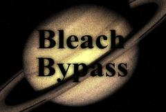

## S_BleachBypass

模拟一种胶片冲洗工艺，其中银不会从底片中去除。结果具有更高的对比度和更低的色彩饱和度。

在 Sapphire Stylize 效果子菜单中。

### Inputs:

- **Source**: 当前图层。要处理的片段。

- **Mask**: 默认为无。在结果和 Source 输入之间进行插值。白色区域使用效果的结果。黑色区域使用 Source 片段。

### Parameters:

- **Load Preset** (Push-button)
  打开预设浏览器，浏览此效果的所有可用预设。

- **Save Preset** (Push-button)
  打开预设保存对话框，保存此效果的预设。

- **Mocha Project** (Default: 0, Range: 0 or greater)
  打开 Mocha 窗口，用于跟踪素材和生成蒙版。

- **Blur Mocha** (Default: 0, Range: 0 or greater)
  在使用前按此数量模糊 Mocha 蒙版。可用于柔化蒙版的边缘或量化伪影，并平滑时间位移。

- **Mocha Opacity** (Default: 1, Range: 0 to 1)
  控制 Mocha 蒙版的强度。较低的值会降低效果的强度。

- **Invert Mocha** (Check-box, Default: off)
  如果启用，在应用效果之前反转 Mocha 蒙版的黑白。

- **Resize Mocha** (Default: 1, Range: 0 to 2)
  缩放 Mocha 蒙版。1.0 为原始大小。

- **Resize Rel X** (Default: 1, Range: 0 to 2)
  Mocha 蒙版的相对水平大小。

- **Resize Rel Y** (Default: 1, Range: 0 to 2)
  Mocha 蒙版的相对垂直大小。

- **Shift Mocha** (X & Y, Default: [0 0], Range: any)
  偏移 Mocha 蒙版的位置。

- **Dilate Mocha** (Default: 0, Range: -100 to 100)
  在使用前按此像素数量膨胀或腐蚀 Mocha 蒙版。

- **Dilation Quality** (Popup menu, Default: Fast)
  选择 Dilate Mocha 是在默认的 Fast 模式下快速调整，还是在 High 质量模式下获得更好的效果。
  - **Fast**: 在 Fast 模式下膨胀 Mocha 蒙版，以便快速调整。
  - **High**: 在 High 质量模式下膨胀 Mocha 蒙版，以获得更好的蒙版形状。

- **Bypass Mocha** (Check-box, Default: off)
  忽略 Mocha 蒙版，将效果应用于整个源片段。

- **Show Mocha Only** (Check-box, Default: off)
  跳过效果，仅显示 Mocha 蒙版本身。

- **Combine Masks** (Popup menu, Default: Union)
  当同时提供 Mocha 蒙版和输入蒙版时，确定如何组合它们。
  - **Union**: 使用两个蒙版共同覆盖的区域。
  - **Intersect**: 使用两个蒙版之间重叠的区域。
  - **Mocha Only**: 忽略输入蒙版，仅使用 Mocha 蒙版。

- **Amount** (Default: 1, Range: 0 or greater)
  通过在原始源和结果之间进行插值来控制效果的强度。

- **Soft Focus** (Default: 0, Range: 0 or greater)
  如果为正值，还会应用柔焦效果。增大以获得更宽泛的柔焦外观。

- **Sharpen** (Default: 0, Range: any)
  应用的后处理锐化量。

- **Saturation** (Default: 1, Range: 0 to 10)
  缩放色彩饱和度。增大以获得更鲜艳的颜色。设为 0 可获得单色效果。

- **Scale Lights** (Default: 1, Range: 0 or greater)
  按此值缩放结果。增大以获得更亮的结果。

- **Offset Darks** (Default: 0, Range: -8 to 2)
  将此灰度值添加到结果的较暗区域。可以为负值以增加对比度。

### Grain Parameters:

Grain Amp:
*Default:
*0,
*Range:
*0 or greater.缩放添加到结果中的胶片颗粒的振幅。设为 0 可禁用所有颗粒。

Grain Amp Red:
*Default:
*0.9,
*Range:
*0 or greater.缩放红色颗粒振幅。

Grain Amp Green:
*Default:
*1,
*Range:
*0 or greater.缩放绿色颗粒振幅。

Grain Amp Blue:
*Default:
*1.6,
*Range:
*0 or greater.缩放蓝色颗粒振幅。请注意，颗粒会在图像上加减，因此例如增大 Grain Amp Blue 会同时放大蓝色和黄色斑点。

Grain Amp Darks:
*Default:
*0.2,
*Range:
*0 to 2.每个通道中应用于图像最暗区域的颗粒相对量。此值默认小于 1.0，因为暗区通常比中间调有更少的颗粒。

Grain Amp Brights:
*Default:
*0,
*Range:
*0 to 2.每个通道中应用于图像最亮区域的颗粒相对量。此值默认为零，因为亮区通常比中间调有更少的颗粒。请注意，高饱和度颜色可能同时受到 Grain Amp Darks 和 Grain Amp Brights 的影响，因为它们在某些颜色通道中较暗，在其他通道中较亮。

Grain Blur:
*Default:
*0,
*Range:
*0 or greater.按此数量平滑颗粒。增大以获得更粗的颗粒。

Grain Blur Red:
*Default:
*1,
*Range:
*0 or greater.红色颗粒的相对模糊量。

Grain Blur Green:
*Default:
*0.9,
*Range:
*0 or greater.绿色颗粒的相对模糊量。

Grain Blur Blue:
*Default:
*1.2,
*Range:
*0 or greater.蓝色颗粒的相对模糊量。

Grain Mono:
*Check-box, Default:
*off.启用后，红色、绿色和蓝色通道使用相同的颗粒图案。要制作真正的单色颗粒，还应将 Grain Amp Red/Green/Blue 设为相等，确保 Midtone Pos Red/Green/Blue 相等，如果 GrainBlur 为正值，还应将 Grain Blur Red/Green/Blue 设为相等。

Grain Seed:
*Default:
*0,
*Range:
*0 or greater.
初始化颗粒生成的随机数生成器。实际种子值并不重要，但不同的种子会产生不同的颗粒图案，相同的值应产生可重复的图案。

### Other Parameters:

Scale Colors:
*Default rgb:
*[1 1 1].缩放结果的颜色。例如，如果为黄色 [1 1 0]，则结果的蓝色将为 0。

Opacity:
*Popup menu, Default: Normal
*.确定处理不透明度/透明度的方法。
*All Opaque:
*当输入图像完全不透明且无透明度 (alpha=1) 时，使用此选项可稍微加快渲染速度。*Normal:
*正常处理不透明度。*As Premult:
*按预乘形式处理图像（颜色已按不透明度缩放）。此选项的渲染速度也比 Normal 模式稍快，但结果也将为预乘形式，有时可能不太准确。

Mask Use:
*Popup menu, Default: Luma
*.确定如何使用 Mask 输入通道来创建单色蒙版。
*Luma:
*使用 RGB 通道的亮度。*Alpha:
*仅使用 Alpha 通道。

Blur Mask:
*Default:
*0.05,
*Range:
*0 or greater.在使用前按此数量模糊 Matte 输入。可以在蒙版区域和非蒙版区域之间提供更平滑的过渡。除非提供了 Matte 输入，否则无效。

Invert Mask:
*Check-box, Default:
*off.
如果开启，反转 Matte 输入，使效果应用于 Matte 为黑色而非白色的区域。除非提供了 Matte 输入，否则无效。
