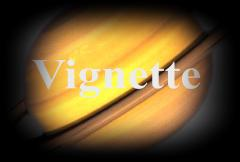

## S_Vignette

使源片段的边框区域变暗，以创建暗角效果。使用 Squareness、Radius 和 Edge Softness 参数来影响暗角的形状。使用 Opacity 和 Color 参数来调整其强度和颜色。

在 Sapphire Stylize 效果子菜单中。

### Inputs:

- **Source**: 当前图层。要处理的片段。

### Parameters:

- **Load Preset** (Push-button)
  打开预设浏览器，浏览此效果的所有可用预设。

- **Save Preset** (Push-button)
  打开预设保存对话框，保存此效果的预设。

- **Mode** (Popup menu, Default: Vignette)
  在几种生成暗角形状的变体之间进行选择。
  - **Vignette**: 暗角形状和位置由特定参数定义。
  - **VignetteMocha**: 暗角形状和位置使用 Mocha 蒙版定义。

- **Center** (X & Y, Default: [0 0], Range: any)
  暗角效果的中心位置。此参数可通过 Center 小部件进行调整。

- **Squareness** (Default: 0, Range: 0 to 1)
  确定暗角形状的方形程度。设为 1.0 表示正方形或矩形。设为 0 表示圆形或椭圆。介于两者之间的值通过不同程度产生圆角矩形。

- **Radius** (Default: 0.9, Range: 0 or greater)
  从中心到应用暗角的距离。此参数可通过 Radius 小部件进行调整。

- **Rel Height** (Default: 0.75, Range: 0.05 or greater)
  暗角形状的相对垂直大小。增大以获得更高的形状，减小以获得更宽的形状。

- **Rel Width** (Default: 1, Range: 0.05 or greater)
  暗角形状的相对水平大小。增大以获得更宽的形状，减小以获得更高的形状。

- **Rotate** (Default: 0, Range: any)
  暗角形状的旋转角度（度）。请注意，如果 Squareness 为零且 Rel Width 和 Rel Height 相等，则旋转不会产生效果。此参数可通过 Rotate 小部件进行调整。

- **Mocha Project** (Default: 0, Range: 0 or greater)
  打开 Mocha 窗口，用于跟踪素材和生成蒙版。

- **Blur Mocha** (Default: 0, Range: 0 or greater)
  在使用前按此数量模糊 Mocha 蒙版。可用于柔化蒙版的边缘或量化伪影，并平滑时间位移。

- **Mocha Opacity** (Default: 1, Range: 0 to 1)
  控制 Mocha 蒙版的强度。较低的值会降低效果的强度。

- **Invert Mocha** (Check-box, Default: off)
  如果启用，在应用效果之前反转 Mocha 蒙版的黑白。

- **Resize Mocha** (Default: 1, Range: 0 or greater)
  缩放 Mocha 蒙版。1.0 为原始大小。

- **Resize Rel X** (Default: 1, Range: 0 or greater)
  Mocha 蒙版的相对水平大小。

- **Resize Rel Y** (Default: 1, Range: 0 or greater)
  Mocha 蒙版的相对垂直大小。

- **Shift Mocha** (X & Y, Default: [0 0], Range: any)
  偏移 Mocha 蒙版的位置。

- **Dilate Mocha** (Default: 0, Range: -100 to 100)
  在使用前按此像素数量膨胀或腐蚀 Mocha 蒙版。

- **Dilation Quality** (Popup menu, Default: Fast)
  选择 Dilate Mocha 是在默认的 Fast 模式下快速调整，还是在 High 质量模式下获得更好的效果。
  - **Fast**: 在 Fast 模式下膨胀 Mocha 蒙版，以便快速调整。
  - **High**: 在 High 质量模式下膨胀 Mocha 蒙版，以获得更好的蒙版形状。

- **Bypass Mocha** (Check-box, Default: off)
  忽略 Mocha 蒙版，将效果应用于整个源片段。

- **Show Mocha Only** (Check-box, Default: off)
  跳过效果，仅显示 Mocha 蒙版本身。

- **Edge Softness** (Default: 1, Range: 0 or greater)
  暗角柔和边缘的宽度。较大的值产生更柔和、更不明显的边缘。

- **Smooth Curve** (Default: 0.4, Range: 0 to 1)
  如果为零，则在柔和边缘区域使用线性渐变。增大此值以使用更平滑的"S"形曲线进行插值，这可以减少对渐变起始和结束位置的视觉感知。

- **Color** (Default rgb: [0 0 0])
  暗角的颜色。

- **Opacity** (Default: 1, Range: 0 or greater)
  暗角的不透明度；动画到 0 以淡出暗角。

- **Blur Amount** (Default: 0, Range: 0 or greater)
  除了使边框变暗外，还对图像边框进行模糊处理。

- **Blur Inside** (Check-box, Default: off)
  如果勾选，则模糊图像的中心（未变暗的）区域，而不是边框。

- **Source Brightness** (Default: 1, Range: 0 or greater)
  缩放源片段的亮度。要仅查看暗角，请将此值设为零。

- **Combine** (Popup menu, Default: Composite)
  确定暗角如何与 Source 合并。
  - **Composite**: 将暗角合成在源片段之上。
  - **Mult**: 暗角颜色与源片段相乘。如果颜色不是黑色，这将选择性地为暗角区域着色。
  - **Add**: 暗角颜色添加到源片段。如果暗角颜色为黑色，则不会产生效果。
  - **Screen**: 暗角颜色使用滤色操作与源片段合并。如果暗角颜色为黑色，则不会产生效果。
  - **Subtract Inv**: 暗角颜色的反色从源片段中减去。反色表示白色对应黑色，黄色对应蓝色，依此类推。此模式看起来类似于 Mult，但更为强烈；它压制黑部并保留更多高光。如果暗角颜色为白色，则不会产生效果。
  - **Vignette Only**: 仅显示暗角图案，不包含源片段。输出在暗角效果最大的地方为白色（即源片段会被完全变暗的地方）。
  - **Vignette Only Inv**: 仅显示反转的暗角图案，不包含源片段。输出在没有暗角的地方为白色（即源片段不会被变暗的地方）。

- **Show Radius** (Check-box, Default: on)
  打开或关闭用于调整 Center 参数的屏幕用户界面。此参数仅出现在支持屏幕小部件的 AE 和 Premiere 中。

- **Show Rotate** (Check-box, Default: on)
  打开或关闭用于调整 Center 参数的屏幕用户界面。此参数仅出现在支持屏幕小部件的 AE 和 Premiere 中。

- **Show Center** (Check-box, Default: on)
  打开或关闭用于调整 Center 参数的屏幕用户界面。此参数仅出现在支持屏幕小部件的 AE 和 Premiere 中。

