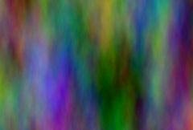

## S_CloudsColorSmooth

生成全彩云朵纹理。程序化噪波纹理为红、绿、蓝每个输出通道独立生成。Shift Speed 参数可使纹理随时间自动平移。

在 Sapphire Render 效果子菜单中。

### Inputs:

- **Background**: 当前图层。用于与云朵图像合成的素材片段。如果 Combine 选项设置为 Clouds Only，则可能忽略此输入。

- **Mask**: 默认为无。在结果与源输入之间进行插值。白色区域使用效果结果，黑色区域使用源素材片段。

### Parameters:

- **Load Preset** (Push-button)
  打开预设浏览器，浏览此效果的所有可用预设。

- **Save Preset** (Push-button)
  打开预设保存对话框，保存此效果的预设。

- **Mocha Project** (Default: 0, Range: 0 or greater)
  打开 Mocha 窗口，用于跟踪素材和生成遮罩。

- **Blur Mocha** (Default: 0, Range: 0 or greater)
  在使用前按此数值模糊 Mocha 遮罩。可用于柔化遮罩的边缘或量化伪影，并平滑时间位移。

- **Mocha Opacity** (Default: 1, Range: 0 to 1)
  控制 Mocha 遮罩的强度。较低的值会降低效果的强度。

- **Invert Mocha** (Check-box, Default: off)
  如果启用，则在应用效果前反转 Mocha 遮罩的黑白。

- **Resize Mocha** (Default: 1, Range: 0 to 2)
  缩放 Mocha 遮罩。1.0 为原始大小。

- **Resize Rel X** (Default: 1, Range: 0 to 2)
  Mocha 遮罩的相对水平大小。

- **Resize Rel Y** (Default: 1, Range: 0 to 2)
  Mocha 遮罩的相对垂直大小。

- **Shift Mocha** (X & Y, Default: [0 0], Range: any)
  偏移 Mocha 遮罩的位置。

- **Dilate Mocha** (Default: 0, Range: -100 to 100)
  在使用前按此像素数量膨胀或收缩 Mocha 遮罩。

- **Dilation Quality** (Popup menu, Default: Fast)
  选择 Dilate Mocha 是在默认的 Fast 模式下快速调整，还是在 High 质量模式下获得更好的效果。
  - **Fast**: 在 Fast 模式下膨胀 Mocha 遮罩，用于快速调整。
  - **High**: 在 High 质量模式下膨胀 Mocha 遮罩，获得更好的遮罩形状。

- **Bypass Mocha** (Check-box, Default: off)
  忽略 Mocha 遮罩并将效果应用于整个源素材片段。

- **Show Mocha Only** (Check-box, Default: off)
  绕过效果并显示 Mocha 遮罩本身。

- **Combine Masks** (Popup menu, Default: Union)
  当两个遮罩都提供给效果时，确定如何合并 Mocha 遮罩和输入遮罩。
  - **Union**: 使用两个遮罩共同覆盖的区域。
  - **Intersect**: 使用两个遮罩重叠的区域。
  - **Mocha Only**: 忽略输入遮罩，仅使用
Mocha 遮罩。

- **Frequency** (Default: 8, Range: 0.01 or greater)
  云朵的空间频率。增大可缩小视图，减小可放大视图。非常高的 Frequency 值会在内部被限制，使颗粒大小不小于几个像素。如果需要更细的颗粒，请使用 S_Grain 或 S_Clouds:Perspective。

- **Frequency Rel X** (Default: 0.2, Range: 0.01 or greater)
  纹理的相对水平频率。增大可垂直拉伸，减小可水平拉伸。

- **Octaves** (Integer, Default: 1, Range: 1 to 10)
  叠加的噪波层数。每个八度是前一个八度频率的两倍、振幅的一半。单个八度会产生平滑纹理。添加八度会使结果趋近于分形 (1/f) 噪波纹理。

- **Seed** (Default: 0.6, Range: 0 or greater)
  用于初始化随机数生成器。实际种子值本身并不重要，但不同的种子会产生不同的结果，相同的值应产生可重复的结果。

- **Shift Start** (X & Y, Default: [0 0], Range: any)
  纹理的平移偏移量。由于纹理是程序化生成的，可以平移而不会出现重复单元或接缝。

- **Shift Speed** (X & Y, Default: [0.5 0], Range: any)
  纹理的平移速度。如果非零，结果会自动以此速率进行动画平移。动画化的 Speed 值结果可能不太直观，因此对于可变速度运动，通常最好将此值设为 0 并改为动画化 Shift Start 值。

- **Brightness** (Default: 1, Range: 0 or greater)
  缩放结果的亮度。

- **Scale Colors** (Default rgb: [1 1 1])
  缩放结果的颜色。例如，如果设为黄色 [1 1 0]，则结果的蓝色将为 0。

- **Saturation** (Default: 1, Range: 0 to 10)
  缩放颜色饱和度。增大可获得更浓烈的颜色。设为 0 可获得单色效果。

- **Offset** (Default: 0, Range: -8 to 2)
  将此灰度值添加到结果中（如果为负值则减去）。0 无效果，0.5 为中灰，1 为白色。

- **Bg Brightness** (Default: 1, Range: 0 or greater)
  背景亮度在与云朵合成前按此值缩放。

- **Combine** (Popup menu, Default: Clouds Only)
  确定纹理如何与背景合成。
  - **Clouds Only**: 仅输出云朵纹理，不包含背景。
  - **Mult**: 纹理与背景相乘。
  - **Add**: 纹理叠加到背景上。
  - **Screen**: 纹理使用滤色操作与背景混合。
  - **Difference**: 结果为纹理与背景的差值。
  - **Overlay**: 纹理使用叠加功能与背景合成。

- **Input Opacity** (Popup menu, Default: Normal)
  确定处理不透明度/透明度的方法。
  - **All Opaque**: 当输入图像完全不透明且没有透明度 (alpha=1) 时，使用此选项可稍快地渲染。
  - **Normal**: 正常处理不透明度。
  - **As Premult**: 按预乘形式处理图像（颜色已按不透明度缩放）。此选项的渲染速度也比 Normal 模式稍快，但结果也将是预乘形式，有时可能不太准确。

- **Output Opacity** (Popup menu, Default: Copy From Input)
  确定结果的不透明度/透明度。此效果不处理输入的不透明度（Alpha 通道），但可以从输入复制不透明度，或输出完全不透明的结果。
  - **All Opaque**: 使结果完全不透明，没有透明度。
  - **Copy From Input**: 从提供给此效果的当前图层复制不透明度/透明度。

- **Mask Use** (Popup menu, Default: Luma)
  确定如何使用 Mask 输入通道来生成单色遮罩。
  - **Luma**: 使用 RGB 通道的亮度。
  - **Alpha**: 仅使用 Alpha 通道。

- **Blur Mask** (Default: 0.05, Range: 0 or greater)
  在使用前按此数值模糊蒙版输入。这可以在蒙版区域和非蒙版区域之间提供更平滑的过渡。除非提供了蒙版输入，否则无效。

- **Invert Mask** (Check-box, Default: off)
  如果开启，则反转蒙版输入，使效果应用于蒙版为黑色而非白色的区域。除非提供了蒙版输入，否则无效。
