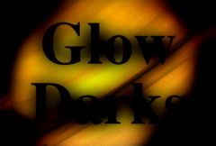

## S_GlowDarks

源素材中暗于给定阈值的区域会被模糊处理并与输入素材合成，以产生深沉的烟雾效果。调整 Darkness、Width 和 Threshold 参数可以获得不同类型的外观。

在 Sapphire Lighting 效果子菜单中。

### Inputs:

- **Source**: 当前图层。用于确定辉光位置和颜色的输入素材。

- **Background**: 默认为无。用于与辉光合成的素材。如果未提供背景，则源素材也将用作背景。

- **Matte**: 默认为无。如果提供，源辉光颜色将按此输入进行缩放。单色遮罩可用于选择源素材中生成辉光的子区域。彩色遮罩可用于在不同区域选择性地调整辉光颜色。遮罩在生成辉光之前应用于源素材，因此不会裁剪生成的辉光。

### Parameters:

- **Load Preset** (Push-button)
  打开预设浏览器，浏览此效果的所有可用预设。

- **Save Preset** (Push-button)
  打开预设保存对话框，保存此效果的预设。

- **Mocha Project** (Default: 0, Range: 0 or greater)
  打开 Mocha 窗口，用于跟踪素材和生成遮罩。

- **Blur Mocha** (Default: 0, Range: 0 or greater)
  在使用前按此数值模糊 Mocha 遮罩。可用于柔化遮罩的边缘或量化伪影，并平滑时间位移。

- **Mocha Opacity** (Default: 1, Range: 0 to 1)
  控制 Mocha 遮罩的强度。较低的值会降低效果的强度。

- **Invert Mocha** (Check-box, Default: off)
  如果启用，Mocha 遮罩的黑白将在应用效果之前反转。

- **Resize Mocha** (Default: 1, Range: 0 to 2)
  缩放 Mocha 遮罩。1.0 为原始大小。

- **Resize Rel X** (Default: 1, Range: 0 to 2)
  Mocha 遮罩的相对水平大小。

- **Resize Rel Y** (Default: 1, Range: 0 to 2)
  Mocha 遮罩的相对垂直大小。

- **Shift Mocha** (X & Y, Default: [0 0], Range: any)
  偏移 Mocha 遮罩的位置。

- **Dilate Mocha** (Default: 0, Range: -100 to 100)
  在使用前按此像素数值膨胀或收缩 Mocha 遮罩。

- **Dilation Quality** (Popup menu, Default: Fast)
  选择 Dilate Mocha 是在默认的 Fast 模式下快速调整，还是在 High 质量模式下获得更好的效果。
  - **Fast**: 在 Fast 模式下膨胀 Mocha 遮罩，用于快速调整。
  - **High**: 在 High 质量模式下膨胀 Mocha 遮罩，获得更好的遮罩形状。

- **Bypass Mocha** (Check-box, Default: off)
  忽略 Mocha 遮罩，将效果应用于整个源素材。

- **Show Mocha Only** (Check-box, Default: off)
  跳过效果，仅显示 Mocha 遮罩本身。

- **Combine Masks** (Popup menu, Default: Union)
  当两个遮罩同时提供给效果时，决定如何合并 Mocha 遮罩和输入遮罩。
  - **Union**: 使用两个遮罩共同覆盖的区域。
  - **Intersect**: 使用两个遮罩重叠的区域。
  - **Mocha Only**: 忽略输入遮罩，仅使用 Mocha 遮罩。

- **Darkness** (Default: 0.5, Range: 0 or greater)
  暗辉光的强度。

- **Threshold** (Default: 0.5, Range: 0 or greater)
  从源素材中暗于此值的位置生成暗辉光。值为 0.1 时仅在最暗的区域产生辉光。值为 1.0 时在每个非白色区域都产生辉光。

- **Glow Saturation** (Default: 1, Range: -2 to 8)
  缩放暗色的饱和度。增大可获得更强烈的颜色。

- **Glow Width** (Default: 1, Range: 0 or greater)
  缩放辉光距离。此参数及所有宽度参数均可通过宽度控件进行调整。请注意，辉光宽度为零时仍会影响暗区域；如果要原样传递源素材，请将暗度参数设为零。

- **Width X** (Default: 1, Range: 0 or greater)
  缩放水平辉光宽度。设为 0 则仅显示垂直方向。

- **Width Y** (Default: 1, Range: 0 or greater)
  缩放垂直辉光宽度。设为 0 则仅显示水平方向。

- **Subpixel** (Check-box, Default: on)
  启用亚像素宽度辉光。用于宽度参数的更平滑动画。

- **Glow From Alpha** (Default: 0, Range: 0 to 1)
  设为 1 可从源输入的 Alpha 通道而非 RGB 通道生成辉光。在这种情况下，辉光不会从源素材获取颜色，通常会更亮。0 到 1 之间的值在使用 RGB 和 Alpha 之间插值。

- **Glow Under Source** (Default: 0, Range: 0 to 1)
  设为 1 可将源输入合成在辉光之上。

- **Source Opacity** (Default: 1, Range: 0 to 1)
  缩放源输入与辉光合成时的不透明度。这不影响辉光本身的生成。

- **Bg Brightness** (Default: 1, Range: 0 or greater)
  缩放背景输入素材的亮度。

- **Show** (Popup menu, Default: Result)
  选择输出类型。
  - **Result**: 显示辉光、源素材和背景合成后的最终结果。
  - **Threshold**: 显示用于生成辉光的阈值化图像。

- **Invert Matte** (Check-box, Default: off)
  如果开启，反转遮罩输入，使效果应用于遮罩为黑色而非白色的区域。除非提供了遮罩输入，否则此选项无效。

- **Atmosphere Amp** (Default: 0, Range: 0 or greater)
  大气效果模拟辉光穿过尘土飞扬的大气层并拾取光线或被遮蔽的效果。此参数调整大气效果的数量或振幅。零值产生平滑辉光，较高值产生更具尘土感的外观。

- **Atmosphere Freq** (Default: 1, Range: 0.1 to 20)
  控制大气噪声的空间频率。调高可获得更精细的细节，调低可获得更宽泛的整体变化。

- **Atmosphere Detail** (Default: 0.6, Range: 0 to 1)
  控制大气模拟中精细细节的数量。降低可获得更平滑的大气效果，增加可获得更粗糙或颗粒感的外观。

- **Atmosphere Seed** (Default: 0.123, Range: 0 or greater)
  用于初始化大气噪声的随机数生成器。实际种子值本身不重要，但不同的种子会产生不同的结果，相同的值应产生可重复的结果。

- **Atmosphere Speed** (Default: 1, Range: any)
  大气中的云状噪声会像真实的尘云一样随时间演变；此参数控制云图案随时间变化的速度。设为零可获得静态图案。

- **Opacity** (Popup menu, Default: Normal)
  决定处理不透明度/透明度的方法。
  - **All Opaque**: 当输入图像完全不透明且没有透明度 (alpha=1) 时使用此选项可稍微加快渲染速度。
  - **Normal**: 正常处理不透明度。
  - **As Premult**: 按图像已经是预乘形式（颜色已按不透明度缩放）来处理。此选项的渲染速度也比 Normal 模式稍快，但结果也将是预乘形式，有时不太准确。

- **Show Glow Width** (Check-box, Default: on)
  开启或关闭用于调整 Glow Width 参数的屏幕用户界面。此参数仅在 AE 和 Premiere 中出现，因为这些软件支持屏幕控件。
