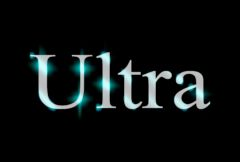

## S_UltraGlow

从源素材的明亮区域生成多种辉光效果。提高阈值参数可以减少产生辉光的区域。调整 Width RGB 参数可以制作不同颜色衰减的辉光，调整 Width XY 参数可以制作水平或垂直方向的辉光。调整 Glow Falloff 和 Glow Bias 参数可控制衰减距离和最亮区域的扩展范围。调整 After Glow 参数可在主辉光结果上生成二次辉光。还可以选择增强源素材的边缘、添加高光，或将结果与大气噪声结合。

在 Sapphire Lighting 效果子菜单中。

### Inputs:

- **Source**: 当前图层。用于确定辉光位置和颜色的输入素材。

- **Background**: 默认为无。用于与辉光合成的素材。如果未提供背景，则源素材也将用作背景。

- **Matte**: 默认为无。如果提供，源辉光颜色将按此输入进行缩放。单色遮罩可用于选择源素材中生成辉光的子区域。彩色遮罩可用于在不同区域选择性地调整辉光颜色。遮罩在生成辉光之前应用于源素材，因此不会裁剪生成的辉光。

### Parameters:

- **Load Preset** (Push-button)
  打开预设浏览器，浏览此效果的所有可用预设。

- **Save Preset** (Push-button)
  打开预设保存对话框，保存此效果的预设。

- **Mocha Project** (Default: 0, Range: 0 or greater)
  打开 Mocha 窗口，用于跟踪素材和生成遮罩。

- **Blur Mocha** (Default: 0, Range: 0 or greater)
  在使用前按此数值模糊 Mocha 遮罩。可用于柔化遮罩的边缘或量化伪影，并平滑时间位移。

- **Mocha Opacity** (Default: 1, Range: 0 to 1)
  控制 Mocha 遮罩的强度。较低的值会降低效果的强度。

- **Invert Mocha** (Check-box, Default: off)
  如果启用，Mocha 遮罩的黑白将在应用效果之前反转。

- **Resize Mocha** (Default: 1, Range: 0 to 2)
  缩放 Mocha 遮罩。1.0 为原始大小。

- **Resize Rel X** (Default: 1, Range: 0 to 2)
  Mocha 遮罩的相对水平大小。

- **Resize Rel Y** (Default: 1, Range: 0 to 2)
  Mocha 遮罩的相对垂直大小。

- **Shift Mocha** (X & Y, Default: [0 0], Range: any)
  偏移 Mocha 遮罩的位置。

- **Dilate Mocha** (Default: 0, Range: -100 to 100)
  在使用前按此像素数值膨胀或收缩 Mocha 遮罩。

- **Dilation Quality** (Popup menu, Default: Fast)
  选择 Dilate Mocha 是在默认的 Fast 模式下快速调整，还是在 High 质量模式下获得更好的效果。
  - **Fast**: 在 Fast 模式下膨胀 Mocha 遮罩，用于快速调整。
  - **High**: 在 High 质量模式下膨胀 Mocha 遮罩，获得更好的遮罩形状。

- **Bypass Mocha** (Check-box, Default: off)
  忽略 Mocha 遮罩，将效果应用于整个源素材。

- **Show Mocha Only** (Check-box, Default: off)
  跳过效果，仅显示 Mocha 遮罩本身。

- **Combine Masks** (Popup menu, Default: Union)
  当两个遮罩同时提供给效果时，决定如何合并 Mocha 遮罩和输入遮罩。
  - **Union**: 使用两个遮罩共同覆盖的区域。
  - **Intersect**: 使用两个遮罩重叠的区域。
  - **Mocha Only**: 忽略输入遮罩，仅使用 Mocha 遮罩。

- **Brightness** (Default: 1.8, Range: 0 or greater)
  缩放所有辉光的亮度。

- **Color** (Default rgb: [1 1 1])
  缩放主辉光的颜色。

- **Threshold** (Default: 0.4, Range: 0 or greater)
  从源素材中亮度超过此值的位置生成辉光。值为 0.9 时仅在最亮的位置产生辉光。值为 0 时在每个非黑色区域都产生辉光。

- **Threshold Add Color** (Default rgb: [0 0 0])
  可用于提高特定颜色的阈值，从而减少源素材中包含该颜色的区域所产生的辉光。

- **Glow Width** (Default: 0.371, Range: 0 or greater)
  缩放辉光距离。此参数及所有宽度参数均可通过宽度控件进行调整。请注意，辉光宽度为零时仍会增强明亮区域；如果要原样传递源素材，请将亮度参数设为零。

- **Glow Falloff** (Default: 0.35, Range: -2 to 2)
  增强或削减辉光扩展的距离。

- **Glow Bias** (Default: 0, Range: -3 to 3)
  扩展阈值化结果的外围区域，负值则收缩。

- **Width X** (Default: 1, Range: 0 or greater)
  缩放水平辉光宽度。设为 0 则仅显示垂直方向。

- **Width Y** (Default: 1, Range: 0 or greater)
  缩放垂直辉光宽度。设为 0 则仅显示水平方向。

- **Width Red** (Default: 1, Range: 0 or greater)
  缩放红色辉光宽度。如果红、绿、蓝宽度相等，辉光将与源素材的颜色一致。如果不相等，辉光颜色将随距离变化。

- **Width Green** (Default: 1, Range: 0 or greater)
  缩放绿色辉光宽度。

- **Width Blue** (Default: 1, Range: 0 or greater)
  缩放蓝色辉光宽度。

- **Subpixel** (Check-box, Default: on)
  启用亚像素宽度辉光。用于宽度参数的更平滑动画。

- **Show** (Popup menu, Default: Result)
  选择输出类型。
  - **Result**: 显示辉光、源素材和背景合成后的最终结果。
  - **Threshold**: 显示用于生成辉光的阈值化图像。

- **After Glow Width** (Default: 0.808, Range: 0 or greater)
  缩放二次辉光的辉光距离。

- **After Glow Color** (Default rgb: [1 1 1])
  缩放二次辉光的颜色。

- **After Glow Stretch X** (Default: 0.3, Range: 0 or greater)
  缩放二次辉光的水平宽度。

- **After Glow Stretch Y** (Default: 0.1, Range: 0 or greater)
  缩放二次辉光的垂直宽度。

- **Horizontal Streaks** (Default: 0.25, Range: 0 or greater)
  缩放水平方向窄条纹的外观。

- **Vertical Streaks** (Default: 0.25, Range: 0 or greater)
  缩放垂直方向窄条纹的外观。

- **Edge Detect** (Check-box, Default: off)
  启用边缘检测。

- **Edge Combine** (Popup menu, Default: Screen)
  决定检测到的边缘如何与源素材合成。
  - **Screen**: 检测到的边缘使用滤色操作与源素材混合。
  - **Add**: 检测到的边缘添加到源素材上。
  - **Edges Only**: 仅显示检测到的边缘，不包含源素材。

- **Edge Smooth** (Default: 0, Range: 0 or greater)
  增大可获得更厚、更平滑的边缘。

- **Edge Mode** (Popup menu, Default: Reflect)
  决定访问源图像外部区域时的行为。
  - **Transparent**: 源图像外部区域被视为透明，这可能在图像边缘产生透明效果。选择此选项可获得最快的渲染速度。
  - **Reflect**: 在边界外反射图像。

- **Edge Fill** (Check-box, Default: on)
  使检测到的边缘内部区域不透明。

- **Edge Thin** (Default: 0, Range: 0 or greater)
  从检测到的边缘结果中减去此值。增大可去除次要边缘产生的不需要的噪声。

- **Atmosphere** (Check-box, Default: off)
  大气效果模拟辉光穿过尘土飞扬的大气层并拾取光线或被遮蔽的效果。此参数调整大气效果的数量或振幅。零值产生平滑辉光，较高值产生更具尘土感的外观。

- **Atmosphere Amp** (Default: 1, Range: 0 or greater)
  大气效果模拟辉光穿过尘土飞扬的大气层并拾取光线或被遮蔽的效果。此参数调整大气效果的数量或振幅。零值产生平滑辉光，较高值产生更具尘土感的外观。

- **Atmosphere Freq** (Default: 11.6, Range: 0.1 to 20)
  控制大气噪声的空间频率。调高可获得更精细的细节，调低可获得更宽泛的整体变化。

- **Atmosphere Detail** (Default: 0.506, Range: 0 to 1)
  控制大气模拟中精细细节的数量。降低可获得更平滑的大气效果，增加可获得更粗糙或颗粒感的外观。

- **Atmosphere Speed** (Default: 1, Range: any)
  大气中的云状噪声会像真实的尘云一样随时间演变；此参数控制云图案随时间变化的速度。设为零可获得静态图案。

- **Atmosphere Lights** (Default: 0.5, Range: 0 or greater)
  按此值缩放大气层。增大可获得更强烈的结果。

- **Atmosphere Darks** (Default: 0, Range: 0 or greater)
  向大气层的较暗区域添加此灰度值。可为负值以增加对比度。

- **Atmosphere Seed** (Default: 0.123, Range: 0 or greater)
  用于初始化大气噪声的随机数生成器。实际种子值本身不重要，但不同的种子会产生不同的结果，相同的值应产生可重复的结果。

- **Apply Pre-Glow** (Check-box, Default: off)
  启用在任何辉光之前将大气效果与源素材合成。

- **Highlights** (Check-box, Default: off)
  启用使用选定纹理图案的高光。

- **Highlights Texture** (Popup menu, Default: Plasma)
  选择用于高光的纹理。
  - **Plasma**: 使用电浆纹理的高光。
  - **Micro**: 使用放大的粗糙表面纹理的高光。

- **Highlights Freq** (Default: 1.2, Range: 0.01 or greater)
  高光的空间频率。增大可缩小视图，减小可放大视图。

- **Highlights Freq Rel X** (Default: 1, Range: 0.01 or greater)
  高光的相对水平频率。增大可垂直拉伸，减小可水平拉伸。

- **Highlights Octaves** (Integer, Default: 4, Range: 1 to 10)
  包含的高光倍频程数。每个倍频程的频率是前一个的两倍，振幅是前一个的一半。

- **Highlights Grad X** (Default: 0.1, Range: any)
  决定用于定向高光的渐变的振幅和方向。增大 X 值使高光更偏向垂直方向。

- **Highlights Grad Y** (Default: 0, Range: any)
  决定用于定向高光的渐变的振幅和方向。增大 Y 值使高光更偏向水平方向。

- **Highlights Layers** (Default: 4.5, Range: 0 or greater)
  高光的层数。增大可获得更多条纹效果。

- **Highlights Threshold** (Default: 0.5, Range: 0 or greater)
  决定高光的厚度。增大可获得更细的线条，减小可获得更粗更亮的线条。

- **Highlights Speed** (Default: 1, Range: any)
  高光的相位速度。如果非零，线条会自动以此速率进行波动动画。

- **Highlights Details** (Default: 0.43, Range: 0 to 1)
  增加或减少纹理中精细细节的数量。减小可获得更平滑的外观，增加可获得更高频、更嘈杂的外观。

- **Highlights Brightness** (Default: 1, Range: 0 or greater)
  缩放高光的亮度。

- **Highlights Lights** (Default: 1, Range: 0 or greater)
  按此值缩放高光层。增大可获得更强烈的结果。

- **Highlights Darks** (Default: 0, Range: 0 or greater)
  向高光层的较暗区域添加此灰度值。可为负值以增加对比度。

- **Highlights Blur** (Default: 0, Range: 0 or greater)
  柔化高光的边缘。

- **Highlights Combine** (Popup menu, Default: Multiply)
  决定使用哪种混合方法将高光与背景合成。
  - **Multiply**: 默认方法，将高光与背景"相交"。
  - **Highlights Only**: 仅显示高光以抑制轮廓。
  - **Dissolve**: 随机将背景像素替换为高光。
  - **Screen**: 显示高光与背景的"并集"。
  - **Overlay**: 使用叠加函数合成高光和背景。
  - **Soft Light**: 根据高光使背景变暗或变亮。
  - **Hard Light**: 类似于叠加，但高光和背景互换。
  - **Color Dodge**: 根据高光使背景变亮。
  - **Color Burn**: 根据高光使背景变暗。
  - **Darken**: 高光和背景的最小值。也可用作"相交"操作，结果与 Multiply 略有不同。
  - **Lighten**: 高光和背景的最大值。也可用作"并集"操作，结果与 Screen 略有不同。
  - **Add**: 将高光添加到背景上。
  - **Subtract**: 从背景中减去高光。
  - **Difference**: 类似于 Subtract，但使用结果的绝对值，往往能产生更多在范围内的颜色。
  - **Exclusion**: 类似于 Difference，但结果更平滑。
  - **Hue**: 将高光的色相与背景的饱和度和亮度合成。
  - **Saturation**: 将高光的饱和度与背景的色相和亮度合成。
  - **Chroma**: 将高光的色相和饱和度与背景的亮度合成。
  - **Luminance**: 将高光的亮度与背景的色相和饱和度合成。
  - **Linear Dodge**: 将高光和背景相加并将结果钳制为白色。
  - **Linear Burn**: 将高光和背景相加但偏移使结果更暗。
  - **Linear Light**: 根据高光是否超过 50% 灰度执行线性加深或线性减淡。
  - **Vivid Light**: 根据高光是否超过 50% 灰度执行颜色加深或颜色减淡。
  - **Pin Light**: 根据高光是否超过 50% 灰度执行变亮或变暗。

- **Combine** (Popup menu, Default: Screen)
  决定辉光如何与源素材或背景合成。如果 Light BG 设为 1，此参数无效。
  - **Mult**: 源素材或背景与辉光相乘。
  - **Add**: 辉光添加到源素材或背景上。
  - **Screen**: 辉光与源素材或背景使用滤色操作混合。
  - **Difference**: 结果为辉光与源素材或背景的差值。
  - **Overlay**: 辉光与源素材或背景使用叠加函数合成。

- **Affect Alpha** (Default: 1, Range: 0 or greater)
  如果此值为正，输出的 Alpha 通道将包含来自辉光的一些不透明度。红、绿、蓝辉光亮度的最大值按此值缩放，并在每个像素处与背景 Alpha 合成。

- **Glow From Alpha** (Default: 0, Range: 0 to 1)
  设为 1 可从源输入的 Alpha 通道而非 RGB 通道生成辉光。在这种情况下，辉光不会从源素材获取颜色，通常会更亮。0 到 1 之间的值在使用 RGB 和 Alpha 之间插值。

- **Glow Under Source** (Default: 0, Range: 0 to 1)
  设为 1 可将源输入合成在辉光之上。

- **Light Background** (Default: 0, Range: 0 to 1)
  增大此值可产生辉光照亮背景图像的效果。要更清楚地看到此效果，还可以降低背景缩放参数或提高亮度参数。

- **Source Opacity** (Default: 1, Range: 0 to 1)
  缩放源输入与辉光合成时的不透明度。这不影响辉光本身的生成。

- **Bg Brightness** (Default: 1, Range: 0 or greater)
  缩放背景的亮度。此参数仅在提供了背景输入，并且由于部分透明的源图像或降低的源不透明度参数值而可见时才有效。

- **Invert Matte** (Check-box, Default: off)
  如果开启，反转遮罩输入，使效果应用于遮罩为黑色而非白色的区域。除非提供了遮罩输入，否则此选项无效。

- **Expand Borders** (Check-box, Default: on)
  如果启用，在处理前向输入图像添加透明边框。这允许结果包含超出原始图像大小的柔和边缘。关闭时，效果仅在画面内发生，结果将在边界处保留硬边。

- **Opacity** (Popup menu, Default: Normal)
  决定处理不透明度/透明度的方法。
  - **All Opaque**: 当输入图像完全不透明且没有透明度 (alpha=1) 时使用此选项可稍微加快渲染速度。
  - **Normal**: 正常处理不透明度。
  - **As Premult**: 按图像已经是预乘形式（颜色已按不透明度缩放）来处理。此选项的渲染速度也比 Normal 模式稍快，但结果也将是预乘形式，有时不太准确。

- **Show Glow Width** (Check-box, Default: on)
  开启或关闭用于调整 Glow Width 参数的屏幕用户界面。此参数仅在 AE 和 Premiere 中出现，因为这些软件支持屏幕控件。
