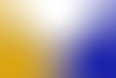

## S_GradientMulti

使用多个控制点在屏幕上生成平滑的多色渐变，并可选择将渐变与背景素材合成。

在 Sapphire Render 效果子菜单中。

### Inputs:

- **Background**: 当前图层。用于与渐变合成的素材。

- **Mask**: 默认为无。在结果和源输入之间进行插值。白色区域使用效果结果，黑色区域使用源素材。

### Parameters:

- **Load Preset** (Push-button)
  打开预设浏览器，浏览此效果的所有可用预设。

- **Save Preset** (Push-button)
  打开预设保存对话框，保存此效果的预设。

- **Mocha Project** (Default: 0, Range: 0 or greater)
  打开 Mocha 窗口，用于跟踪素材和生成遮罩。

- **Blur Mocha** (Default: 0, Range: 0 or greater)
  在使用前按此数值模糊 Mocha 遮罩。可用于柔化遮罩的边缘或量化伪影，并平滑时间位移。

- **Mocha Opacity** (Default: 1, Range: 0 to 1)
  控制 Mocha 遮罩的强度。较低的值会降低效果的强度。

- **Invert Mocha** (Check-box, Default: off)
  如果启用，在应用效果前反转 Mocha 遮罩的黑白。

- **Resize Mocha** (Default: 1, Range: 0 to 2)
  缩放 Mocha 遮罩。1.0 为原始大小。

- **Resize Rel X** (Default: 1, Range: 0 to 2)
  Mocha 遮罩的相对水平大小。

- **Resize Rel Y** (Default: 1, Range: 0 to 2)
  Mocha 遮罩的相对垂直大小。

- **Shift Mocha** (X & Y, Default: [0 0], Range: any)
  偏移 Mocha 遮罩的位置。

- **Dilate Mocha** (Default: 0, Range: -100 to 100)
  在使用前按此像素量膨胀或侵蚀 Mocha 遮罩。

- **Dilation Quality** (Popup menu, Default: Fast)
  选择 Dilate Mocha 是在默认的快速模式下快速调整，还是在高质量模式下获得更好的效果。
  - **Fast**: 在快速模式下膨胀 Mocha 遮罩，用于快速调整。
  - **High**: 在高质量模式下膨胀 Mocha 遮罩，获得更好的遮罩形状。

- **Bypass Mocha** (Check-box, Default: off)
  忽略 Mocha 遮罩，将效果应用于整个源素材。

- **Show Mocha Only** (Check-box, Default: off)
  绕过效果，仅显示 Mocha 遮罩本身。

- **Combine Masks** (Popup menu, Default: Union)
  当两个遮罩同时提供给效果时，确定如何合并 Mocha 遮罩和输入遮罩。
  - **Union**: 使用两个遮罩共同覆盖的区域。
  - **Intersect**: 使用两个遮罩之间重叠的区域。
  - **Mocha Only**: 忽略输入遮罩，仅使用 Mocha 遮罩。

- **Softness** (Default: 1, Range: 0.01 or greater)
  颜色区域之间边缘的柔和度。增加此参数会创建更平滑的渐变，减小则会创建更锐利的边缘和更清晰的颜色。

- **Softness Falloff** (Default: 0, Range: 0 or greater)
  随着与控制点距离的增加而降低柔和度。较高的值会在图像边缘附近创建更清晰的颜色区域，较低的值会使颜色更多地混合在一起。

### Point 1 Parameters:

Point 1 Enable:
*Check-box, Default:
*on.开启或关闭第一个控制点。

Color 1:
*Default rgb:
*[1 0 0].控制点 1 处的颜色。

Point 1:
*X & Y, Default:
*[-0.972 -0.719],
*Range:
*any.第一个控制点。可使用 Point 1 Widget 调整此参数。

Softness 1:
*Default:
*1,
*Range:
*0.1 or greater.颜色 1 的相对柔和度。

Size 1:
*Default:
*1,
*Range:
*0.1 or greater.
缩放以控制点 1 为中心的颜色大小。

### Point 2 Parameters:

Point 2 Enable:
*Check-box, Default:
*on.开启或关闭第二个控制点。

Color 2:
*Default rgb:
*[0 1 0].控制点 2 处的颜色。

Point 2:
*X & Y, Default:
*[-0.972 0.701],
*Range:
*any.第二个控制点。可使用 Point 2 Widget 调整此参数。

Softness 2:
*Default:
*1,
*Range:
*0.1 or greater.颜色 2 的相对柔和度。

Size 2:
*Default:
*1,
*Range:
*0.1 or greater.
缩放以控制点 2 为中心的颜色大小。

### Point 3 Parameters:

Point 3 Enable:
*Check-box, Default:
*on.开启或关闭第三个控制点。

Color 3:
*Default rgb:
*[0 0 1].控制点 3 处的颜色。

Point 3:
*X & Y, Default:
*[0.972 0.701],
*Range:
*any.第三个控制点。可使用 Point 3 Widget 调整此参数。

Softness 3:
*Default:
*1,
*Range:
*0.1 or greater.颜色 3 的相对柔和度。

Size 3:
*Default:
*1,
*Range:
*0.1 or greater.
缩放以控制点 3 为中心的颜色大小。

### Point 4 Parameters:

Point 4 Enable:
*Check-box, Default:
*off.开启或关闭第四个控制点。

Color 4:
*Default rgb:
*[1 1 1].控制点 4 处的颜色。

Point 4:
*X & Y, Default:
*[0.972 -0.719],
*Range:
*any.第四个控制点。可使用 Point 4 Widget 调整此参数。

Softness 4:
*Default:
*1,
*Range:
*0.1 or greater.颜色 4 的相对柔和度。

Size 4:
*Default:
*1,
*Range:
*0.1 or greater.
缩放以控制点 4 为中心的颜色大小。

### Point 5 Parameters:

Point 5 Enable:
*Check-box, Default:
*off.开启或关闭第五个控制点。

Color 5:
*Default rgb:
*[1 1 0].控制点 5 处的颜色。

Point 5:
*X & Y, Default:
*[-0.167 0],
*Range:
*any.第五个控制点。可使用 Point 5 Widget 调整此参数。

Softness 5:
*Default:
*1,
*Range:
*0.1 or greater.颜色 5 的相对柔和度。

Size 5:
*Default:
*1,
*Range:
*0.1 or greater.
缩放以控制点 5 为中心的颜色大小。

### Point 6 Parameters:

Point 6 Enable:
*Check-box, Default:
*off.开启或关闭第六个控制点。

Color 6:
*Default rgb:
*[0 1 1].控制点 6 处的颜色。

Point 6:
*X & Y, Default:
*[0.167 0],
*Range:
*any.第六个控制点。可使用 Point 6 Widget 调整此参数。

Softness 6:
*Default:
*1,
*Range:
*0.1 or greater.颜色 6 的相对柔和度。

Size 6:
*Default:
*1,
*Range:
*0.1 or greater.缩放以控制点 6 为中心的颜色大小。

Combine:
*Popup menu, Default: Grad Only
*.确定渐变与背景的合成方式。
*Grad Only:
*仅显示渐变图像，不包含背景。*Mult:
*背景与渐变相乘。*Add:
*背景与渐变相加。*Screen:
*背景与渐变使用滤色操作混合。*Difference:
*结果为背景与渐变的差值。*Overlay:
*使用叠加功能合并渐变和背景。

Bg Brightness:
*Default:
*1,
*Range:
*0 or greater.在与渐变合成之前缩放背景的亮度。

Input Opacity:
*Popup menu, Default: Normal
*.确定处理不透明度/透明度的方法。
*All Opaque:
*当输入图像完全不透明且无透明度（alpha=1）时，使用此选项可略微加快渲染速度。*Normal:
*正常处理不透明度。*As Premult:
*按预乘形式处理图像（颜色已按不透明度缩放）。此选项的渲染速度也略快于正常模式，但结果也将为预乘形式，有时可能不太准确。

Output Opacity:
*Popup menu, Default: Copy From Input
*.确定结果的不透明度/透明度。此效果不处理输入的不透明度（Alpha 通道），但可以从输入复制不透明度，或输出完全不透明的结果。
*All Opaque:
*使结果完全不透明，无透明度。*Copy From Input:
*从提供给此效果的当前图层复制不透明度/透明度。

Mask Use:
*Popup menu, Default: Luma
*.确定如何使用遮罩输入通道来生成单色遮罩。
*Luma:
*使用 RGB 通道的亮度。*Alpha:
*仅使用 Alpha 通道。

Blur Mask:
*Default:
*0.05,
*Range:
*0 or greater.在使用前按此数值模糊蒙版输入。这可以提供遮罩区域和非遮罩区域之间更平滑的过渡。除非提供了蒙版输入，否则无效。

Invert Mask:
*Check-box, Default:
*off.
如果开启，反转蒙版输入，使效果应用于蒙版为黑色而非白色的区域。除非提供了蒙版输入，否则无效。
