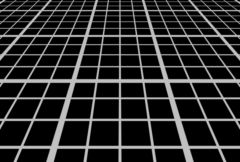

## S_Grid

生成网格线并将其与背景素材合成。调整 Latitude、Swing 和 Roll 参数可在各轴上旋转网格，调整 Shift 和 Z Dist 可进行平移和缩放。

在 Sapphire Render 效果子菜单中。

### Inputs:

- **Background**: 当前图层。用于绘制网格的素材。

- **Mask**: 默认为无。在结果和源输入之间进行插值。白色区域使用效果结果，黑色区域使用源素材。

### Parameters:

- **Load Preset** (Push-button)
  打开预设浏览器，浏览此效果的所有可用预设。

- **Save Preset** (Push-button)
  打开预设保存对话框，保存此效果的预设。

- **Mocha Project** (Default: 0, Range: 0 or greater)
  打开 Mocha 窗口，用于跟踪素材和生成遮罩。

- **Blur Mocha** (Default: 0, Range: 0 or greater)
  在使用前按此数值模糊 Mocha 遮罩。可用于柔化遮罩的边缘或量化伪影，并平滑时间位移。

- **Mocha Opacity** (Default: 1, Range: 0 to 1)
  控制 Mocha 遮罩的强度。较低的值会降低效果的强度。

- **Invert Mocha** (Check-box, Default: off)
  如果启用，在应用效果前反转 Mocha 遮罩的黑白。

- **Resize Mocha** (Default: 1, Range: 0 to 2)
  缩放 Mocha 遮罩。1.0 为原始大小。

- **Resize Rel X** (Default: 1, Range: 0 to 2)
  Mocha 遮罩的相对水平大小。

- **Resize Rel Y** (Default: 1, Range: 0 to 2)
  Mocha 遮罩的相对垂直大小。

- **Shift Mocha** (X & Y, Default: [0 0], Range: any)
  偏移 Mocha 遮罩的位置。

- **Dilate Mocha** (Default: 0, Range: -100 to 100)
  在使用前按此像素量膨胀或侵蚀 Mocha 遮罩。

- **Dilation Quality** (Popup menu, Default: Fast)
  选择 Dilate Mocha 是在默认的快速模式下快速调整，还是在高质量模式下获得更好的效果。
  - **Fast**: 在快速模式下膨胀 Mocha 遮罩，用于快速调整。
  - **High**: 在高质量模式下膨胀 Mocha 遮罩，获得更好的遮罩形状。

- **Bypass Mocha** (Check-box, Default: off)
  忽略 Mocha 遮罩，将效果应用于整个源素材。

- **Show Mocha Only** (Check-box, Default: off)
  绕过效果，仅显示 Mocha 遮罩本身。

- **Combine Masks** (Popup menu, Default: Union)
  当两个遮罩同时提供给效果时，确定如何合并 Mocha 遮罩和输入遮罩。
  - **Union**: 使用两个遮罩共同覆盖的区域。
  - **Intersect**: 使用两个遮罩之间重叠的区域。
  - **Mocha Only**: 忽略输入遮罩，仅使用 Mocha 遮罩。

- **Boxes** (X & Y, Integer, Default: [24 16], Range: 1 or greater)
  水平和垂直方向上网格单元的总数。

- **Grid Size** (Default: 1, Range: 0 or greater)
  缩放网格对象的大小。

- **Grid Size X** (Default: 1, Range: 0 or greater)
  缩放网格的相对水平大小。

- **Grid Size Y** (Default: 0.75, Range: 0 or greater)
  缩放网格的相对垂直大小。

- **Shift** (X & Y, Default: [0 0], Range: any)
  按此数值平移网格。

- **Line Width** (Default: 1.16, Range: 0 or greater)
  缩放所有网格线的粗细。

- **H Line Rel Width** (Default: 1, Range: 0 or greater)
  缩放水平线的相对粗细。

- **V Line Rel Width** (Default: 1, Range: 0 or greater)
  缩放垂直线的相对粗细。

- **Major Line Spacing** (Integer, Default: 4, Range: 0 or greater)
  每隔此数量的线绘制更粗的线。如果为零，则禁用主线，所有线宽度相同。

- **Major Line Width** (Default: 2.5, Range: 1 or greater)
  主线的相对粗细。

- **Brightness** (Default: 1, Range: 0 or greater)
  缩放网格颜色的亮度。

- **Color** (Default rgb: [1 1 1])
  网格的颜色。

- **Grid Opacity** (Default: 1, Range: 0 to 1)
  网格的不透明度。较低的值允许更多背景透过显示。

- **Latitude** (Default: 0, Range: -89 to 89)
  将网格向上或向下倾斜此度数。

- **Swing** (Default: 0, Range: any)
  网格在其初始帧中的旋转角度（度）。

- **Roll** (Default: 0, Range: any)
  将网格从一侧倾斜到另一侧，以度为单位。如果 Latitude 为 0，则 Swing 和 Roll 的效果相同。

- **Z Dist** (Default: 1, Range: 0.01 or greater)
  缩放网格的"距离"。大于 1.0 的值使其移远并缩小，小于 1.0 的值使其靠近并放大。

- **Tele Lens Width** (Default: 1, Range: 0.2 to 3)
  镜头望远程度。增加以在较少透视的情况下放大，减小以获得更宽的视角和更多透视效果。

- **Bg Brightness** (Default: 1, Range: 0 or greater)
  在与网格合成之前缩放背景的亮度。如果为 0，结果将仅包含黑色背景上的网格图像。

- **Combine** (Popup menu, Default: Over)
  确定网格与背景的合成方式。
  - **Over**: 将网格合成在背景之上。
  - **Exclusion**: 使用差值运算符合并网格和背景。
  - **Grid Only**: 在黑色背景上显示网格，忽略背景。

- **Opacity** (Popup menu, Default: Normal)
  确定处理不透明度/透明度的方法。
  - **All Opaque**: 当输入图像完全不透明且无透明度（alpha=1）时，使用此选项可略微加快渲染速度。
  - **Normal**: 正常处理不透明度。
  - **As Premult**: 按预乘形式处理图像（颜色已按不透明度缩放）。此选项的渲染速度也略快于正常模式，但结果也将为预乘形式，有时可能不太准确。

- **Mask Use** (Popup menu, Default: Luma)
  确定如何使用遮罩输入通道来生成单色遮罩。
  - **Luma**: 使用 RGB 通道的亮度。
  - **Alpha**: 仅使用 Alpha 通道。

- **Blur Mask** (Default: 0.05, Range: 0 or greater)
  在使用前按此数值模糊蒙版输入。这可以提供遮罩区域和非遮罩区域之间更平滑的过渡。除非提供了蒙版输入，否则无效。

- **Invert Mask** (Check-box, Default: off)
  如果开启，反转蒙版输入，使效果应用于蒙版为黑色而非白色的区域。除非提供了蒙版输入，否则无效。
