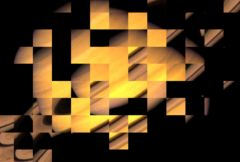

## S_TileScramble

将图像分割成矩形瓦片，并移动每个瓦片内的图像，以创建类似于一面由小型随机朝向的镜子组成的墙壁反射源图像的效果。移动的数量和方向可以控制。

在 Sapphire Stylize 效果子菜单中。

### Inputs:

- **Source**: 当前图层。要扭曲的输入片段。

- **Matte**: 默认为无。如果提供，扭曲的幅度将按此输入片段的值进行缩放。灰度值在内部缩放扭曲幅度，而不是简单地在效果和原始源之间交叉淡化，从而在蒙版边缘获得更连续的结果，并对扭曲量进行更精细的控制。此输入可通过 Blur Matte、Invert Matte 或 Matte Use 参数进行调整。

### Parameters:

- **Load Preset** (Push-button)
  打开预设浏览器，浏览此效果的所有可用预设。

- **Save Preset** (Push-button)
  打开预设保存对话框，保存此效果的预设。

- **Mocha Project** (Default: 0, Range: 0 or greater)
  打开 Mocha 窗口，用于跟踪素材和生成遮罩。

- **Blur Mocha** (Default: 0, Range: 0 or greater)
  在使用前按此数量模糊 Mocha 遮罩。可用于柔化遮罩的边缘或量化伪影，并平滑时间位移。

- **Mocha Opacity** (Default: 1, Range: 0 to 1)
  控制 Mocha 遮罩的强度。较低的值会降低效果的强度。

- **Invert Mocha** (Check-box, Default: off)
  如果启用，在应用效果之前反转 Mocha 遮罩的黑白。

- **Resize Mocha** (Default: 1, Range: 0 to 2)
  缩放 Mocha 遮罩。1.0 为原始大小。

- **Resize Rel X** (Default: 1, Range: 0 to 2)
  Mocha 遮罩的相对水平大小。

- **Resize Rel Y** (Default: 1, Range: 0 to 2)
  Mocha 遮罩的相对垂直大小。

- **Shift Mocha** (X & Y, Default: [0 0], Range: any)
  偏移 Mocha 遮罩的位置。

- **Dilate Mocha** (Default: 0, Range: -100 to 100)
  在使用前按此像素量膨胀或腐蚀 Mocha 遮罩。

- **Dilation Quality** (Popup menu, Default: Fast)
  选择 Dilate Mocha 是在默认的 Fast 模式下快速调整，还是在 High 质量模式下获得更好的效果。
  - **Fast**: 在 Fast 模式下膨胀 Mocha 遮罩，用于快速调整。
  - **High**: 在 High 质量模式下膨胀 Mocha 遮罩，获得更好的遮罩形状。

- **Bypass Mocha** (Check-box, Default: off)
  忽略 Mocha 遮罩，将效果应用于整个源片段。

- **Show Mocha Only** (Check-box, Default: off)
  绕过效果，仅显示 Mocha 遮罩本身。

- **Combine Masks** (Popup menu, Default: Union)
  当两个遮罩都提供给效果时，确定如何组合 Mocha 遮罩和输入遮罩。
  - **Union**: 使用两个遮罩共同覆盖的区域。
  - **Intersect**: 使用两个遮罩之间重叠的区域。
  - **Mocha Only**: 忽略输入遮罩，仅使用 Mocha 遮罩。

- **Scramble Speed** (Default: 0.1, Range: any)
  应用于每个瓦片的扰乱程度。零表示保持原始图像。

- **Scramble Rel X** (Default: 1, Range: 0 or greater)
  X 方向的相对扰乱量。设为零可仅获得垂直方向的扰乱。

- **Scramble Rel Y** (Default: 1, Range: 0 or greater)
  Y 方向的相对扰乱量。设为零可仅获得水平方向的扰乱。

- **Tiles** (Default: 10, Range: 1 or greater)
  图像上的瓦片数量。增大可获得更多微小的瓦片；减小可获得较少的大瓦片。

- **Tile Rel Width** (Default: 1, Range: 0.01 or greater)
  缩放每个瓦片的高度。

- **Tile Rel Height** (Default: 1, Range: 0.01 or greater)
  缩放每个瓦片的宽度。

- **Tile Shift** (X & Y, Default: [0 0], Range: any)
  在 X 和 Y 方向移动瓦片的边缘。这不会移动瓦片的内容，只移动边界。添加动画可获得有趣的效果。

- **Rotate Warp Dir** (Default: 0, Range: any)
  将扭曲方向旋转此度数。添加动画以旋转瓦片可获得有趣的效果。

- **Z Dist** (Default: 1, Range: 0.01 or greater)
  缩放每个瓦片中图像相对于其中心的距离。增大以缩小，减小以放大。

- **Seed** (Default: 0.123, Range: 0 or greater)
  用于初始化随机数生成器。实际的种子值不重要，但不同的种子会产生不同的结果，相同的值应产生可重复的结果。

- **Wrap** (Popup menu, Default: No)
  确定访问源图像边界之外区域的方法。
  - **No**: 边界之外显示黑色。
  - **Tile**: 重复图像的副本。
  - **Reflect**: 重复图像的镜像副本。使用此方法时边缘通常不太明显。

- **Filter** (Check-box, Default: off)
  如果启用，图像在缩小重新采样时会进行滤波。当 Z Dist 大于 1 时，这可以获得更好的质量结果。当 Z Dist 为 1 或更小时无效。

- **Blur Matte** (Default: 0, Range: 0 or greater)
  在使用前按此数量模糊蒙版输入。这可以在蒙版和非蒙版区域之间提供更平滑的过渡。除非提供了蒙版输入，否则无效。

- **Invert Matte** (Check-box, Default: off)
  如果启用，反转蒙版输入，使效果应用于蒙版为黑色而非白色的区域。除非提供了蒙版输入，否则无效。

- **Matte Use** (Popup menu, Default: Luma)
  确定如何使用蒙版输入通道来生成单色蒙版。
  - **Luma**: 使用 RGB 通道的亮度。
  - **Alpha**: 仅使用 Alpha 通道。

- **Opacity** (Popup menu, Default: Normal)
  确定处理不透明度/透明度的方法。
  - **All Opaque**: 当输入图像完全不透明且没有透明度（alpha=1）时，使用此选项可稍微加快渲染速度。
  - **Normal**: 正常处理不透明度。
  - **As Premult**: 按图像已经是预乘形式处理（颜色已按不透明度缩放）。此选项的渲染速度也比 Normal 模式略快，但结果也将是预乘形式，有时可能不太准确。如果图像在蒙版通道边缘也有锐利变化的颜色区域，使用 Normal 模式可能会获得更好的结果。

- **Crop Input Parameters** (Default: 0, Range: 0 or greater)
  这 4 个参数（Crop Top、Crop Bottom、Crop Left 和 Crop Right）允许选择输入图像的矩形子区域进行处理。如果 Wrap 参数设置为"No"，暴露的边界将是透明的。如果 Wrap 为"Tile"或"Reflect"，源图像将在新的裁剪边界上进行包裹以填充画面。这可以更容易地避免因扭曲具有不良边缘的图像而产生的伪影。
