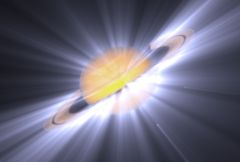

## S_EdgeRays

从输入素材的边缘生成光束。您可以提供遮罩输入来选择性地缩放光线的颜色。如果遮罩类型设置为 Color，您还可以使用遮罩输入在不同区域对光线进行不同的着色。将 Rays Res 参数设置为 1/2 可获得更快的渲染速度，光线会略微柔和一些。

在 Sapphire Lighting 效果子菜单中。

### Inputs:

- **Source**: 当前图层。要处理的素材。

- **Background**: 默认为无。用作背景的素材。

- **Matte**: 默认为无。如果提供了此输入，光线颜色将按此输入进行缩放。可以使用单色遮罩来选择生成光线的区域子集。如果遮罩类型设置为 Color，可以使用彩色遮罩输入在不同区域选择性地调整光线颜色。此输入可以选择使用 Blur Matte 或 Invert Matte 参数进行模糊或反转。

### Parameters:

- **Load Preset** (Push-button)
  打开预设浏览器，浏览此效果的所有可用预设。

- **Save Preset** (Push-button)
  打开预设保存对话框，保存此效果的预设。

- **Mocha Project** (Default: 0, Range: 0 or greater)
  打开 Mocha 窗口，用于跟踪素材和生成遮罩。

- **Blur Mocha** (Default: 0, Range: 0 or greater)
  在使用前按此数量模糊 Mocha 遮罩。可用于柔化遮罩的边缘或量化伪影，并平滑时间位移。

- **Mocha Opacity** (Default: 1, Range: 0 to 1)
  控制 Mocha 遮罩的强度。较低的值会降低效果的强度。

- **Invert Mocha** (Check-box, Default: off)
  如果启用，在应用效果之前反转 Mocha 遮罩的黑白。

- **Resize Mocha** (Default: 1, Range: 0 to 2)
  缩放 Mocha 遮罩。1.0 为原始大小。

- **Resize Rel X** (Default: 1, Range: 0 to 2)
  Mocha 遮罩的相对水平大小。

- **Resize Rel Y** (Default: 1, Range: 0 to 2)
  Mocha 遮罩的相对垂直大小。

- **Shift Mocha** (X & Y, Default: [0 0], Range: any)
  偏移 Mocha 遮罩的位置。

- **Dilate Mocha** (Default: 0, Range: -100 to 100)
  在使用前按此像素数量膨胀或侵蚀 Mocha 遮罩。

- **Dilation Quality** (Popup menu, Default: Fast)
  选择 Dilate Mocha 是在默认的 Fast 模式下快速调整，还是在 High 质量模式下获得更好的效果。
  - **Fast**: 在 Fast 模式下进行 Dilate Mocha，用于快速调整。
  - **High**: 在 High 质量模式下进行 Dilate Mocha，获得更好的遮罩形状。

- **Bypass Mocha** (Check-box, Default: off)
  忽略 Mocha 遮罩，将效果应用于整个源素材。

- **Show Mocha Only** (Check-box, Default: off)
  跳过效果，仅显示 Mocha 遮罩本身。

- **Combine Masks** (Popup menu, Default: Union)
  确定当同时提供 Mocha 遮罩和输入遮罩时如何组合它们。
  - **Union**: 使用两个遮罩共同覆盖的区域。
  - **Intersect**: 使用两个遮罩之间重叠的区域。
  - **Mocha Only**: 忽略输入遮罩，仅使用 Mocha 遮罩。

- **Center** (X & Y, Default: [0 0], Range: any)
  光线向外发射的位置。可以使用 Center Widget 调整此参数。

- **Center Uses Mocha** (Check-box, Default: off)
  控制中心是由 Center 参数控制，还是跟随 Mocha 内部跟踪的中心点。

- **Smooth Center Track** (Integer, Default: 0, Range: 0 or greater)
  控制在稳定 Mocha 点跟踪时平均多少个点。

- **Rays Length** (Default: 0.25, Range: -5 to 1)
  光线的长度。长度为 1.0 时光线会无限延伸，但在延伸过程中可能仍会逐渐消退。要使光线看起来更长，您还可以增加 Bias Outer Bright 参数。如果 Rays Length 为负值，光线可以向内发射而非向外。请注意，光线越长处理时间越长。可以使用 Center Widget 调整此参数。

- **Length Red** (Default: 1, Range: 0 or greater)
  光线红色通道的相对长度。调整此参数以及 Length Green 和 Length Blue，可以创建色散效果。

- **Length Green** (Default: 1, Range: 0 or greater)
  光线绿色通道的相对长度。

- **Length Blue** (Default: 1, Range: 0 or greater)
  光线蓝色通道的相对长度。

- **Reverse Rays** (Default: 0, Range: 0 or greater)
  将光线向内延伸以及向外延伸。反向光线的长度由 Rays Length 和此参数共同控制。

- **Rays Brightness** (Default: 2, Range: 0 or greater)
  缩放光束的亮度。

- **Blur Rays** (Default: 0, Range: 0 or greater)
  在应用到源图像之前，仅对光线进行模糊处理。

- **Blur Rays Rel** (X & Y, Default: [1 1], Range: 0 or greater)
  应用于光线的相对水平和垂直模糊宽度。将 Blur Rays Rel X 设置为 0 可获得仅垂直模糊，将 Blur Rays Rel Y 设置为 0 可获得仅水平模糊。

- **Rays Color** (Default rgb: [1 1 1])
  缩放光束的颜色。

- **Enable Dark Rays** (Check-box, Default: off)
  允许光线使源图像变暗以及变亮。如果启用，较暗的 Rays Color 会使光线使源图像变暗。较亮的 Rays Color 则照常使源图像变亮。

- **Bias Outer Bright** (Default: 0, Range: 0 to 1)
  确定沿光线方向的可变亮度。通常接近 0，使光线在外端逐渐消退；0.5 使光线沿途亮度相等；1.0 使末端亮度最大。

- **Rays Res** (Popup menu, Default: Full)
  选择光线的分辨率因子。较高的分辨率产生更锐利的光线，较低的分辨率产生更平滑的光线和更快的处理速度。此"Res"因子仅影响光线：背景仍以全分辨率与光线合成。
  - **Full**: 使用全分辨率。
  - **Half**: 以半分辨率计算光线。
  - **Quarter**: 以四分之一分辨率计算光线。

- **Show** (Popup menu, Default: Result)
  在输出选项之间进行选择。
  - **Result**: 在背景上输出光线。
  - **Edges**: 仅输出边缘图像。在调整边缘或微光参数时可能很有用。
  - **Rays**: 仅在黑色背景上输出光线图像。

- **Edge Thickness** (Default: 0.022, Range: 0 or greater)
  生成光线的边缘的厚度。

- **Edge Brightness** (Default: 1, Range: 0 or greater)
  缩放生成光线的边缘的亮度。

- **Edge Subpixel** (Check-box, Default: on)
  启用亚像素精度的 Edge Thickness 数量。如果您正在对 Edge Thickness 进行动画处理，或者希望更精细地控制较小的值，请开启此选项。

- **Shimmer Amp** (Default: 0.5, Range: 0 or greater)
  使用此数量的噪波纹理调制光线源图像，使光线呈现闪烁效果。

- **Shimmer Freq** (Default: 40, Range: 0.1 or greater)
  闪烁纹理的频率。增大可获得更精细的闪烁效果，减小可获得更大、更柔和的闪烁。除非 Shimmer Amp 为正值，否则此参数无效。

- **Shimmer Seed** (Default: 0.123, Range: 0 or greater)
  用于初始化闪烁纹理的随机数生成器。实际的种子值并不重要，但不同的种子会产生不同的结果，相同的值应产生可重复的结果。

- **Shimmer Shift** (X & Y, Default: [0 0], Range: any)
  闪烁纹理的平移。除非 Shimmer Amp 为正值，否则此参数无效。

- **Shimmer Speed** (X & Y, Default: [0 0], Range: any)
  闪烁纹理的平移速度。如果非零，闪烁会自动以此速率进行动画平移。

- **Atmosphere Amp** (Default: 0, Range: 0 or greater)
  大气效果模拟光线穿过尘埃大气层并吸收光线或被遮挡的效果。此参数调整大气效果的数量或振幅。零值产生平滑的光线，较高的值产生更多的尘埃外观。

- **Atmosphere Freq** (Default: 1, Range: 0.1 to 20)
  控制大气噪波的空间频率。调高可获得更精细的细节，调低可获得更宽泛的整体变化。

- **Atmosphere Detail** (Default: 0.6, Range: 0 to 1)
  控制大气模拟中精细细节的数量。减小可获得更平滑的大气效果，增大可获得更粗糙或颗粒感的外观。

- **Atmosphere Speed** (Default: 1, Range: any)
  大气中的云状噪波会随时间演变，就像真实的尘埃云一样；此参数控制云图案随时间变化的速度。设置为零可获得静态图案。

- **Affect Alpha** (Default: 1, Range: 0 or greater)
  如果此值为正，输出的 Alpha 通道将包含来自光线的一些不透明度。红、绿、蓝光线亮度的最大值按此值缩放，并在每个像素处与背景 Alpha 合成。

- **Rays From Alpha** (Default: 0, Range: 0 to 1)
  设置为 1 可从源素材的 Alpha 通道边缘而非 RGB 通道生成光线。这通常会减少从内部边缘生成的光线。0 到 1 之间的值在使用 RGB 和 Alpha 之间进行插值。

- **Rays Under Source** (Default: 0, Range: 0 to 1)
  设置为 1 可将源输入合成在光线之上。

- **Source Opacity** (Default: 1, Range: 0 to 1)
  与光线合成时缩放源输入的不透明度。这不影响光线本身的生成。

- **Bg Brightness** (Default: 1, Range: 0 or greater)
  在与光线合成之前缩放背景的亮度。此参数仅在提供了背景输入时有效。

- **Matte Type** (Popup menu, Default: Luma)
  除非提供了遮罩输入，否则忽略此设置。
  - **Luma**: 使用遮罩输入的亮度来缩放光线的亮度。
  - **Color**: 使用遮罩输入的 RGB 通道来缩放光线的颜色。
  - **Alpha**: 使用遮罩输入的 Alpha 通道来缩放光线的亮度。

- **Blur Matte** (Default: 0, Range: 0 or greater)
  在使用前按此数量模糊遮罩输入。可以在遮罩区域和非遮罩区域之间提供更平滑的过渡。除非提供了遮罩输入，否则无效。

- **Invert Matte** (Check-box, Default: off)
  如果开启，反转遮罩输入，使效果应用于遮罩为黑色的区域而非白色区域。除非提供了遮罩输入，否则无效。

- **Opacity** (Popup menu, Default: Normal)
  确定处理不透明度/透明度的方法。
  - **All Opaque**: 当输入图像完全不透明且没有透明度 (alpha=1) 时，使用此选项可稍快地渲染。
  - **Normal**: 正常处理不透明度。
  - **As Premult**: 假设图像已经是预乘形式（颜色已按不透明度缩放）进行处理。此选项的渲染速度也比 Normal 模式略快，但结果也将是预乘形式，有时可能不太正确。

- **Show Center** (Check-box, Default: on)
  开启或关闭用于调整 Center 和 Rays Length 参数的屏幕用户界面控件。此参数仅在 AE 和 Premiere 中出现，这些软件支持屏幕控件。
