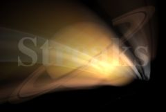

## S_Streaks

将源素材的明亮区域进行运动模糊，在 From 和 To 变换之间形成条纹。这可用于创建延长的胶片曝光效果，或模拟柔和的光束。From 和 To 参数不涉及时间，它们描述了空间中的两个变换，决定了应用于每帧的模糊样式。

在 Sapphire Lighting 效果子菜单中。

### Inputs:

- **Source**: 当前图层。要处理的素材。

- **Matte**: 默认为无。如果提供了此输入，在确定产生条纹的区域之前，源素材会按此输入素材的值进行缩放。可用于选择性地移除或减少应用于源素材特定区域的条纹。

### Parameters:

- **Load Preset** (Push-button)
  打开预设浏览器，浏览此效果的所有可用预设。

- **Save Preset** (Push-button)
  打开预设保存对话框，保存此效果的预设。

- **Mocha Project** (Default: 0, Range: 0 or greater)
  打开 Mocha 窗口，用于跟踪素材和生成遮罩。

- **Blur Mocha** (Default: 0, Range: 0 or greater)
  在使用前按此数量模糊 Mocha 遮罩。可用于柔化遮罩的边缘或量化伪影，并平滑时间位移。

- **Mocha Opacity** (Default: 1, Range: 0 to 1)
  控制 Mocha 遮罩的强度。较低的值会降低效果的强度。

- **Invert Mocha** (Check-box, Default: off)
  如果启用，在应用效果之前反转 Mocha 遮罩的黑白。

- **Resize Mocha** (Default: 1, Range: 0 to 2)
  缩放 Mocha 遮罩。1.0 为原始大小。

- **Resize Rel X** (Default: 1, Range: 0 to 2)
  Mocha 遮罩的相对水平大小。

- **Resize Rel Y** (Default: 1, Range: 0 to 2)
  Mocha 遮罩的相对垂直大小。

- **Shift Mocha** (X & Y, Default: [0 0], Range: any)
  偏移 Mocha 遮罩的位置。

- **Dilate Mocha** (Default: 0, Range: -100 to 100)
  在使用前按此像素数量膨胀或侵蚀 Mocha 遮罩。

- **Dilation Quality** (Popup menu, Default: Fast)
  选择 Dilate Mocha 是在默认的 Fast 模式下快速调整，还是在 High 质量模式下获得更好的效果。
  - **Fast**: 在 Fast 模式下进行 Dilate Mocha，用于快速调整。
  - **High**: 在 High 质量模式下进行 Dilate Mocha，获得更好的遮罩形状。

- **Bypass Mocha** (Check-box, Default: off)
  忽略 Mocha 遮罩，将效果应用于整个源素材。

- **Show Mocha Only** (Check-box, Default: off)
  跳过效果，仅显示 Mocha 遮罩本身。

- **Combine Masks** (Popup menu, Default: Union)
  确定当同时提供 Mocha 遮罩和输入遮罩时如何组合它们。
  - **Union**: 使用两个遮罩共同覆盖的区域。
  - **Intersect**: 使用两个遮罩之间重叠的区域。
  - **Mocha Only**: 忽略输入遮罩，仅使用 Mocha 遮罩。

- **Center** (X & Y, Default: [0 0], Range: any)
  旋转和缩放的中心，以相对于画面中心的屏幕坐标表示。位移值应为零才能使此位置有意义。可以使用 Center Widget 调整此参数。

- **From Z Dist** (Default: 1, Range: 0.001 or greater)
  From 变换的"距离"。当 Shift 为 0 时，围绕 Center 位置进行缩放。增大可缩小，减小可放大。可以使用 From Transfm Widget 调整此参数。

- **From Rotate** (Default: 0, Range: any)
  From 变换的旋转角度，以度为单位，围绕中心旋转。可以使用 From Transfm Widget 调整此参数。

- **From Shift** (X & Y, Default: [0 0], Range: any)
  From 变换的水平和垂直平移。可用于定向运动。如果非零，中心位置的意义会减弱。可以使用 From Transfm Widget 调整此参数。

- **To Z Dist** (Default: 0.8, Range: 0.001 or greater)
  To 变换的"距离"。增大可缩小，减小可放大。可以使用 To Transform Widget 调整此参数。

- **To Rotate** (Default: 0, Range: any)
  To 变换的旋转角度，以度为单位，围绕中心旋转。请注意，如果 From 和 To 的旋转角度差异很大，它们之间的插值精度会降低。可以使用 To Transform Widget 调整此参数。

- **To Shift** (X & Y, Default: [0 0], Range: any)
  To 变换的水平和垂直平移。可用于定向运动。如果非零，中心位置的意义会减弱。可以使用 To Transform Widget 调整此参数。

- **Exposure Bias** (Default: 0, Range: 0 to 1)
  确定 From 和 To 变换之间路径上的可变曝光量。值为 0 时 From 端曝光更多，0.5 时路径上曝光均匀，1.0 时 To 端曝光更多。如果您在暗背景上有亮点，0 值会使处理后的亮点在 From 端更亮、在 To 端更暗，1.0 值则相反。

- **Streaks Brightness** (Default: 1, Range: 0 or greater)
  缩放条纹的亮度。

- **Threshold** (Default: 0.5, Range: 0 or greater)
  从源素材中亮度高于此值的位置生成条纹。值为 0.9 时仅在最亮的位置产生条纹。值为 0 时每个非黑色区域都会产生条纹。

- **Threshold Add Color** (Default rgb: [0 0 0])
  可用于提高特定颜色的阈值，从而减少源素材中包含该颜色的区域所生成的条纹。

- **Mix Source Darks** (Default: 1, Range: 0 to 1)
  源素材中未产生条纹的暗部分按此数量缩放并添加到结果中。这允许将有条纹和无条纹版本的源素材进行组合。

- **Mix Source Brights** (Default: 0, Range: 0 to 1)
  源素材中用于生成条纹的原始亮部分按此数量缩放并添加到结果中。这允许将源素材的一些未产生条纹的亮区域与输出进行组合。

- **Result Brightness** (Default: 1, Range: 0 or greater)
  缩放结果的亮度。

- **Combine** (Popup menu, Default: Add)
  确定条纹与背景的合成方式。
  - **Add**: 将条纹添加到背景上。
  - **Screen**: 执行混合功能，有助于防止过亮的结果。

- **Wrap** (Popup menu, Default: No)
  确定访问源图像边界外区域的方法。
  - **No**: 边界外为黑色。
  - **Tile**: 重复图像的副本。
  - **Reflect**: 重复图像的镜像副本。使用此方法时边缘通常不太明显。

- **Streaks Res** (Popup menu, Default: Full)
  选择条纹的分辨率因子。这类似于通用的"Res"因子参数，但仅影响条纹：与条纹混合的原始图像保持全分辨率。较高的分辨率提供更好的质量，较低的分辨率提供更快的处理速度。
  - **Full**: 使用全分辨率。
  - **Half**: 以半分辨率计算条纹。
  - **Quarter**: 以四分之一分辨率计算条纹。

- **Subpixel** (Check-box, Default: on)
  如果启用，使用质量更好但略慢的方法来渲染条纹。

- **Affect Alpha** (Default: 1, Range: 0 or greater)
  如果此值为正，输出的 Alpha 通道将包含来自条纹的一些不透明度。红、绿、蓝条纹亮度的最大值按此值缩放，并在每个像素处与背景 Alpha 合成。

- **Matte Type** (Popup menu, Default: Color)
  除非提供了遮罩输入，否则忽略此设置。
  - **Luma**: 使用遮罩输入的亮度来缩放条纹的亮度。
  - **Color**: 使用遮罩输入的 RGB 通道来缩放条纹的颜色。
  - **Alpha**: 使用遮罩输入的 Alpha 通道来缩放条纹的亮度。

- **Blur Matte** (Default: 0, Range: 0 or greater)
  在使用前按此数量模糊遮罩输入。可以在遮罩区域和非遮罩区域之间提供更平滑的过渡。除非提供了遮罩输入，否则无效。

- **Invert Matte** (Check-box, Default: off)
  如果开启，反转遮罩输入，使效果应用于遮罩为黑色的区域而非白色区域。除非提供了遮罩输入，否则无效。

- **Opacity** (Popup menu, Default: Normal)
  确定处理不透明度/透明度的方法。
  - **All Opaque**: 当输入图像完全不透明且没有透明度 (alpha=1) 时，使用此选项可稍快地渲染。
  - **Normal**: 正常处理不透明度。
  - **As Premult**: 假设图像已经是预乘形式（颜色已按不透明度缩放）进行处理。此选项的渲染速度也比 Normal 模式略快，但结果也将是预乘形式，有时可能不太正确。

- **Show Center** (Check-box, Default: on)
  开启或关闭用于调整 Center 参数的屏幕用户界面。此参数仅在 AE 和 Premiere 中出现，这些软件支持屏幕控件。

- **Show From Transfm** (Check-box, Default: on)
  开启或关闭用于调整 From Z Dist 和 From Rotate 参数的屏幕用户界面。此参数仅在 AE 和 Premiere 中出现，这些软件支持屏幕控件。

- **Show To Transform** (Check-box, Default: on)
  开启或关闭用于调整 To Z Dist 和 To Rotate 参数的屏幕用户界面。此参数仅在 AE 和 Premiere 中出现，这些软件支持屏幕控件。

- **Show From Shift** (Check-box, Default: off)
  开启或关闭用于调整 Center 参数的屏幕用户界面。此参数仅在 AE 和 Premiere 中出现，这些软件支持屏幕控件。

- **Show To Shift** (Check-box, Default: off)
  开启或关闭用于调整 Center 参数的屏幕用户界面。此参数仅在 AE 和 Premiere 中出现，这些软件支持屏幕控件。
