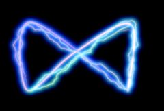

## S_UltraZap

沿样条线生成闪电效果并将其渲染在背景上。增大 Vary Endpoint 可以展开闪电末端。调整 Glow Color 可获得不同颜色的效果。调整 Loop Speed 参数可使闪电随时间沿样条线移动。

在 Sapphire Render 效果子菜单中。

### Inputs:

- **Background**: 当前图层。用于与辉光合成的片段。如果未提供背景，则源也用作背景。

- **Matte**: 默认为无。如果提供，定义闪电应渲染的区域。闪电上的辉光会渗透到没有闪电的区域，以获得自然的效果。

### Parameters:

- **Load Preset** (Push-button)
  打开预设浏览器，浏览此效果的所有可用预设。

- **Save Preset** (Push-button)
  打开预设保存对话框，保存此效果的预设。

- **Mode** (Popup menu, Default: UltraZap)
  选择跟随 Sapphire 样条线工具、AE 路径或 Mocha 轮廓。
  - **UltraZap**: 沿样条线创建电击效果。
  - **UltraZapAEPath**: 沿单个 AE 路径、所有 AE 路径或当前 AE 文字图层创建电击效果。此模式在 Premiere 中不可用。
  - **UltraZapMocha**: 沿单个 Mocha 蒙版轮廓或所有 Mocha 蒙版轮廓创建电击效果。

- **Mocha Project** (Default: 0, Range: 0 or greater)
  打开 Mocha 窗口，用于追踪素材和生成蒙版。

- **Blur Mocha** (Default: 0, Range: 0 or greater)
  在使用前按此量模糊 Mocha 蒙版。可用于柔化蒙版的边缘或量化伪影，并平滑时间偏移。

- **Mocha Opacity** (Default: 1, Range: 0 to 1)
  控制 Mocha 蒙版的强度。较低的值会减弱效果的强度。

- **Invert Mocha** (Check-box, Default: off)
  如果启用，在应用效果之前反转 Mocha 蒙版的黑白。

- **Resize Mocha** (Default: 1, Range: 0 to 2)
  缩放 Mocha 蒙版。1.0 为原始大小。

- **Resize Rel X** (Default: 1, Range: 0 to 2)
  Mocha 蒙版的相对水平大小。

- **Resize Rel Y** (Default: 1, Range: 0 to 2)
  Mocha 蒙版的相对垂直大小。

- **Shift Mocha** (X & Y, Default: [0 0], Range: any)
  偏移 Mocha 蒙版的位置。

- **Dilate Mocha** (Default: 0, Range: -100 to 100)
  在使用前按此像素量膨胀或腐蚀 Mocha 蒙版。

- **Dilation Quality** (Popup menu, Default: Fast)
  选择 Dilate Mocha 是在默认的快速模式下快速调整，还是在高质量模式下获得更好的效果。
  - **Fast**: 在快速模式下膨胀 Mocha 蒙版，便于快速调整。
  - **High**: 在高质量模式下膨胀 Mocha 蒙版，获得更好的蒙版形状。

- **Bypass Mocha** (Check-box, Default: on)
  忽略 Mocha 蒙版，将效果应用于整个源片段。

- **Show Mocha Only** (Check-box, Default: off)
  跳过效果，仅显示 Mocha 蒙版本身。

- **Combine Masks** (Popup menu, Default: Union)
  当同时提供 Mocha 蒙版和输入蒙版时，确定如何组合它们。
  - **Union**: 使用两个蒙版共同覆盖的区域。
  - **Intersect**: 使用两个蒙版重叠的区域。
  - **Mocha Only**: 忽略输入蒙版，仅使用 Mocha 蒙版。

- **Start Point** (X & Y, Default: [-0.5 0.5], Range: any)
  闪电的起始点。

- **Point 1 Enable** (Check-box, Default: off)
  打开或关闭第一个控制点。

- **Control Point 1** (X & Y, Default: [-0.34 0.304], Range: any)
  第一个样条线控制点。

- **Point 2 Enable** (Check-box, Default: off)
  打开或关闭第二个控制点。

- **Control Point 2** (X & Y, Default: [0.1 0.2], Range: any)
  第二个样条线控制点。

- **Point 3 Enable** (Check-box, Default: on)
  打开或关闭第三个控制点。

- **Control Point 3** (X & Y, Default: [0.4 0], Range: any)
  第三个样条线控制点。

- **Point 4 Enable** (Check-box, Default: off)
  打开或关闭第四个控制点。

- **Control Point 4** (X & Y, Default: [0.45 -0.25], Range: any)
  第四个样条线控制点。

- **End Point** (X & Y, Default: [0.5 -0.5], Range: any)
  闪电的终点。此参数可通过终点控件进行调整。

- **Start Uses Mocha** (Check-box, Default: off)
  控制起始点是由 Start 参数控制，还是跟随 Mocha 中的 Start 点追踪。

- **Smooth Start Track** (Integer, Default: 0, Range: 0 or greater)
  控制在稳定 Mocha 点追踪时平均多少个点。

- **Point1 Uses Mocha** (Check-box, Default: off)
  控制点 1 是由 Control Point 1 参数控制，还是跟随 Mocha 中的 Control Point 1 追踪。

- **Smooth Point1 Track** (Integer, Default: 0, Range: 0 or greater)
  控制在稳定 Mocha 点追踪时平均多少个点。

- **Point2 Uses Mocha** (Check-box, Default: off)
  控制点 2 是由 Control Point 2 参数控制，还是跟随 Mocha 中的 Control Point 2 追踪。

- **Smooth Point2 Track** (Integer, Default: 0, Range: 0 or greater)
  控制在稳定 Mocha 点追踪时平均多少个点。

- **Point3 Uses Mocha** (Check-box, Default: off)
  控制点 3 是由 Control Point 3 参数控制，还是跟随 Mocha 中的 Control Point 3 追踪。

- **Smooth Point3 Track** (Integer, Default: 0, Range: 0 or greater)
  控制在稳定 Mocha 点追踪时平均多少个点。

- **Point4 Uses Mocha** (Check-box, Default: off)
  控制点 4 是由 Control Point 4 参数控制，还是跟随 Mocha 中的 Control Point 4 追踪。

- **Smooth Point4 Track** (Integer, Default: 0, Range: 0 or greater)
  控制在稳定 Mocha 点追踪时平均多少个点。

- **End Uses Mocha** (Check-box, Default: off)
  控制终点是由 End 参数控制，还是跟随 Mocha 中的 End 点追踪。

- **Smooth End Track** (Integer, Default: 0, Range: 0 or greater)
  控制在稳定 Mocha 点追踪时平均多少个点。

- **Follow Selection** (Popup menu, Default: text)
  指定电击效果应追踪的内容。
  - **selected path**: 跟随在指定的单个 AE 路径。
  - **all paths**: 跟随应用于当前图层的所有 AE 蒙版。
  - **text**: 如果 UltraZap 应用于 AE 文字图层，此选项

- **Path To Follow** (Default: 0, Range: 0 or greater)
  闪电跟随的 AE 路径。

- **Bolts** (Integer, Default: 1, Range: 0 to 500)
  要绘制的闪电数量，每条闪电在起点和终点之间。

- **Bolt Width** (Default: 0.06, Range: 0 or greater)
  闪电的宽度。

- **Bolt Length** (Default: 1, Range: 0 to 1)
  闪电的长度，从 Start Offset 开始。如果小于 1，闪电将不会从起点到终点完全绘制。这对于制作闪电打击的动画很有用。

- **Wrinkle Amp** (Default: 1, Range: 0 or greater)
  缩放闪电中的褶皱量。减小可获得更直更平滑的闪电，增大可获得更弯曲的闪电。

- **Curve Amp** (Default: 0.5, Range: 0 or greater)
  类似于 Wrinkle Amp，但影响闪电的整体路径。如果减小，闪电将更贴近起点和终点之间的直线。如果增大，闪电可以偏离这条线更远。与 Wrinkle Amp 参数的区别在于，它可以使闪电更直的同时保留细节级别的褶皱。

- **Taper Start** (Default: 0.025, Range: 0 to 1)
  确定闪电起始端的尖锐程度。如果为 0，整条闪电宽度相等。如果为 1，闪电将沿整个长度逐渐变细形成尖端。如果为 0.5，闪电将从细开始，在闪电中心处增长到宽度参数的值。

- **Taper End** (Default: 0.25, Range: 0 to 1)
  确定闪电末端的尖锐程度。如果为 0，整条闪电宽度相等。如果为 1，闪电将沿整个长度逐渐变细形成尖端。如果为 0.5，闪电将从起点和终点的中间位置开始变细。

- **Feather Bolt** (Default: 0, Range: 0 or greater)
  在添加辉光之前为闪电添加柔和度。

- **Zap Edge Blur** (Default: 0, Range: 0 or greater)
  仅模糊电击效果的边缘——当电击效果有噪点时很有用。

- **Zap Brightness** (Default: 1, Range: 0 or greater)
  缩放闪电的亮度。

- **Start Color** (Default rgb: [0.87 0.969 1])
  主闪电起始处的颜色。

- **End Color** (Default rgb: [0 0.333 1])
  主闪电末端的颜色。

- **Vary Bolt Hue** (Default: 0, Range: -1 to 1)
  在多条闪电之间变化起始和终止颜色。不会改变单条闪电上的颜色。

- **Vary Width** (Default: 0, Range: 0 to 1)
  闪电沿其长度方向宽度的随机变化量。

- **Vary Endpoint** (Default: 0, Range: 0 or greater)
  在此半径的圆内随机偏移终点位置。如果 Bolts 大于 1，这对于分散不同的终点很有用。例如，您可以通过增大此半径并将终点放置在起点附近来创建多条辐射状闪电。此参数也可以在设为正值后通过终点控件进行调整。

- **Random Seed** (Default: 0.123, Range: 0 or greater)
  用于初始化随机数生成器。实际的种子值并不重要，但不同的种子会产生不同的随机闪电，相同的值应产生可重复的结果。

- **Start Offset** (Default: 0, Range: 0 to 1)
  从起点开始绘制闪电的偏移量。这对于制作闪电打击的动画很有用。

- **Loop Speed** (Default: 0, Range: any)
  电击效果沿样条线起始位置的动画速度。

- **Loop Start** (Default: 0, Range: any)
  电击效果在样条线上为动画目的而开始的位置。

- **Vary Loop Start** (Default: 0, Range: -1 to 1)
  使多条闪电在样条线上的起始位置相互不同。

- **Zap Direction** (Popup menu, Default: all same)
  控制电击效果沿样条线渲染的方向。
  - **all same**: 所有样条线使用正常的电击方向。
  - **all reverse**: 翻转所有样条线的方向。
  - **even reverse**: 反转偶数样条线的方向。
  - **odd reverse**: 反转奇数样条线的方向。
  - **random reverse**: 为每条样条线随机选择正常或反转方向。

- **Wiggle Start** (Default: 0, Range: 0 or greater)
  默认情况下闪电会随时间自动摆动。此参数为这些闪电扰动提供起始偏移量。

- **Wiggle Speed** (Default: 1, Range: 0 or greater)
  闪电随时间自动扰动的速度。要制作速度变化的动画，请将此值设为零并改为对 Wiggle Start 参数进行动画。

- **Jitter Frames** (Integer, Default: 0, Range: 0 or greater)
  如果为 0，每个处理帧使用相同的随机闪电。如果为 1，每帧使用不同的随机闪电。如果为 2，每隔一帧使用新的随机闪电，依此类推。

- **Bolt Noise** (Default: 0.25, Range: 0 or greater)
  在添加辉光之前对闪电应用噪点图案。

- **Bolt Noise Freq** (Default: 0.05, Range: 0.01 or greater)
  闪电噪点的频率。

- **Bolt Noise Speed** (Default: 1, Range: any)
  闪电噪点的速度。

- **Branches Only** (Check-box, Default: off)
  隐藏核心闪电，仅显示分支。

- **Branchiness** (Default: 4, Range: 0 to 20)
  缩放从主闪电分支出的额外闪电数量。设为 0 可获得没有额外分支的基本闪电。

- **Branch Angle** (Default: 45, Range: 0 to 180)
  随机分支相对于其所分支的闪电的最大角度。如果为 0，分支将更贴近主闪电方向。值越大，分支越垂直于主闪电。

- **Branch Length** (Default: 0.5, Range: 0 to 3)
  分支相对于起点和终点之间距离的缩放长度。

- **Branch Color** (Default rgb: [0.8 0.867 1])
  分支末端的颜色。

- **Vary Branch Hue** (Default: 0, Range: -1 to 1)
  在多个分支之间变化末端颜色。

- **Branch Style** (Popup menu, Default: width uses dist)
  指定分支宽度的计算方式。
  - **width uses dist**: 分支宽度基于分支从闪电上分离的位置来计算。
  - **width uses bolt width**: 分支宽度基于分支分离处闪电的宽度来计算。

- **Branch Width** (Default: 0.5, Range: 0 or greater)
  分支相对于主闪电的宽度。

- **Secondary Bolts** (Integer, Default: 0, Range: 0 or greater)
  要为次级电击效果绘制的独立分叉闪电数量。

- **Secondary Bolt Width** (Default: 0.05, Range: 0 or greater)
  次级闪电的宽度。

- **Secondary Length** (Default: 0.5, Range: 0 to 1)
  次级闪电的长度，从 Start Offset 开始。如果小于 1，闪电将不会从起点到终点完全绘制。这对于制作闪电打击的动画很有用。

- **Secondary Wrinkle Amp** (Default: 0.75, Range: 0 or greater)
  缩放次级闪电中的褶皱量。减小可获得更直更平滑的闪电，增大可获得更弯曲的闪电。

- **Secondary Curve Amp** (Default: 0.35, Range: 0 or greater)
  类似于 Wrinkle Amp，但影响次级闪电的整体路径。如果减小，闪电将更贴近起点和终点之间的直线。如果增大，闪电可以偏离这条线更远。与 Wrinkle Amp 参数的区别在于，它可以使闪电更直的同时保留细节级别的褶皱。

- **Secondary Taper Start** (Default: 0, Range: 0 to 1)
  确定次级闪电起始端的尖锐程度。如果为 0，整条闪电宽度相等。如果为 1，闪电将沿整个长度逐渐变细形成尖端。如果为 0.5，闪电将从细开始，在闪电中心处增长到宽度参数的值。

- **Secondary Taper End** (Default: 0.25, Range: 0 to 1)
  确定次级闪电末端的尖锐程度。如果为 0，整条闪电宽度相等。如果为 1，闪电将沿整个长度逐渐变细形成尖端。如果为 0.5，闪电将从起点和终点的中间位置开始变细。

- **Secondary Brightness** (Default: 1, Range: 0 or greater)
  缩放次级电击效果的亮度。

- **Secondary Start Color** (Default rgb: [1 1 1])
  次级闪电起始处的颜色。

- **Secondary End Color** (Default rgb: [0.557 0 0.557])
  次级闪电末端的颜色。

- **Secondary Vary Bolt Hue** (Default: 0, Range: -1 to 1)
  在多条次级闪电之间变化颜色。不会改变单条闪电上的颜色。

- **Secondary Vary Width** (Default: 0, Range: 0 to 1)
  次级闪电沿其长度方向宽度的随机变化量。

- **Secondary Vary Endpoint** (Default: 0, Range: 0 or greater)
  在此半径的圆内随机偏移终点位置。如果 Bolts 大于 1，这对于分散不同的终点很有用。例如，您可以通过增大此半径并将终点放置在起点附近来创建多条辐射状闪电。

- **Secondary Seed** (Default: 0.456, Range: 0 or greater)
  次级闪电的独立随机种子，使其运动与主闪电不同。

- **Secondary Start Offset** (Default: 0, Range: 0 to 1)
  从起点开始绘制闪电的偏移量。这对于制作闪电打击的动画很有用。

- **Secondary Loop Speed** (Default: 0, Range: any)
  次级电击效果沿样条线起始位置的动画速度。

- **Secondary Loop Start** (Default: 0, Range: any)
  电击效果在样条线上开始的位置。

- **Secondary Vary Loop Start** (Default: 0, Range: -1 to 1)
  使多条闪电在样条线上的起始位置相互不同。

- **Secondary Direction** (Popup menu, Default: all same)
  控制电击效果沿次级样条线渲染的方向。
  - **all same**: 所有次级样条线使用正常的电击方向。
  - **all reverse**: 翻转所有次级样条线的方向。
  - **even reverse**: 反转偶数次级样条线的方向。
  - **odd reverse**: 反转奇数次级样条线的方向。
  - **random reverse**: 为每条次级样条线随机选择正常或反转方向。

- **Secondary Wiggle Start** (Default: 0, Range: 0 or greater)
  默认情况下闪电会随时间自动摆动。此参数为这些闪电扰动提供起始偏移量。

- **Secondary Wiggle Speed** (Default: 1, Range: 0 or greater)
  闪电随时间自动扰动的速度。要制作速度变化的动画，请将此值设为零并改为对 Wiggle Start 参数进行动画。

- **Secondary Jitter Frames** (Integer, Default: 0, Range: 0 or greater)
  如果为 0，噪点纹理在每个处理帧保持不变。如果为 1，每帧使用新的噪点纹理。如果为 2，每隔一帧使用新的噪点纹理，依此类推。

- **Secondary Branchiness** (Default: 4, Range: 0 to 20)
  缩放从主闪电分支出的额外闪电数量。设为 0 可获得没有额外分支的基本闪电。

- **Secondary Branch Angle** (Default: 45, Range: 0 to 180)
  随机分支相对于其所分支的闪电的最大角度。如果为 0，分支将更贴近主闪电方向。值越大，分支越垂直于主闪电。

- **Secondary Branch Width** (Default: 0.5, Range: 0 or greater)
  次级分支相对于次级闪电的宽度。

- **Secondary Branch Length** (Default: 0.7, Range: 0 to 3)
  次级分支相对于起点和终点之间距离的缩放长度。

- **Secondary Branch Color** (Default rgb: [1 0.8 1])
  次级分支末端的颜色。

- **Secondary Vary Branch Hue** (Default: 0, Range: -1 to 1)
  在多个分支之间变化末端颜色。

- **Glow Brightness** (Default: 1.5, Range: 0 or greater)
  缩放应用于闪电的辉光亮度。

- **Glow Threshold** (Default: 0, Range: 0 or greater)
  从电击效果中产生辉光的颜色阈值。

- **Glow Color** (Default rgb: [0.97 0.87 1])
  应用于闪电的辉光颜色。

- **Glow Width** (Default: 0.3, Range: 0 or greater)
  应用于闪电的辉光宽度。

- **Glow Width Red** (Default: 1, Range: 0 or greater)
  辉光的相对红色宽度。

- **Glow Width Green** (Default: 1, Range: 0 or greater)
  辉光的相对绿色宽度。

- **Glow Width Blue** (Default: 1, Range: 0 or greater)
  辉光的相对蓝色宽度。

- **Glow Falloff** (Default: 0.05, Range: -2 to 2)
  增强或减弱辉光扩展的距离。

- **Glow Bias** (Default: 0.5, Range: -3 to 3)
  扩大阈值处理结果的外围区域，如果为负值则缩小。

- **After Glow Width** (Default: 0.6, Range: 0 or greater)
  缩放次级辉光的辉光距离。

- **After Glow Color** (Default rgb: [1 1 1])
  缩放次级辉光的颜色。

- **Glow Highlights** (Check-box, Default: off)
  使用电浆纹理启用高光。

- **Glow Highlights Frequency** (Default: 1.2, Range: 0.01 or greater)
  高光的空间频率。增大可缩小视图，减小可放大视图。

- **Glow Highlights Speed** (Default: 1, Range: any)
  高光的相位速度。如果非零，线条将以此速率自动波动动画。

- **Glow Atmosphere** (Check-box, Default: off)
  打开或关闭大气效果。

- **Glow Atmosphere Amp** (Default: 1, Range: 0 or greater)
  大气效果模拟光线穿过尘埃大气时被照亮或遮蔽的效果。此参数调整大气效果的量或幅度。零值产生平滑光线，较高值产生更多尘埃感。

- **Glow Atmosphere Freq** (Default: 0.5, Range: 0.1 or greater)
  控制大气噪点的频率。

- **Glow Atmosphere Speed** (Default: 1, Range: any)
  大气中的云状噪点会像真实的尘埃云一样随时间变化；此参数控制云图案随时间变化的速度。设为零可获得静态图案。

- **Affect Alpha** (Default: 1, Range: 0 or greater)
  如果此值为正，输出 Alpha 通道将包含来自闪电及其辉光的一些不透明度。红、绿、蓝亮度的最大值按此值缩放，并与每个像素处的背景 Alpha 合成。

- **Combine** (Popup menu, Default: Screen)
  确定闪电和辉光与背景的合成方式。
  - **Screen**: 执行混合功能，有助于防止过亮的结果。
  - **Add**: 将闪电添加到背景上。在明亮背景上会产生更亮的辉光。
  - **Zap Only**: 在黑色背景上显示闪电，忽略源图像。

- **Opacity** (Popup menu, Default: Normal)
  确定处理不透明度/透明度的方法。
  - **All Opaque**: 当输入图像完全不透明（无透明度，alpha=1）时使用此选项可略微加快渲染速度。
  - **Normal**: 正常处理不透明度。
  - **As Premult**: 按照图像已经是预乘形式（颜色已按不透明度缩放）来处理。此选项的渲染速度也比正常模式略快，但结果也将是预乘形式，有时不太准确。

- **Bg Brightness** (Default: 1, Range: 0 or greater)
  在与闪电合成之前缩放背景的亮度。如果为 0，结果将只包含黑色背景上的闪电图像。

- **Blur Matte** (Default: 0.05, Range: 0 or greater)
  在使用前按此量模糊蒙版输入。这可以提供蒙版区域和非蒙版区域之间更平滑的过渡。除非提供了蒙版输入，否则无效。

- **Invert Matte** (Check-box, Default: off)
  如果开启，反转蒙版输入，使效果应用于蒙版为黑色的区域而非白色区域。除非提供了蒙版输入，否则无效。

- **Matte Use** (Popup menu, Default: Luma)
  确定如何使用蒙版输入通道来生成单色蒙版。
  - **Luma**: 使用 RGB 通道的亮度。
  - **Alpha**: 仅使用 Alpha 通道。

- **Show Spline** (Check-box, Default: on)
  打开或关闭用于调整 Start Point 参数的屏幕用户界面。此参数仅在 AE 和 Premiere 中出现，因为这些平台支持屏幕控件。
