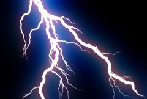

## S_Zap

在两点之间生成闪电，并将其渲染在背景上。增加闪电数量可产生电浆效果。增大 Vary Endpoint 可以展开闪电末端。调整 Glow Color 可获得不同颜色的效果。Wiggle Speed 参数使闪电随时间自动波动。

在 Sapphire Render 效果子菜单中。

### Inputs:

- **Background**: 当前图层。用作背景的片段。

- **Matte**: 默认为无。如果提供，定义闪电应渲染的区域。闪电上的辉光会渗透到没有闪电的区域，以获得自然的效果。

### Parameters:

- **Load Preset** (Push-button)
  打开预设浏览器，浏览此效果的所有可用预设。

- **Save Preset** (Push-button)
  打开预设保存对话框，保存此效果的预设。

- **Mode** (Popup menu, Default: 2D)
  选择 2D 和 3D 模式。
  - **2D**: 沿样条线创建电击效果。
  - **3D**: 创建三维电击效果。
  - **Follow Path**: 沿 AE 路径创建电击效果。

- **Mocha Project** (Default: 0, Range: 0 or greater)
  打开 Mocha 窗口，用于追踪素材和生成蒙版。

- **Blur Mocha** (Default: 0, Range: 0 or greater)
  在使用前按此量模糊 Mocha 蒙版。可用于柔化蒙版的边缘或量化伪影，并平滑时间偏移。

- **Mocha Opacity** (Default: 1, Range: 0 to 1)
  控制 Mocha 蒙版的强度。较低的值会减弱效果的强度。

- **Invert Mocha** (Check-box, Default: off)
  如果启用，在应用效果之前反转 Mocha 蒙版的黑白。

- **Resize Mocha** (Default: 1, Range: 0 to 2)
  缩放 Mocha 蒙版。1.0 为原始大小。

- **Resize Rel X** (Default: 1, Range: 0 to 2)
  Mocha 蒙版的相对水平大小。

- **Resize Rel Y** (Default: 1, Range: 0 to 2)
  Mocha 蒙版的相对垂直大小。

- **Shift Mocha** (X & Y, Default: [0 0], Range: any)
  偏移 Mocha 蒙版的位置。

- **Dilate Mocha** (Default: 0, Range: -100 to 100)
  在使用前按此像素量膨胀或腐蚀 Mocha 蒙版。

- **Dilation Quality** (Popup menu, Default: Fast)
  选择 Dilate Mocha 是在默认的快速模式下快速调整，还是在高质量模式下获得更好的效果。
  - **Fast**: 在快速模式下膨胀 Mocha 蒙版，便于快速调整。
  - **High**: 在高质量模式下膨胀 Mocha 蒙版，获得更好的蒙版形状。

- **Bypass Mocha** (Check-box, Default: off)
  忽略 Mocha 蒙版，将效果应用于整个源片段。

- **Show Mocha Only** (Check-box, Default: off)
  跳过效果，仅显示 Mocha 蒙版本身。

- **Combine Masks** (Popup menu, Default: Union)
  当同时提供 Mocha 蒙版和输入蒙版时，确定如何组合它们。
  - **Union**: 使用两个蒙版共同覆盖的区域。
  - **Intersect**: 使用两个蒙版重叠的区域。
  - **Mocha Only**: 忽略输入蒙版，仅使用 Mocha 蒙版。

- **Path To Follow** (Default: 0, Range: 0 or greater)
  闪电跟随的 AE 路径。

- **Bolts** (Integer, Default: 1, Range: 1 to 500)
  要绘制的闪电数量，每条闪电在起点和终点之间。

- **Start** (X & Y, Default: [-0.5 0.596], Range: any)
  闪电的起始点。

- **Start Uses Mocha** (Check-box, Default: off)
  控制起始点是由 Start 参数控制，还是跟随 Mocha 中的 Start 点追踪。

- **Smooth Start Track** (Integer, Default: 0, Range: 0 or greater)
  控制在稳定 Mocha 点追踪时平均多少个点。

- **Point 1 Enable** (Check-box, Default: off)
  打开或关闭第一个控制点。

- **Control Point 1** (X & Y, Default: [-0.33 0.4], Range: any)
  第一个样条线控制点。

- **Point1 Uses Mocha** (Check-box, Default: off)
  控制点 1 是由 Control Point 1 参数控制，还是跟随 Mocha 中的 Control Point 1 追踪。

- **Smooth Point1 Track** (Integer, Default: 0, Range: 0 or greater)
  控制在稳定 Mocha 点追踪时平均多少个点。

- **Point 2 Enable** (Check-box, Default: off)
  打开或关闭第二个控制点。

- **Control Point 2** (X & Y, Default: [0.1 0.25], Range: any)
  第二个样条线控制点。

- **Point2 Uses Mocha** (Check-box, Default: off)
  控制点 2 是由 Control Point 2 参数控制，还是跟随 Mocha 中的 Control Point 2 追踪。

- **Smooth Point2 Track** (Integer, Default: 0, Range: 0 or greater)
  控制在稳定 Mocha 点追踪时平均多少个点。

- **Point 3 Enable** (Check-box, Default: on)
  打开或关闭第三个控制点。

- **Control Point 3** (X & Y, Default: [0.4 0], Range: any)
  第三个样条线控制点。

- **Point3 Uses Mocha** (Check-box, Default: off)
  控制点 3 是由 Control Point 3 参数控制，还是跟随 Mocha 中的 Control Point 3 追踪。

- **Smooth Point3 Track** (Integer, Default: 0, Range: 0 or greater)
  控制在稳定 Mocha 点追踪时平均多少个点。

- **Point 4 Enable** (Check-box, Default: off)
  打开或关闭第四个控制点。

- **Control Point 4** (X & Y, Default: [0.45 -0.33], Range: any)
  第四个样条线控制点。

- **Point4 Uses Mocha** (Check-box, Default: off)
  控制点 4 是由 Control Point 4 参数控制，还是跟随 Mocha 中的 Control Point 4 追踪。

- **Smooth Point4 Track** (Integer, Default: 0, Range: 0 or greater)
  控制在稳定 Mocha 点追踪时平均多少个点。

- **End** (X & Y, Default: [0.5 -0.596], Range: any)
  闪电的终点。此参数可通过终点控件进行调整。

- **End Uses Mocha** (Check-box, Default: off)
  控制终点是由 End 参数控制，还是跟随 Mocha 中的 End 点追踪。

- **Smooth End Track** (Integer, Default: 0, Range: 0 or greater)
  控制在稳定 Mocha 点追踪时平均多少个点。

- **Start** (X & Y, Default: [-0.5 0.596], Range: any)
  闪电的起始点。

- **End** (X & Y, Default: [0.5 -0.596], Range: any)
  闪电的终点。此参数可通过终点控件进行调整。

- **Vary Endpoint** (Default: 0, Range: 0 or greater)
  在此半径的圆内随机偏移终点位置。如果 Bolts 大于 1，这对于分散不同的终点很有用。例如，您可以通过增大此半径并将终点放置在起点附近来创建多条辐射状闪电。此参数也可以在设为正值后通过终点控件进行调整。

- **Bolt Width** (Default: 0.07, Range: 0 or greater)
  闪电的宽度。

- **Vary Width** (Default: 0, Range: 0 to 1)
  闪电沿其长度方向宽度的随机变化量。

- **End Pointiness** (Default: 0.1, Range: 0 to 1)
  确定闪电末端的尖锐程度。如果为 0，整条闪电宽度相等。如果为 1，闪电将沿整个长度逐渐变细形成尖端。如果为 0.5，闪电将从起点和终点的中间位置开始变细。

- **Wiggle Start** (Default: 0, Range: 0 or greater)
  默认情况下闪电会随时间自动摆动。此参数为这些闪电扰动提供起始偏移量。

- **Wiggle Speed** (Default: 1, Range: 0 or greater)
  闪电随时间自动扰动的速度。要制作速度变化的动画，请将此值设为零并改为对 Wiggle Start 参数进行动画。

- **Jitter Frames** (Integer, Default: 0, Range: 0 or greater)
  如果为 0，每个处理帧使用相同的随机闪电。如果为 1，每帧使用不同的随机闪电。如果为 2，每隔一帧使用新的随机闪电，依此类推。

- **Rand Seed** (Default: 0.123, Range: 0 or greater)
  用于初始化随机数生成器。实际的种子值并不重要，但不同的种子会产生不同的随机闪电，相同的值应产生可重复的结果。

- **Wrinkle Amp** (Default: 1, Range: 0 or greater)
  缩放闪电中的褶皱量。减小可获得更直更平滑的闪电，增大可获得更弯曲的闪电。

- **Curve Amp** (Default: 0.5, Range: 0 or greater)
  类似于 Wrinkle Amp，但影响闪电的整体路径。如果减小，闪电将更贴近起点和终点之间的直线。如果增大，闪电可以偏离这条线更远。与 Wrinkle Amp 参数的区别在于，它可以使闪电更直的同时保留细节级别的褶皱。

- **Branchiness** (Default: 1, Range: 0 to 20)
  缩放从主闪电分支出的额外闪电数量。设为 0 可获得没有额外分支的基本闪电。

- **Branch Angle** (Default: 65, Range: 0 to 180)
  随机分支相对于其所分支的闪电的最大角度。如果为 0，分支将更贴近主闪电方向。值越大，分支越垂直于主闪电。

- **Branch Length** (Default: 0.5, Range: 0 to 3)
  分支相对于起点和终点之间距离的缩放长度。

### Glow Parameters:

Glow Bright:
*Default:
*2,
*Range:
*0 or greater.缩放应用于闪电的辉光亮度。

Glow Color:
*Default rgb:
*[0.5 0.5 1].应用于闪电的辉光颜色。

Glow Width:
*Default:
*0.224,
*Range:
*0 or greater.应用于闪电的辉光宽度。

Glow Width Red:
*Default:
*0.5,
*Range:
*0 or greater.辉光的相对红色宽度。

Glow Width Grn:
*Default:
*1,
*Range:
*0 or greater.辉光的相对绿色宽度。

Glow Width Blue:
*Default:
*1.5,
*Range:
*0 or greater.辉光的相对蓝色宽度。

Affect Alpha:
*Default:
*1,
*Range:
*0 or greater.
如果此值为正，输出 Alpha 通道将包含来自闪电及其辉光的一些不透明度。红、绿、蓝亮度的最大值按此值缩放，并与每个像素处的背景 Alpha 合成。

### Other Parameters:

Zap Bright:
*Default:
*1,
*Range:
*0 or greater.缩放闪电的亮度。

Zap Color:
*Default rgb:
*[1 1 1].闪电的颜色。如果您想保持闪电本身为亮白色，可以通过调整 Glow Color 来影响感知颜色。

Start Offset:
*Default:
*0,
*Range:
*0 to 1.从起点开始绘制闪电的偏移量。这对于制作闪电打击的动画很有用。

Length:
*Default:
*1,
*Range:
*0 to 1.闪电的长度，从 Start Offset 开始。如果小于 1，闪电将不会从起点到终点完全绘制。这对于制作闪电打击的动画很有用。

Bg Brightness:
*Default:
*1,
*Range:
*0 or greater.在与闪电合成之前缩放背景的亮度。如果为 0，结果将只包含黑色背景上的闪电图像。

Combine:
*Popup menu, Default: Screen
*.确定闪电和辉光与背景的合成方式。
*Screen:
*执行混合功能，有助于防止过亮的结果。*Add:
*将闪电添加到背景上。在明亮背景上会产生更亮的辉光。*Zap Only:
*在黑色背景上显示闪电，忽略源图像。

Atmosphere Amp:
*Default:
*0,
*Range:
*0 or greater.大气效果模拟电击效果穿过尘埃大气时被照亮或遮蔽的效果。此参数调整大气效果的量或幅度。零值产生平滑的电击效果，较高值产生更多尘埃感。

Atmosphere Freq:
*Default:
*2,
*Range:
*0.1 to 20.控制大气噪点的空间频率。调高可获得更精细的细节，调低可获得更宽泛的整体变化。

Atmosphere Detail:
*Default:
*0.7,
*Range:
*0 to 1.控制大气模拟中精细细节的量。减小可获得更平滑的大气效果，增大可获得更粗糙或颗粒感的外观。

Atmosphere Seed:
*Default:
*0.123,
*Range:
*0 or greater.用于初始化大气噪点的随机数生成器。实际的种子值并不重要，但不同的种子会产生不同的结果，相同的值应产生可重复的结果。

Atmosphere Speed:
*Default:
*1,
*Range:
*any.大气中的云状噪点会像真实的尘埃云一样随时间变化；此参数控制云图案随时间变化的速度。设为零可获得静态图案。

Opacity:
*Popup menu, Default: Normal
*.确定处理不透明度/透明度的方法。
*All Opaque:
*当输入图像完全不透明（无透明度，alpha=1）时使用此选项可略微加快渲染速度。*Normal:
*正常处理不透明度。*As Premult:
*按照图像已经是预乘形式（颜色已按不透明度缩放）来处理。此选项的渲染速度也比正常模式略快，但结果也将是预乘形式，有时不太准确。

Show:
*Popup menu, Default: Result
*.选择效果的输出内容。
*Result:
*显示背景上的正常闪电结果。*ZBuffer:
*显示闪电的深度图，可用于合成或控制其他效果。

Swivel Zap:
*Default:
*-45,
*Range:
*any.在 3D 模式下，围绕垂直轴向左或向右旋转闪电。

Tilt Zap:
*Default:
*-15,
*Range:
*any.在 3D 模式下，围绕水平轴向上或向下旋转闪电。您可以同时使用 Swivel 和 Tilt 来围绕任意对角轴旋转。

Camera Zoom:
*Default:
*0,
*Range:
*-5 to 1.在 3D 模式下，对闪电进行放大或缩小。

Glow Fade:
*Default:
*0.2,
*Range:
*0 or greater.在 3D 模式下，对闪电较远部分的辉光进行淡出。

Blur Matte:
*Default:
*0.05,
*Range:
*0 or greater.在使用前按此量模糊蒙版输入。这可以提供蒙版区域和非蒙版区域之间更平滑的过渡。除非提供了蒙版输入，否则无效。

Invert Matte:
*Check-box, Default:
*off.如果开启，反转蒙版输入，使效果应用于蒙版为黑色的区域而非白色区域。除非提供了蒙版输入，否则无效。

Matte Use:
*Popup menu, Default: Luma
*.确定如何使用蒙版输入通道来生成单色蒙版。
*Luma:
*使用 RGB 通道的亮度。*Alpha:
*仅使用 Alpha 通道。

Show Spline:
*Check-box, Default:
*on.打开或关闭用于调整 Start 参数的屏幕用户界面。此参数仅在 AE 和 Premiere 中出现，因为这些平台支持屏幕控件。

Show Vary Endpoint:
*Check-box, Default:
*on.
打开或关闭用于调整 End 参数的屏幕用户界面。此参数仅在 AE 和 Premiere 中出现，因为这些平台支持屏幕控件。参见
[Motion Blur](/en/sapphire/#motion-blur) 的一般信息
