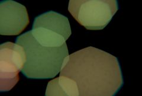

## S_BokehLights

生成随机的、散焦的灯光，在屏幕上四处移动。

在 Sapphire Lighting 效果子菜单中。

### Inputs:

- **Source**: 当前图层。要处理的素材片段。

- **Matte**: 默认为无。每个灯光的颜色会按该素材在灯光中心处的颜色进行缩放。可以使用黑白遮罩来创建被前景物体遮挡的灯光。彩色遮罩会给灯光着色，从而产生灯光穿过半透明物体的效果。

### Parameters:

- **Load Preset** (Push-button)
  打开预设浏览器，浏览该效果的所有可用预设。

- **Save Preset** (Push-button)
  打开预设保存对话框，保存该效果的预设。

- **Mocha Project** (Default: 0, Range: 0 or greater)
  打开 Mocha 窗口，用于跟踪素材和生成遮罩。

- **Blur Mocha** (Default: 0, Range: 0 or greater)
  在使用前按此数值模糊 Mocha 遮罩。可用于柔化遮罩的边缘或量化伪影，并平滑时间位移。

- **Mocha Opacity** (Default: 1, Range: 0 to 1)
  控制 Mocha 遮罩的强度。较低的值会降低效果的强度。

- **Invert Mocha** (Check-box, Default: off)
  启用后，在应用效果之前反转 Mocha 遮罩的黑白区域。

- **Resize Mocha** (Default: 1, Range: 0 to 2)
  缩放 Mocha 遮罩。1.0 为原始大小。

- **Resize Rel X** (Default: 1, Range: 0 to 2)
  Mocha 遮罩的相对水平大小。

- **Resize Rel Y** (Default: 1, Range: 0 to 2)
  Mocha 遮罩的相对垂直大小。

- **Shift Mocha** (X & Y, Default: [0 0], Range: any)
  偏移 Mocha 遮罩的位置。

- **Dilate Mocha** (Default: 0, Range: -100 to 100)
  在使用前按此像素值膨胀或收缩 Mocha 遮罩。

- **Dilation Quality** (Popup menu, Default: Fast)
  选择 Dilate Mocha 是以默认的快速模式进行快速调整，还是以高质量模式获得更好的效果。
  - **Fast**: 以快速模式膨胀 Mocha 遮罩，便于快速调整。
  - **High**: 以高质量模式膨胀 Mocha 遮罩，获得更好的遮罩形状。

- **Bypass Mocha** (Check-box, Default: off)
  忽略 Mocha 遮罩，将效果应用于整个源素材片段。

- **Show Mocha Only** (Check-box, Default: off)
  跳过效果，仅显示 Mocha 遮罩本身。

- **Combine Masks** (Popup menu, Default: Union)
  当同时提供 Mocha 遮罩和输入遮罩时，确定如何组合它们。
  - **Union**: 使用两个遮罩共同覆盖的区域。
  - **Intersect**: 使用两个遮罩之间重叠的区域。
  - **Mocha Only**: 忽略输入遮罩，仅使用 Mocha 遮罩。

- **Brightness** (Default: 0.5, Range: 0 or greater)
  灯光的整体亮度。

- **Color** (Default rgb: [1 1 0.3])
  灯光的整体颜色。

- **Vary Hue** (Default: 0, Range: 0 to 1)
  随机变化每个灯光的色相。

- **Vary Saturation** (Default: 0, Range: 0 to 1)
  随机变化每个灯光的饱和度。

- **Vary Brightness** (Default: 1, Range: 0 to 1)
  随机变化每个灯光的亮度。

- **Size** (Default: 0.3, Range: 0 or greater)
  散焦灯光的整体大小。此参数可通过大小控件进行调整。

- **Rel Height** (Default: 1, Range: 0.01 or greater)
  光圈形状的相对高度。如果不为 1，圆形将变为椭圆形，以此类推。

- **Vary Size** (Default: 0.2, Range: 0 or greater)
  随机变化灯光的大小，以模拟距离摄像机远近不同的灯光。

- **Softness** (Default: 0.01, Range: 0.001 or greater)
  光源的柔和度。增大此值可使灯光更模糊。

- **Lights** (Integer, Default: 30, Range: 0 or greater)
  灯光的数量。

- **Drift Speed** (Default: 0.2, Range: 0 or greater)
  灯光在屏幕上移动的速度。

- **Drift Distance** (Default: 0.5, Range: 0 or greater)
  每个灯光移动的最大距离。

- **Drift Size Speed** (Default: 0.1, Range: 0 or greater)
  灯光改变大小的速度。

- **Drift Size Distance** (Default: 0.3, Range: 0 or greater)
  每个灯光大小变化的最大幅度。

- **Drift Smoothness** (Default: 0.65, Range: 0 to 1)
  控制每个灯光运动中高频变化的程度。增大此值可获得平缓的漂移运动，减小此值可获得抖动的震颤运动。

- **Shift Speed** (X & Y, Default: [0 0], Range: any)
  灯光的平移速度。如果非零，结果会自动以此速率进行动画平移。动画化的速度值可能不够直观，因此对于变速运动，通常最好将此设为 0，改为对 Shift Start 值进行动画。

- **Shift Start** (X & Y, Default: [0 0], Range: any)
  灯光的平移偏移量。

- **Use Source Color** (Default: 0.25, Range: 0 to 1)
  按源素材片段的平滑版本缩放灯光。增大此值可帮助灯光与背景融合。

- **Smooth Source Color** (Default: 0.4, Range: 0 or greater)
  在缩放灯光之前对源素材片段进行模糊的程度。当 Use Source Color 为零时无效。

- **Shape** (Popup menu, Default: 7 sides)
  确定模拟摄像机光圈的形状。
  - **Circle**: 圆形。
  - **3 sides**: 三角形。
  - **4 sides**: 正方形。
  - **5 sides**: 五边形。
  - **6 sides**: 六边形。
  - **7 sides**: 七边形，以此类推。

- **Roundness** (Default: 0.3, Range: any)
  修改模拟摄像机光圈的形状。值为 1 时产生圆形；值为 0 时产生由 Shape 参数指定边数的平边多边形。小于 0 时边缘向内挤压形成星形，大于 1 时角向内挤压形成花朵形状。当 Shape 设置为 Circle 时无效。

- **Rotate** (Default: 0, Range: any)
  旋转光圈形状。

- **Bokeh** (Default: 0.5, Range: any)
  柔化光圈形状的外边缘，使散焦高光看起来更柔和。负值会使光圈形状中心变暗，产生环形散焦形状。

- **Lens Noise** (Default: 0.5, Range: 0 or greater)
  增大此值可向光圈形状添加噪点，使散焦效果稍显粗糙。可使结果更加真实。超过 1 时会产生更具风格化的效果。

- **Noise Freq** (Default: 20, Range: 0.01 or greater)
  添加噪点的频率。当 Lens Noise 为零时忽略此参数。

- **Noise Freq Rel X** (Default: 1, Range: 0.01 or greater)
  添加的光圈噪点的相对水平频率。增大此值可使噪点在垂直方向拉伸，减小此值可使噪点在水平方向拉伸。

- **Chroma Distort** (Default: 0.05, Range: any)
  在图像边缘添加一些色差效果；在真实镜头中，红色和蓝色波长的光折射方式不同，在光线以斜角射入镜头时会产生彩色边缘。

- **Color Fringing** (Default: 0, Range: any)
  Color Fringing 通过改变每个颜色通道的焦距，在图像中每个物体周围产生彩色环。它与 Chroma Distort 产生的色差风格不同，因为它不仅出现在图像角落。

- **Flicker Amp** (Default: 0.2, Range: 0 or greater)
  灯光随机闪烁的幅度。

- **Flicker Speed** (Default: 0.5, Range: 0 or greater)
  随机闪烁的速度。

- **Flicker Randomness** (Default: 0.7, Range: 0 to 1)
  控制闪烁的变化性。设为零时，灯光会持续闪烁，带有少量随机变化。较高值时，闪烁会有更长的稳定期，偶尔出现大幅度尖峰。

- **Seed** (Default: 0.123, Range: 0 or greater)
  初始化用于灯光定位、大小和颜色变化的随机数生成器。实际种子值本身并不重要，但不同的种子会产生不同的结果，相同的值会产生可重复的结果。

- **Combine** (Popup menu, Default: Screen)
  确定灯光与源素材片段的组合方式。
  - **Screen**: 执行混合功能，有助于防止结果过亮。
  - **Add**: 灯光被添加到源上。
  - **Lights Only**: 仅显示灯光，没有背景。

- **Affect Alpha** (Default: 1, Range: 0 or greater)
  如果此值为正，输出的 Alpha 通道将包含来自灯光的一些不透明度。每个像素处红、绿、蓝灯光亮度的最大值按此值缩放，并与源 Alpha 组合。

- **Blur Matte** (Default: 0, Range: 0 or greater)
  在使用前按此数值模糊遮罩输入。这可以提供遮罩区域和非遮罩区域之间更平滑的过渡。除非提供了遮罩输入，否则无效。

- **Invert Matte** (Check-box, Default: off)
  启用后，反转遮罩输入，使效果应用于遮罩为黑色而非白色的区域。除非提供了遮罩输入，否则无效。

- **Matte Type** (Popup menu, Default: Luma)
  除非提供了遮罩输入，否则此设置会被忽略。
  - **Luma**: 使用遮罩输入的亮度来缩放灯光的亮度。
  - **Color**: 使用遮罩输入的 RGB 通道来缩放灯光的颜色。
  - **Alpha**: 使用遮罩输入的 Alpha 通道来缩放灯光的亮度。

- **Opacity** (Popup menu, Default: Normal)
  确定处理不透明度/透明度的方法。
  - **All Opaque**: 当输入图像完全不透明且没有透明度 (alpha=1) 时，使用此选项可稍微加快渲染速度。
  - **Normal**: 正常处理不透明度。
  - **As Premult**: 按预乘形式处理图像（颜色已按不透明度缩放）。此选项的渲染速度也比 Normal 模式稍快，但结果也将为预乘形式，有时可能不太准确。

- **Show Size** (Check-box, Default: on)
  开启或关闭用于调整 Size 参数的屏幕用户界面。此参数仅在 AE 和 Premiere 中出现，因为那里支持屏幕控件。
