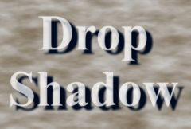

## S_DropShadow

使用前景的 Alpha 通道或可选的遮罩在背景素材上生成阴影，然后将前景合成到背景上以得到最终结果。

在 Sapphire Lighting 效果子菜单中。

### Inputs:

- **Foreground**: 当前图层。用作前景的素材片段，其 Alpha 通道用作生成阴影的遮罩。

- **Background**: 默认为无。阴影绘制在此背景素材上。

- **Matte**: 默认为无。如果提供此输入，则使用其 Alpha 通道代替前景来生成阴影。此输入可受 Invert Matte 或 Matte Use 参数的影响。

### Parameters:

- **Load Preset** (Push-button)
  打开预设浏览器，浏览该效果的所有可用预设。

- **Save Preset** (Push-button)
  打开预设保存对话框，保存该效果的预设。

- **Mocha Project** (Default: 0, Range: 0 or greater)
  打开 Mocha 窗口，用于跟踪素材和生成遮罩。

- **Blur Mocha** (Default: 0, Range: 0 or greater)
  在使用前按此数值模糊 Mocha 遮罩。可用于柔化遮罩的边缘或量化伪影，并平滑时间位移。

- **Mocha Opacity** (Default: 1, Range: 0 to 1)
  控制 Mocha 遮罩的强度。较低的值会降低效果的强度。

- **Invert Mocha** (Check-box, Default: off)
  启用后，在应用效果之前反转 Mocha 遮罩的黑白区域。

- **Resize Mocha** (Default: 1, Range: 0 to 2)
  缩放 Mocha 遮罩。1.0 为原始大小。

- **Resize Rel X** (Default: 1, Range: 0 to 2)
  Mocha 遮罩的相对水平大小。

- **Resize Rel Y** (Default: 1, Range: 0 to 2)
  Mocha 遮罩的相对垂直大小。

- **Shift Mocha** (X & Y, Default: [0 0], Range: any)
  偏移 Mocha 遮罩的位置。

- **Dilate Mocha** (Default: 0, Range: -100 to 100)
  在使用前按此像素值膨胀或收缩 Mocha 遮罩。

- **Dilation Quality** (Popup menu, Default: Fast)
  选择 Dilate Mocha 是以默认的快速模式进行快速调整，还是以高质量模式获得更好的效果。
  - **Fast**: 以快速模式膨胀 Mocha 遮罩，便于快速调整。
  - **High**: 以高质量模式膨胀 Mocha 遮罩，获得更好的遮罩形状。

- **Bypass Mocha** (Check-box, Default: off)
  忽略 Mocha 遮罩，将效果应用于整个源素材片段。

- **Show Mocha Only** (Check-box, Default: off)
  跳过效果，仅显示 Mocha 遮罩本身。

- **Combine Masks** (Popup menu, Default: Union)
  当同时提供 Mocha 遮罩和输入遮罩时，确定如何组合它们。
  - **Union**: 使用两个遮罩共同覆盖的区域。
  - **Intersect**: 使用两个遮罩之间重叠的区域。
  - **Mocha Only**: 忽略输入遮罩，仅使用 Mocha 遮罩。

- **Shadow Color** (Default rgb: [0 0 0])
  阴影的颜色。

- **Shadow Opacity** (Default: 1, Range: 0 or greater)
  阴影的不透明度，使用接近 0 的值可产生微妙的透明阴影，使用接近 1.0 的值可产生较强的阴影。

- **Shadow Blur** (Default: 0.1, Range: 0 or greater)
  确定阴影的柔和度。此参数可通过 Shift 控件进行调整。

- **Shift** (X & Y, Default: [0.042 -0.042], Range: any)
  阴影的水平和垂直偏移量。此参数可通过 Shift 控件进行调整。

- **Fg Opacity** (Default: 1, Range: 0 to 1)
  在不影响阴影的情况下缩放前景的不透明度。降低此值可用于淡出前景，设为零则完全不将前景合成到结果上。

- **Comp Premult** (Check-box, Default: on)
  如果您提供了单独的遮罩输入且前景像素值尚未按此遮罩进行预乘，请禁用此选项。

- **Matte Use** (Popup menu, Default: Alpha)
  确定使用哪些前景或遮罩输入通道来生成阴影。
  - **Luma**: 使用 RGB 通道的亮度。
  - **Alpha**: 仅使用 Alpha 通道。

- **Invert Matte** (Check-box, Default: off)
  启用后，在使用前反转前景 Alpha 通道的黑白区域。

- **Expand Borders** (Check-box, Default: on)
  启用后，在处理前向输入图像添加透明边框。这允许结果包含超出原始图像大小的柔和边缘。关闭时，效果仅在画面内发生，结果将在边界处保留硬边缘。

- **Opacity** (Popup menu, Default: Normal)
  确定处理不透明度/透明度的方法。
  - **All Opaque**: 当输入图像完全不透明且没有透明度 (alpha=1) 时，使用此选项可稍微加快渲染速度。
  - **Normal**: 正常处理不透明度。
  - **As Premult**: 按预乘形式处理图像（颜色已按不透明度缩放）。此选项的渲染速度也比 Normal 模式稍快，但结果也将为预乘形式，有时可能不太准确。

- **Show Shift** (Check-box, Default: on)
  开启或关闭用于调整 Shadow Blur 参数的屏幕用户界面。此参数仅在 AE 和 Premiere 中出现，因为那里支持屏幕控件。
