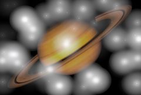

## S_Flashbulbs

模拟大量闪光灯闪烁的效果。使用许多小闪光时，看起来像体育场场景。使用少量大闪光时，适合用于名人红毯素材。

在 Sapphire Lighting 效果子菜单中。

### Inputs:

- **Background**: 当前图层。用作背景的素材片段。

- **Matte**: 默认为无。用于将闪光限制在图像的特定区域。白色区域会出现闪光灯效果；黑色区域不会出现闪光。

### Parameters:

- **Load Preset** (Push-button)
  打开预设浏览器，浏览该效果的所有可用预设。

- **Save Preset** (Push-button)
  打开预设保存对话框，保存该效果的预设。

- **Mocha Project** (Default: 0, Range: 0 or greater)
  打开 Mocha 窗口，用于跟踪素材和生成遮罩。

- **Blur Mocha** (Default: 0, Range: 0 or greater)
  在使用前按此数值模糊 Mocha 遮罩。可用于柔化遮罩的边缘或量化伪影，并平滑时间位移。

- **Mocha Opacity** (Default: 1, Range: 0 to 1)
  控制 Mocha 遮罩的强度。较低的值会降低效果的强度。

- **Invert Mocha** (Check-box, Default: off)
  启用后，在应用效果之前反转 Mocha 遮罩的黑白区域。

- **Resize Mocha** (Default: 1, Range: 0 to 2)
  缩放 Mocha 遮罩。1.0 为原始大小。

- **Resize Rel X** (Default: 1, Range: 0 to 2)
  Mocha 遮罩的相对水平大小。

- **Resize Rel Y** (Default: 1, Range: 0 to 2)
  Mocha 遮罩的相对垂直大小。

- **Shift Mocha** (X & Y, Default: [0 0], Range: any)
  偏移 Mocha 遮罩的位置。

- **Dilate Mocha** (Default: 0, Range: -100 to 100)
  在使用前按此像素值膨胀或收缩 Mocha 遮罩。

- **Dilation Quality** (Popup menu, Default: Fast)
  选择 Dilate Mocha 是以默认的快速模式进行快速调整，还是以高质量模式获得更好的效果。
  - **Fast**: 以快速模式膨胀 Mocha 遮罩，便于快速调整。
  - **High**: 以高质量模式膨胀 Mocha 遮罩，获得更好的遮罩形状。

- **Bypass Mocha** (Check-box, Default: off)
  忽略 Mocha 遮罩，将效果应用于整个源素材片段。

- **Show Mocha Only** (Check-box, Default: off)
  跳过效果，仅显示 Mocha 遮罩本身。

- **Combine Masks** (Popup menu, Default: Union)
  当同时提供 Mocha 遮罩和输入遮罩时，确定如何组合它们。
  - **Union**: 使用两个遮罩共同覆盖的区域。
  - **Intersect**: 使用两个遮罩之间重叠的区域。
  - **Mocha Only**: 忽略输入遮罩，仅使用 Mocha 遮罩。

- **Flash Style** (Default: 0, Range: 0 or greater)
  使用的闪光灯样式。有多种样式可选，您也可以尝试一些眩光样式以获得不同的外观。

- **Brightness** (Default: 5, Range: 0 or greater)
  闪光的整体亮度。

- **Vary Brightness** (Default: 0.2, Range: 0 to 1)
  增大此值可在每帧中改变每个闪光灯的亮度。

- **Flashes** (Integer, Default: 2, Range: 0 or greater)
  每帧的大致闪光数量。

- **Flash Randomness** (Default: 0.5, Range: 0 to 1)
  增大此值可使某些帧出现更多闪光（最多达到 Flashes 的值），而其他帧出现更少闪光。

- **Flash Size** (Default: 1, Range: 0 or greater)
  闪光的平均大小。此参数可通过 Flash Size 控件进行调整。

- **Flash Size Rel** (X & Y, Default: [1 1], Range: 0 or greater)
  用于压缩或拉伸闪光。此参数可通过 Flash Size 控件进行调整。

- **Flash Gamma** (Default: 1, Range: 0.1 or greater)
  增亮或变暗闪光的中间调。可产生圆润、硬边缘的外观，或使闪光更加柔和细腻。

- **Hold Frames** (Integer, Default: 1, Range: 0 or greater)
  每个闪光在时间上会略微衰减，以模拟视觉暂留效果以及老式闪光灯灯丝冷却的效果。Hold Frames 控制该拖尾持续多长时间。

- **Flash Decay Rate** (Default: 0.1, Range: 0 to 1)
  闪光在 Hold Frames 时间内衰减的速度。增大此值可使闪光在屏幕上停留更长时间且更亮；减小此值可使闪光迅速消失。请注意，您可能需要增加 Hold Frames 才能看到持续时间较长的闪光拖尾。

- **Bg Brightness** (Default: 1, Range: 0 or greater)
  在与闪光灯合成之前缩放背景的亮度。如果为 0，结果将只包含黑色背景上的闪光灯图像。

- **Combine** (Popup menu, Default: Add)
  确定闪光图像与背景的组合方式。
  - **Screen**: 将闪光与背景混合，有助于防止结果过亮。
  - **Add**: 将闪光图像添加到背景上。
  - **Flashes Only**: 在透明黑色背景上显示闪光。

- **Seed** (Default: 0.1, Range: 0 or greater)
  用于初始化随机数生成器。实际种子值本身并不重要，但不同的种子会产生不同的结果，相同的值会产生可重复的结果。

- **Affect Alpha** (Default: 1, Range: 0 or greater)
  如果此值为正，输出的 Alpha 通道将包含来自闪光的一些不透明度。每个像素处红、绿、蓝闪光亮度的最大值按此值缩放，并与背景 Alpha 组合。

- **Opacity** (Popup menu, Default: Normal)
  确定处理不透明度/透明度的方法。
  - **All Opaque**: 当输入图像完全不透明且没有透明度 (alpha=1) 时，使用此选项可稍微加快渲染速度。
  - **Normal**: 正常处理不透明度。
  - **As Premult**: 按预乘形式处理图像（颜色已按不透明度缩放）。此选项的渲染速度也比 Normal 模式稍快，但结果也将为预乘形式，有时可能不太准确。

- **Invert Matte** (Check-box, Default: off)
  启用后，反转遮罩输入，使效果应用于遮罩为黑色而非白色的区域。除非提供了遮罩输入，否则无效。

- **Matte Use** (Popup menu, Default: Luma)
  确定如何使用遮罩输入通道来生成单色遮罩。
  - **Luma**: 使用 RGB 通道的亮度。
  - **Alpha**: 仅使用 Alpha 通道。

- **Flip Vertically** (Check-box, Default: off)
  如有需要，垂直翻转闪光以获得一致的外观。

- **Show Flash Size** (Check-box, Default: on)
  开启或关闭用于调整 Flash Size 参数的屏幕用户界面。此参数仅在 AE 和 Premiere 中出现，因为那里支持屏幕控件。
