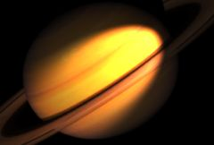

## S_SpotLight

使用一个或两个聚光灯照亮输入素材。对于每个启用的灯光，根据给定的光源位置、瞄准位置和光束角度，计算 3D 光锥与图像平面的交线。还可以应用环境光来均匀影响整个源图像。通过调整提供的参数，可以创建多种多样的照明形状。

在 Sapphire Lighting 效果子菜单中。

### Inputs:

- **Background**: 当前图层。用于与灯光组合的素材片段。

- **Mask**: 默认为无。如果提供，源光斑颜色将按此输入缩放。单色遮罩可用于选择将生成光斑的源区域子集。彩色遮罩可用于选择性地调整不同区域的光斑颜色。遮罩在生成光斑之前应用于源，因此不会裁剪生成的光斑。

### Parameters:

- **Load Preset** (Push-button)
  打开预设浏览器，浏览该效果的所有可用预设。

- **Save Preset** (Push-button)
  打开预设保存对话框，保存该效果的预设。

- **Mocha Project** (Default: 0, Range: 0 or greater)
  打开 Mocha 窗口，用于跟踪素材和生成遮罩。

- **Blur Mocha** (Default: 0, Range: 0 or greater)
  在使用前按此数值模糊 Mocha 遮罩。可用于柔化遮罩的边缘或量化伪影，并平滑时间位移。

- **Mocha Opacity** (Default: 1, Range: 0 to 1)
  控制 Mocha 遮罩的强度。较低的值会降低效果的强度。

- **Invert Mocha** (Check-box, Default: off)
  启用后，在应用效果之前反转 Mocha 遮罩的黑白区域。

- **Resize Mocha** (Default: 1, Range: 0 to 2)
  缩放 Mocha 遮罩。1.0 为原始大小。

- **Resize Rel X** (Default: 1, Range: 0 to 2)
  Mocha 遮罩的相对水平大小。

- **Resize Rel Y** (Default: 1, Range: 0 to 2)
  Mocha 遮罩的相对垂直大小。

- **Shift Mocha** (X & Y, Default: [0 0], Range: any)
  偏移 Mocha 遮罩的位置。

- **Dilate Mocha** (Default: 0, Range: -100 to 100)
  在使用前按此像素值膨胀或收缩 Mocha 遮罩。

- **Dilation Quality** (Popup menu, Default: Fast)
  选择 Dilate Mocha 是以默认的快速模式进行快速调整，还是以高质量模式获得更好的效果。
  - **Fast**: 以快速模式膨胀 Mocha 遮罩，便于快速调整。
  - **High**: 以高质量模式膨胀 Mocha 遮罩，获得更好的遮罩形状。

- **Bypass Mocha** (Check-box, Default: off)
  忽略 Mocha 遮罩，将效果应用于整个源素材片段。

- **Show Mocha Only** (Check-box, Default: off)
  跳过效果，仅显示 Mocha 遮罩本身。

- **Combine Masks** (Popup menu, Default: Union)
  当同时提供 Mocha 遮罩和输入遮罩时，确定如何组合它们。
  - **Union**: 使用两个遮罩共同覆盖的区域。
  - **Intersect**: 使用两个遮罩之间重叠的区域。
  - **Mocha Only**: 忽略输入遮罩，仅使用 Mocha 遮罩。

- **Light1 Enable** (Check-box, Default: on)
  开启或关闭此聚光灯。

- **Light1 Uses Mocha** (Check-box, Default: off)
  控制第一个灯光是由 Light 1 参数控制，还是跟随在 Mocha 中跟踪的 Light 1。

- **Smooth Light1 Track** (Integer, Default: 0, Range: 0 or greater)
  控制在稳定 Mocha 点跟踪时平均多少个点。

- **Light1 Bright** (Default: 0.8, Range: any)
  缩放此聚光灯的亮度。此值可设为负值以产生"暗光"聚光灯效果。

- **Light1 Color** (Default rgb: [1 1 1])
  确定此聚光灯的颜色。

- **Light1** (X & Y, Default: [-0.5 0.361], Range: any)
  此光源相对于图像平面的位置。此参数可通过 Light1 控件进行调整。

- **Light1 Z** (Default: 0.5, Range: 0.028 or greater)
  此光源到图像平面的距离。减小此值会使光源更靠近表面，使光束方向更平行于表面，从而可能将光斑拉伸为椭圆或双曲线形状。

- **Aim1** (X & Y, Default: [-0.167 0], Range: any)
  此聚光灯指向图像平面上的此位置。如果此位置正好在光源正下方，将产生圆形光斑。当远离光源移动时，也可能使光斑变为椭圆或双曲线形状。此参数可通过 Aim1 控件进行调整。

- **Aim1 Uses Mocha** (Check-box, Default: off)
  控制第一个灯光的方向是由 Aim 1 参数控制，还是跟随在 Mocha 中跟踪的 Aim 1。

- **Smooth Aim1 Track** (Integer, Default: 0, Range: 0 or greater)
  控制在稳定 Mocha 点跟踪时平均多少个点。

- **Spread Angle1** (Default: 45, Range: 0 to 360)
  此聚光灯光束的扩散角度（以度为单位）。较大的值会打开光束以产生更大的光斑。

- **Softness1** (Default: 0.3, Range: 0.01 to 1)
  确定聚光灯边缘的半影量或柔和度，相对于扩散角度。较低的值产生清晰边缘的形状，较高的值产生更柔和的形状。

- **Falloff Power1** (Default: 0, Range: 0 or greater)
  确定聚光灯亮度随距离衰减的程度。值为 0 不产生衰减，1 表示亮度随距离增加而衰减，2 表示随距离衰减更快。值为 2 适用于物理上真实的点光源。

- **Light2 Enable** (Check-box, Default: off)
  开启或关闭第二个聚光灯。其余 Light2 参数与上述 Light1 的参数相同，但控制的是第二个聚光灯。

- **Ambient Bright** (Default: 0.2, Range: any)
  整个画面中包含的环境光量。这使得聚光灯之外的背景部分在需要时仍然可见。

- **Ambient Color** (Default rgb: [1 1 1])
  确定环境光的颜色。

- **All Lights Bright** (Default: 1, Range: any)
  统一缩放所有聚光灯的亮度。

- **All Lights Color** (Default rgb: [1 1 1])
  统一缩放所有聚光灯的颜色。

- **All Aims Shift** (X & Y, Default: [0 0], Range: any)
  将此数值添加到所有灯光的 Aim 参数中。可用于方便地使所有灯光瞄准同一位置。此参数可通过 All Aims Shift 控件进行调整。

- **All Shift** (X & Y, Default: [0 0], Range: any)
  通过将此数值添加到所有灯光和瞄准位置来移动整个聚光灯图案，而不改变其形状。

- **Combine** (Popup menu, Default: Mult)
  确定灯光与背景的组合方式。
  - **Lights Only**: 仅显示灯光图像，没有背景。
  - **Mult**: 灯光与背景相乘。这是真实灯光通常产生的效果。
  - **Add**: 灯光被添加到背景上。
  - **Screen**: 灯光使用滤色操作与背景混合。
  - **Overlay**: 灯光使用叠加功能与背景组合。

- **Mask Use** (Popup menu, Default: Luma)
  确定如何使用遮罩输入通道来生成单色遮罩。
  - **Luma**: 使用 RGB 通道的亮度。
  - **Alpha**: 仅使用 Alpha 通道。

- **Blur Mask** (Default: 0.05, Range: 0 or greater)
  在使用前按此数值模糊遮罩输入。这可以提供遮罩区域和非遮罩区域之间更平滑的过渡。除非提供了遮罩输入，否则无效。

- **Invert Mask** (Check-box, Default: off)
  启用后，反转遮罩输入，使效果应用于遮罩为黑色而非白色的区域。除非提供了遮罩输入，否则无效。

- **Show Light1** (Check-box, Default: on)
  开启或关闭用于调整 Light1 参数的屏幕用户界面。此参数仅在 AE 和 Premiere 中出现，因为那里支持屏幕控件。

- **Show Aim1** (Check-box, Default: on)
  开启或关闭用于调整 Aim1 参数的屏幕用户界面。此参数仅在 AE 和 Premiere 中出现，因为那里支持屏幕控件。

- **Show Light2** (Check-box, Default: off)
  开启或关闭用于调整 Light2 参数的屏幕用户界面。此参数仅在 AE 和 Premiere 中出现，因为那里支持屏幕控件。

- **Show Aim2** (Check-box, Default: off)
  开启或关闭用于调整 Aim2 参数的屏幕用户界面。此参数仅在 AE 和 Premiere 中出现，因为那里支持屏幕控件。

- **Show All Aims Shift** (Check-box, Default: on)
  开启或关闭用于调整 All Aims Shift 参数的屏幕用户界面。此参数仅在 AE 和 Premiere 中出现，因为那里支持屏幕控件。
