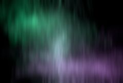

## S_Aurora

沿用户控制的样条线生成双色光旋涡，效果类似于极光（北极光）。

在 Sapphire Render 效果子菜单中。

### Inputs:

- **Background**: 当前图层。用作背景的素材。

- **Mask**: 默认为无。定义应渲染极光的区域。

### Parameters:

- **Load Preset** (Push-button)
  打开预设浏览器，浏览此效果的所有可用预设。

- **Save Preset** (Push-button)
  打开预设保存对话框，保存此效果的预设。

- **Mode** (Popup menu, Default: Aurora)
  在 2D 和 3D 模式之间选择。
  - **Aurora**: 沿样条线创建极光。
  - **Follow Path**: 沿 AE 路径创建极光。

- **Mocha Project** (Default: 0, Range: 0 or greater)
  打开 Mocha 窗口，用于跟踪素材和生成遮罩。

- **Blur Mocha** (Default: 0, Range: 0 or greater)
  在使用前按此数值模糊 Mocha 遮罩。可用于柔化遮罩的边缘或量化伪影，并平滑时间偏移。

- **Mocha Opacity** (Default: 1, Range: 0 to 1)
  控制 Mocha 遮罩的强度。较低的值会降低效果的强度。

- **Invert Mocha** (Check-box, Default: off)
  启用后，在应用效果之前反转 Mocha 遮罩的黑白。

- **Resize Mocha** (Default: 1, Range: 0 to 2)
  缩放 Mocha 遮罩。1.0 为原始大小。

- **Resize Rel X** (Default: 1, Range: 0 to 2)
  Mocha 遮罩的相对水平大小。

- **Resize Rel Y** (Default: 1, Range: 0 to 2)
  Mocha 遮罩的相对垂直大小。

- **Shift Mocha** (X & Y, Default: [0 0], Range: any)
  偏移 Mocha 遮罩的位置。

- **Dilate Mocha** (Default: 0, Range: -100 to 100)
  在使用前按此像素值膨胀或收缩 Mocha 遮罩。

- **Dilation Quality** (Popup menu, Default: Fast)
  选择 Mocha 膨胀是在默认的快速模式下快速调整，还是在高质量模式下获得更好的效果。
  - **Fast**: 在快速模式下膨胀 Mocha 遮罩，用于快速调整。
  - **High**: 在高质量模式下膨胀 Mocha 遮罩，获得更好的遮罩形状。

- **Bypass Mocha** (Check-box, Default: off)
  忽略 Mocha 遮罩，将效果应用于整个源素材。

- **Show Mocha Only** (Check-box, Default: off)
  跳过效果，仅显示 Mocha 遮罩本身。

- **Combine Masks** (Popup menu, Default: Union)
  当同时提供 Mocha 遮罩和输入遮罩时，决定如何组合它们。
  - **Union**: 使用两个遮罩共同覆盖的区域。
  - **Intersect**: 使用两个遮罩之间重叠的区域。
  - **Mocha Only**: 忽略输入遮罩，仅使用 Mocha 遮罩。

- **Start** (X & Y, Default: [-0.7 0.4], Range: any)
  极光的起始点。

- **Start Uses Mocha** (Check-box, Default: off)
  控制起始点是由 Start 参数控制，还是跟随 Mocha 中的 Start 点跟踪。

- **Smooth Start Track** (Integer, Default: 0, Range: 0 or greater)
  控制在稳定 Mocha 点跟踪时平均多少个点。

- **Point 1 Enable** (Check-box, Default: off)
  开启或关闭第一个控制点。

- **Control Point 1** (X & Y, Default: [-0.33 0.4], Range: any)
  第一个样条控制点。

- **Point1 Uses Mocha** (Check-box, Default: off)
  控制点 1 是由 Control Point 1 参数控制，还是跟随 Mocha 中的 Control Point 1 跟踪。

- **Smooth Point1 Track** (Integer, Default: 0, Range: 0 or greater)
  控制在稳定 Mocha 点跟踪时平均多少个点。

- **Point 2 Enable** (Check-box, Default: on)
  开启或关闭第二个控制点。

- **Control Point 2** (X & Y, Default: [0.04 0.2], Range: any)
  第二个样条控制点。

- **Point2 Uses Mocha** (Check-box, Default: off)
  控制点 2 是由 Control Point 2 参数控制，还是跟随 Mocha 中的 Control Point 2 跟踪。

- **Smooth Point2 Track** (Integer, Default: 0, Range: 0 or greater)
  控制在稳定 Mocha 点跟踪时平均多少个点。

- **Point 3 Enable** (Check-box, Default: on)
  开启或关闭第三个控制点。

- **Control Point 3** (X & Y, Default: [-0.1 -0.4], Range: any)
  第三个样条控制点。

- **Point3 Uses Mocha** (Check-box, Default: off)
  控制点 3 是由 Control Point 3 参数控制，还是跟随 Mocha 中的 Control Point 3 跟踪。

- **Smooth Point3 Track** (Integer, Default: 0, Range: 0 or greater)
  控制在稳定 Mocha 点跟踪时平均多少个点。

- **Point 4 Enable** (Check-box, Default: off)
  开启或关闭第四个控制点。

- **Control Point 4** (X & Y, Default: [0.45 -0.33], Range: any)
  第四个样条控制点。

- **Point4 Uses Mocha** (Check-box, Default: off)
  控制点 4 是由 Control Point 4 参数控制，还是跟随 Mocha 中的 Control Point 4 跟踪。

- **Smooth Point4 Track** (Integer, Default: 0, Range: 0 or greater)
  控制在稳定 Mocha 点跟踪时平均多少个点。

- **End** (X & Y, Default: [0.8 -0.5], Range: any)
  极光的终止点。

- **End Uses Mocha** (Check-box, Default: off)
  控制终止点是由 End 参数控制，还是跟随 Mocha 中的 End 点跟踪。

- **Smooth End Track** (Integer, Default: 0, Range: 0 or greater)
  控制在稳定 Mocha 点跟踪时平均多少个点。

- **Path To Follow** (Default: 0, Range: 0 or greater)
  极光跟随的 AE 路径。

- **Start Color** (Default rgb: [0 0.8 0.3])
  设置起始控制点处的颜色。

- **End Color** (Default rgb: [0.6 0.2 0.8])
  设置终止控制点处的颜色。

- **Color Phase** (Default: 0, Range: 0 or greater)
  调整起始颜色和终止颜色之间渐变的相位。使用此参数可以为颜色沿极光移动制作动画。

- **Stroke Size** (Default: 0.25, Range: 0 or greater)
  影响极光沿样条线的宽度。此参数控制底层颜色渐变在变形前的大小。

- **Brightness** (Default: 0.3, Range: 0 or greater)
  缩放极光的亮度。

- **Softness** (Default: 0.075, Range: 0 or greater)
  应用于极光的模糊量。设为 0 可获得彩色点云效果。

- **Softness Rel Y** (Default: 10, Range: 0 or greater)
  相对垂直方向的柔和度。

- **Swirl Complexity** (Integer, Default: 3, Range: 1 or greater)
  指定极光中应渲染多少层。渲染的层数越多，沿样条线生成的图案就越复杂。

- **Swirl Magnitude** (Default: 0.7, Range: 0 or greater)
  沿样条线的旋涡幅度或振幅。将其设为 0 将沿样条线渲染颜色渐变。

- **Magnitude Rel Y** (Default: 1.25, Range: 0 or greater)
  旋涡的相对垂直幅度。

- **Swirl Frequency** (Default: 2, Range: 0 to 50)
  沿样条线的旋涡频率。

- **Frequency Rel Y** (Default: 10, Range: 0 or greater)
  沿样条线的相对垂直频率。

- **Swirl Speed X** (Default: 0.1, Range: any)
  旋涡水平移动的速度。

- **Swirl Speed Y** (Default: 0, Range: any)
  旋涡垂直移动的速度。

- **Light Brightness** (Default: 1, Range: 0 or greater)
  照亮极光的一个圆形区域。设为 0 可禁用灯光。增大值可增加灯光强度。

- **Light Pos** (X & Y, Default: [-0.3 -0.5], Range: any)
  灯光中心的位置。

- **Light Color** (Default rgb: [1 1 1])
  灯光的颜色。

- **Ambient Light** (Default: 1, Range: 0 or greater)
  灯光外部区域的照明级别。

- **Light Radius** (Default: 1, Range: 0 or greater)
  从灯光中心到最亮区域边缘的距离。

- **Light Softness** (Default: 2, Range: 0 or greater)
  灯光边缘向黑暗过渡的速度。

- **Seed** (Default: 0.123, Range: 0 or greater)
  用于初始化随机数生成器。实际种子值本身并不重要，但不同的种子会产生不同的结果，相同的值应产生可重复的结果。

- **Bg Brightness** (Default: 1, Range: 0 or greater)
  缩放背景输入的亮度。

- **Combine** (Popup menu, Default: Screen)
  决定极光如何与源图像合成。
  - **Screen**: 使用滤色操作将极光与源混合。
  - **Add**: 将极光叠加到源上。
  - **Aurora Only**: 仅显示极光，不包含源。

- **Affect Alpha** (Default: 1, Range: 0 or greater)
  如果此值为正，输出的 Alpha 通道将包含来自极光的一些不透明度。红、绿、蓝极光亮度的最大值按此值缩放，并在每个像素处与背景 Alpha 合成。

- **Opacity** (Popup menu, Default: Normal)
  决定处理不透明度/透明度的方法。
  - **All Opaque**: 当输入图像完全不透明且无透明度 (alpha=1) 时，使用此选项可略微加快渲染速度。
  - **Normal**: 正常处理不透明度。
  - **As Premult**: 按预乘形式处理图像（颜色已按不透明度缩放）。此选项的渲染速度也比 Normal 模式略快，但结果也将是预乘形式，有时不够精确。

- **Mask Use** (Popup menu, Default: Luma)
  决定如何使用遮罩输入通道来生成单色遮罩。
  - **Luma**: 使用 RGB 通道的亮度。
  - **Alpha**: 仅使用 Alpha 通道。

- **Blur Mask** (Default: 0.05, Range: 0 or greater)
  在使用前按此数值模糊蒙版输入。可在蒙版区域和非蒙版区域之间提供更平滑的过渡。除非提供了蒙版输入，否则无效。

- **Invert Mask** (Check-box, Default: off)
  开启后，反转蒙版输入，使效果应用于蒙版为黑色而非白色的区域。除非提供了蒙版输入，否则无效。

- **Show Spline** (Check-box, Default: on)
  开启或关闭用于调整 Start 参数的屏幕用户界面。此参数仅在 AE 和 Premiere 中出现，这些软件支持屏幕控件。

- **Show Light Pos** (Check-box, Default: on)
  开启或关闭用于调整 Light Pos 参数的屏幕用户界面。此参数仅在 AE 和 Premiere 中出现，这些软件支持屏幕控件。
