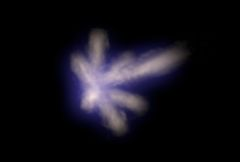

## S_MuzzleFlash

模拟枪械开火时产生的闪光和烟雾。可以模拟多种类型枪械的闪光。所有枪械都有主闪光，带有消音器的枪械可能有二级闪光。枪械可以轻松地反复开火。
注意：此效果中所有时间单位均以帧为单位。

在 Sapphire Render 效果子菜单中。

### Inputs:

- **Background**: 当前图层。用作背景的素材。

- **Mask**: 默认为无。在结果和源输入之间插值。白色区域使用效果结果。黑色区域使用源素材。

### Parameters:

- **Load Preset** (Push-button)
  打开预设浏览器，浏览此效果的所有可用预设。

- **Save Preset** (Push-button)
  打开预设保存对话框，保存此效果的预设。

- **Mocha Project** (Default: 0, Range: 0 or greater)
  打开 Mocha 窗口，用于跟踪素材和生成遮罩。

- **Blur Mocha** (Default: 0, Range: 0 or greater)
  在使用前按此数值模糊 Mocha 遮罩。可用于柔化遮罩的边缘或量化伪影，并平滑时间偏移。

- **Mocha Opacity** (Default: 1, Range: 0 to 1)
  控制 Mocha 遮罩的强度。较低的值会降低效果的强度。

- **Invert Mocha** (Check-box, Default: off)
  启用后，在应用效果之前反转 Mocha 遮罩的黑白。

- **Resize Mocha** (Default: 1, Range: 0 to 2)
  缩放 Mocha 遮罩。1.0 为原始大小。

- **Resize Rel X** (Default: 1, Range: 0 to 2)
  Mocha 遮罩的相对水平大小。

- **Resize Rel Y** (Default: 1, Range: 0 to 2)
  Mocha 遮罩的相对垂直大小。

- **Shift Mocha** (X & Y, Default: [0 0], Range: any)
  偏移 Mocha 遮罩的位置。

- **Dilate Mocha** (Default: 0, Range: -100 to 100)
  在使用前按此像素值膨胀或收缩 Mocha 遮罩。

- **Dilation Quality** (Popup menu, Default: Fast)
  选择 Mocha 膨胀是在默认的快速模式下快速调整，还是在高质量模式下获得更好的效果。
  - **Fast**: 在快速模式下膨胀 Mocha 遮罩，用于快速调整。
  - **High**: 在高质量模式下膨胀 Mocha 遮罩，获得更好的遮罩形状。

- **Bypass Mocha** (Check-box, Default: off)
  忽略 Mocha 遮罩，将效果应用于整个源素材。

- **Show Mocha Only** (Check-box, Default: off)
  跳过效果，仅显示 Mocha 遮罩本身。

- **Combine Masks** (Popup menu, Default: Union)
  当同时提供 Mocha 遮罩和输入遮罩时，决定如何组合它们。
  - **Union**: 使用两个遮罩共同覆盖的区域。
  - **Intersect**: 使用两个遮罩之间重叠的区域。
  - **Mocha Only**: 忽略输入遮罩，仅使用 Mocha 遮罩。

- **Location** (X & Y, Default: [0 0], Range: any)
  枪管末端在图像上的位置。此参数可通过 MuzzleFlash 控件调整。

- **Location Uses Mocha** (Check-box, Default: off)
  控制位置是由 Location 参数控制，还是跟随 Mocha 内部跟踪的 Location。

- **Smooth Location Track** (Integer, Default: 0, Range: 0 or greater)
  控制在稳定 Mocha 点跟踪时平均多少个点。

- **Elevation** (Default: 0, Range: -360 to 360)
  枪管在垂直平面上相对于水平方向的角度。此参数可通过 MuzzleFlash 控件调整。

- **Rotation** (Default: 0, Range: -360 to 360)
  枪管在水平平面上相对于正东方向的角度。此参数可通过 MuzzleFlash 控件调整。

- **Radius** (Default: 0.2, Range: 0.05 or greater)
  枪口火焰的整体大小。此参数可通过 MuzzleFlash 控件调整。

- **Brightness** (Default: 1, Range: 0 or greater)
  闪光的整体亮度。

- **Shift Out** (Default: 0, Range: 0 or greater)
  枪口闪光将在距离枪管末端此距离处绘制。

- **Gun** (Popup menu, Default: M16)
  正在开火的枪械类型。
  - **AK47**: AK47 突击步枪。
  - **Beretta**: 贝雷塔手枪。
  - **Colt45**: 柯尔特 45 左轮手枪。
  - **M16**: M16 突击步枪。
  - **12Gauge**: 霰弹枪。

- **Variant** (Popup menu, Default: Two)
  枪口闪光图案的变体。
  - **One**: 第一种变体。
  - **Two**: 第二种变体。
  - **Three**: 第三种变体。
  - **Random**: 每次开枪时随机选择一种变体。

- **Seed** (Default: 0.123, Range: 0 or greater)
  随机数种子。枪口闪光外观的许多方面取决于种子值。要在给定的控制值组合下获得不同的结果，请尝试更改此种子值。

- **Animate Seed** (Check-box, Default: off)
  选择此项将微妙地改变每次生成的闪光形状，使其在逐帧之间有所不同。

- **Octaves** (Integer, Default: 3, Range: 1 to 6)
  增大此值会增加烟雾中的细节。

- **Blur** (Default: 0.0015, Range: 0 or greater)
  应用于枪口闪光的模糊量。

- **Mid Density** (Default: 0.4, Range: 0.01 to 0.99)
  枪口闪光在其半径一半处的密度。

- **Mid Color** (Default rgb: [1 0.792 0.6])
  枪口闪光在其半径一半处的颜色。

- **Affect Alpha** (Default: 1, Range: 0 or greater)
  如果此值为正，输出的 Alpha 通道将包含来自枪口闪光的一些不透明度。红、绿、蓝枪口闪光亮度的最大值按此值缩放，并在每个像素处与背景 Alpha 合成。

- **Combine** (Popup menu, Default: Screen)
  决定枪口闪光如何与背景合成。
  - **Screen**: 使用滤色操作将枪口闪光与背景混合。
  - **Add**: 将枪口闪光叠加到背景上。
  - **MuzzleFlash Only**: 仅显示枪口闪光，不包含背景。

- **Primary Length** (Default: 0.21, Range: 0 or greater)
  主闪光的长度。它始终与枪管对齐，存在于所有枪械中。

- **Primary Width** (Default: 0.035, Range: 0 or greater)
  主闪光的宽度。

- **Primary Brightness** (Default: 0.6, Range: 0 or greater)
  主闪光的整体密度和亮度。

- **Primary Puff** (Default: 0.8, Range: 0 or greater)
  主闪光应呈现多蓬松（而非平滑）的外观。

- **Primary Detail** (Default: 0.5, Range: 0 or greater)
  主闪光中应呈现多少细节。

- **Secondary Number** (Integer, Default: 6, Range: 0 to 10)
  对于有二级闪光的枪械，应生成多少个二级闪光。这些闪光从消音器的孔中出现，只有带消音器的枪械才会有。闪光在垂直平面上相对于枪管方向呈一定角度。此控件指定消音器上有多少个孔。孔假定均匀分布在消音器的圆周上。

- **Secondary Angle** (Default: 66, Range: 0 to 89)
  二级闪光在垂直平面上相对于枪管的角度。

- **Secondary Length** (Default: 0.11, Range: 0 or greater)
  二级闪光的长度。

- **Secondary Width** (Default: 0.02, Range: 0 or greater)
  二级闪光的宽度。

- **Secondary Brightness** (Default: 0.6, Range: 0 or greater)
  二级闪光的整体密度和亮度。

- **Secondary Puff** (Default: 0.7, Range: 0 or greater)
  二级闪光应呈现多蓬松（而非平滑）的外观。

- **Secondary Detail** (Default: 0.8, Range: 0 or greater)
  二级闪光中应呈现多少细节。

- **Time Mode** (Popup menu, Default: Always)
  随着帧编号变化时如何绘制闪光。
  - **Always**: 始终绘制闪光。闪光是否出现必须通过手动关键帧控制。
  - **Repeat**: 在起始时间和结束时间之间以固定间隔开火。这适用于自动武器，但也可用于非自动武器生成单次闪光。闪光在单帧上绘制。
  - **Repeat+Fade**: 与 Repeat 相同，但闪光会在若干帧内淡出。

- **Start Time** (Integer, Default: 0, Range: 0 or greater)
  在 Repeat 和 Repeat+Fade 模式下，这是闪光首次出现的帧。

- **Duration** (Integer, Default: 10, Range: 0 to 500)
  在 Repeat 和 Repeat+Fade 模式下，这是起始时间之后可能出现闪光的时间长度。

- **Gap Time** (Integer, Default: 3, Range: 1 to 50)
  在 Repeat 和 Repeat+Fade 模式下，这是闪光之间的帧数。

- **Fade Time** (Integer, Default: 1, Range: 1 to 5)
  在 Repeat+Fade 模式下，这是闪光消失所需的帧数。

- **Glow Color** (Default rgb: [0.1 0.1 1])
  枪口闪光明亮部分周围整体辉光的颜色。

- **Glow Bright** (Default: 3, Range: 0 to 8)
  枪口闪光周围整体辉光的亮度。

- **Glow Width** (Default: 1, Range: 0 to 2)
  枪口闪光周围整体辉光的大小。

- **Glow Threshold** (Default: 0.1, Range: 0.01 to 1)
  高于此阈值的枪口闪光强度将产生辉光。

- **Opacity** (Popup menu, Default: Normal)
  决定处理不透明度/透明度的方法。
  - **All Opaque**: 当输入图像完全不透明且无透明度 (alpha=1) 时，使用此选项可略微加快渲染速度。
  - **Normal**: 正常处理不透明度。
  - **As Premult**: 按预乘形式处理图像（颜色已按不透明度缩放）。此选项的渲染速度也比 Normal 模式略快，但结果也将是预乘形式，有时不够精确。

- **Mask Use** (Popup menu, Default: Luma)
  决定如何使用遮罩输入通道来生成单色遮罩。
  - **Luma**: 使用 RGB 通道的亮度。
  - **Alpha**: 仅使用 Alpha 通道。

- **Blur Mask** (Default: 0.05, Range: 0 or greater)
  在使用前按此数值模糊蒙版输入。可在蒙版区域和非蒙版区域之间提供更平滑的过渡。除非提供了蒙版输入，否则无效。

- **Invert Mask** (Check-box, Default: off)
  开启后，反转蒙版输入，使效果应用于蒙版为黑色而非白色的区域。除非提供了蒙版输入，否则无效。

- **Show MuzzleFlash** (Check-box, Default: on)
  开启或关闭用于调整 Location 参数的屏幕用户界面。此参数仅在 AE 和 Premiere 中出现，这些软件支持屏幕控件。
