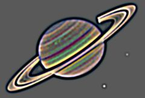

## S_BandPass

使用带通滤波器生成类似X光的效果。
对图像执行两次不同宽度的模糊处理，结果为
差值经缩放后偏移一个灰度值。高于和低于
截止频率的频率被衰减，只保留中间频段的
频率。

位于 Sapphire Stylize 效果子菜单中。

### Inputs:

- **Source**: 当前图层。要处理的素材。

- **Mask**: 默认为无。在结果和源素材输入之间进行插值。白色区域使用效果结果。黑色区域使用源素材。

### Parameters:

- **Load Preset** (Push-button)
  打开预设浏览器，浏览此效果的所有可用预设。

- **Save Preset** (Push-button)
  打开预设保存对话框，保存此效果的预设。

- **Mocha Project** (Default: 0, Range: 0 or greater)
  打开 Mocha 窗口，用于跟踪素材和生成遮罩。

- **Blur Mocha** (Default: 0, Range: 0 or greater)
  在使用前按此数值模糊 Mocha 遮罩。可用于柔化遮罩的边缘或量化伪影，并平滑时间位移。

- **Mocha Opacity** (Default: 1, Range: 0 to 1)
  控制 Mocha 遮罩的强度。较低的值会降低效果的强度。

- **Invert Mocha** (Check-box, Default: off)
  如果启用，在应用效果之前反转 Mocha 遮罩的黑白。

- **Resize Mocha** (Default: 1, Range: 0 to 2)
  缩放 Mocha 遮罩。1.0 为原始大小。

- **Resize Rel X** (Default: 1, Range: 0 to 2)
  Mocha 遮罩的相对水平大小。

- **Resize Rel Y** (Default: 1, Range: 0 to 2)
  Mocha 遮罩的相对垂直大小。

- **Shift Mocha** (X & Y, Default: [0 0], Range: any)
  偏移 Mocha 遮罩的位置。

- **Dilate Mocha** (Default: 0, Range: -100 to 100)
  在使用前按此像素数扩展或收缩 Mocha 遮罩。

- **Dilation Quality** (Popup menu, Default: Fast)
  选择 Dilate Mocha 是在默认的快速模式下快速调整，还是在高质量模式下获得更好的效果。
  - **Fast**: 在快速模式下扩展 Mocha 遮罩，用于快速调整。
  - **High**: 在高质量模式下扩展 Mocha 遮罩，获得更好的遮罩形状。

- **Bypass Mocha** (Check-box, Default: off)
  忽略 Mocha 遮罩，将效果应用于整个源素材。

- **Show Mocha Only** (Check-box, Default: off)
  跳过效果，仅显示 Mocha 遮罩本身。

- **Combine Masks** (Popup menu, Default: Union)
  当两个遮罩同时提供给效果时，决定如何组合 Mocha 遮罩和输入遮罩。
  - **Union**: 使用两个遮罩共同覆盖的区域。
  - **Intersect**: 使用两个遮罩之间重叠的区域。
  - **Mocha Only**: 忽略输入遮罩，仅使用 Mocha 遮罩。

- **Blur Amount1** (Default: 0.112, Range: 0 or greater)
  第一次模糊的宽度。设置低频截止。此参数可以使用 Blur Amount1 控件调整。

- **Blur Amount2** (Default: 0.224, Range: 0 or greater)
  第二次模糊的宽度。设置高频截止。此参数可以使用 Blur Amount2 控件调整。

- **Blur Rel** (X & Y, Default: [1 1], Range: 0 or greater)
  相对水平和垂直模糊宽度。将 Blur Rel X 设为 0 可实现仅垂直模糊，或将 Blur Rel Y 设为 0 可实现仅水平模糊。此参数可以使用 Blur Amount1 控件调整。

- **Brightness** (Default: 3, Range: any)
  缩放结果的亮度。

- **Saturation** (Default: 1, Range: any)
  缩放颜色饱和度。增大以获得更浓烈的颜色。设为 0 则为单色。

- **Offset Darks** (Default: 0.5, Range: any)
  将此灰度值添加到结果的较暗区域。可以为负值以增加对比度。

- **Opacity** (Popup menu, Default: Normal)
  决定处理不透明度/透明度的方法。
  - **All Opaque**: 当输入图像完全不透明且没有透明度（alpha=1）时，使用此选项可略微加快渲染速度。
  - **Normal**: 正常处理不透明度。
  - **As Premult**: 将图像视为已经是预乘形式（颜色已按不透明度缩放）来处理。此选项的渲染速度也比 Normal 模式略快，但结果也将是预乘形式，有时不太正确。

- **Mask Use** (Popup menu, Default: Luma)
  决定如何使用 Mask 输入通道生成单色遮罩。
  - **Luma**: 使用 RGB 通道的亮度。
  - **Alpha**: 仅使用 Alpha 通道。

- **Blur Mask** (Default: 0.05, Range: 0 or greater)
  在使用前按此数值模糊蒙版输入。可以在蒙版区域和非蒙版区域之间提供更平滑的过渡。除非提供了蒙版输入，否则无效。

- **Invert Mask** (Check-box, Default: off)
  如果开启，反转蒙版输入，使效果应用于蒙版为黑色而非白色的区域。除非提供了蒙版输入，否则无效。

- **Show Blur Amount1** (Check-box, Default: on)
  开启或关闭用于调整 Blur Amount1 参数的屏幕用户界面。此参数仅在 AE 和 Premiere 中出现，这些软件支持屏幕控件。

- **Show Blur Amount2** (Check-box, Default: on)
  开启或关闭用于调整 Blur Amount2 参数的屏幕用户界面。此参数仅在 AE 和 Premiere 中出现，这些软件支持屏幕控件。

