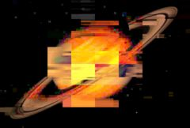

## S_DigitalDamage

模拟数字电视信号传输不良的效果，包含许多选项，如冻结帧、位移和流动色块、各种块状噪声和像素化。可以产生类似 MPEG 流错误、数字信号丢失和卫星信号数据损坏的效果。

位于 Sapphire Stylize 效果子菜单中。

### Inputs:

- **Source**: 当前图层。要处理的素材。

- **Mask**: 默认为无。在结果和源素材输入之间进行插值。白色区域使用效果结果。黑色区域使用源素材。

### Parameters:

- **Load Preset** (Push-button)
  打开预设浏览器，浏览此效果的所有可用预设。

- **Save Preset** (Push-button)
  打开预设保存对话框，保存此效果的预设。

- **Mocha Project** (Default: 0, Range: 0 or greater)
  打开 Mocha 窗口，用于跟踪素材和生成遮罩。

- **Blur Mocha** (Default: 0, Range: 0 or greater)
  在使用前按此数值模糊 Mocha 遮罩。可用于柔化遮罩的边缘或量化伪影，并平滑时间位移。

- **Mocha Opacity** (Default: 1, Range: 0 to 1)
  控制 Mocha 遮罩的强度。较低的值会降低效果的强度。

- **Invert Mocha** (Check-box, Default: off)
  如果启用，在应用效果之前反转 Mocha 遮罩的黑白。

- **Resize Mocha** (Default: 1, Range: 0 to 2)
  缩放 Mocha 遮罩。1.0 为原始大小。

- **Resize Rel X** (Default: 1, Range: 0 to 2)
  Mocha 遮罩的相对水平大小。

- **Resize Rel Y** (Default: 1, Range: 0 to 2)
  Mocha 遮罩的相对垂直大小。

- **Shift Mocha** (X & Y, Default: [0 0], Range: any)
  偏移 Mocha 遮罩的位置。

- **Dilate Mocha** (Default: 0, Range: -100 to 100)
  在使用前按此像素数扩展或收缩 Mocha 遮罩。

- **Dilation Quality** (Popup menu, Default: Fast)
  选择 Dilate Mocha 是在默认的快速模式下快速调整，还是在高质量模式下获得更好的效果。
  - **Fast**: 在快速模式下扩展 Mocha 遮罩，用于快速调整。
  - **High**: 在高质量模式下扩展 Mocha 遮罩，获得更好的遮罩形状。

- **Bypass Mocha** (Check-box, Default: off)
  忽略 Mocha 遮罩，将效果应用于整个源素材。

- **Show Mocha Only** (Check-box, Default: off)
  跳过效果，仅显示 Mocha 遮罩本身。

- **Combine Masks** (Popup menu, Default: Union)
  当两个遮罩同时提供给效果时，决定如何组合 Mocha 遮罩和输入遮罩。
  - **Union**: 使用两个遮罩共同覆盖的区域。
  - **Intersect**: 使用两个遮罩之间重叠的区域。
  - **Mocha Only**: 忽略输入遮罩，仅使用 Mocha 遮罩。

- **Intensity** (Default: 1, Range: 0 or greater)
  损坏的整体空间强度。调高以在每帧上获得更多损坏。

- **Time Intensity** (Default: 1, Range: 0 or greater)
  时间强度。通常，并非所有损坏类型都应用于每一帧。调高此值将使每种损坏类型影响更多帧。

- **Damage Size** (Default: 1, Range: 0.001 or greater)
  调高以增大损坏区域的平均尺寸。

- **Damage Size Rel X** (Default: 1, Range: 0.001 or greater)
  调高以水平拉长损坏区域。这不会拉伸图像，只是改变损坏区域和噪声图案的宽高比。

- **Freeze** (Check-box, Default: on)
  启用冻结帧损坏。

- **Freeze Threshold** (Default: 0.09, Range: 0 to 1)
  降低以在每帧上获得更多冻结区域。

- **Freeze Saturation** (Default: 2.5, Range: 0 or greater)
  增强冻结区域的饱和度，以获得更受损的外观。

- **Freeze Quality** (Default: 0.1, Range: 0 or greater)
  降低以给冻结区域一个 JPEG 量化外观。

- **Freeze Errs** (Default: 0.05, Range: 0 or greater)
  为冻结区域添加 JPEG 量化错误。

- **Freeze Frames** (Integer, Default: 10, Range: 0 to 20)
  每隔 N 帧冻结一次。这不会冻结整个图像，但当存在冻结损坏时，它使用每第 N 帧。调高以获得更极端的外观。设为 1 则不产生冻结。

- **Freeze Blink Freq** (Default: 15, Range: 0.1 or greater)
  控制此类损坏闪烁开关的速度。

- **Freeze Always** (Default: 0.3, Range: 0 to 1)
  控制此类损坏发生的频率。

- **Shift** (Check-box, Default: on)
  启用色块位移损坏。

- **Shift Amount** (Default: 0.1, Range: 0 or greater)
  控制色块位移损坏的强度或数量。

- **Shift Threshold** (Default: 0.3, Range: 0 to 1)
  降低以在每帧上获得更多色块位移区域。

- **Shift Blink Freq** (Default: 10, Range: 0.1 or greater)
  控制此类损坏闪烁开关的速度。

- **Shift Always** (Default: 0.3, Range: 0 to 1)
  控制此类损坏发生的频率。

- **Brights Noise** (Check-box, Default: on)
  启用出现在图像亮区的噪声。

- **Brights Threshold** (Default: 0.6, Range: 0 to 1)
  亮度高于此值的区域将受到亮区噪声的影响。

- **Brights Band Threshold** (Default: 0.4, Range: 0 to 1)
  此损坏类型以条带形式出现；增大此参数以产生更多损坏条带，从而增加整体损坏量。

- **Brights Band Freq** (Default: 6, Range: 0.1 or greater)
  控制损坏条带的平均高度；降低以获得更大的条带，增大以获得更短、更细的条带。

- **Brights Blink Freq** (Default: 10, Range: 0.1 or greater)
  控制此类损坏闪烁开关的速度。

- **Brights Always** (Default: 0.23, Range: 0 to 1)
  控制此类损坏发生的频率。

- **Pixelate** (Check-box, Default: on)
  启用像素化损坏。

- **Pixelate Frequency** (Default: 40, Range: 1 or greater)
  控制块状像素的大小。增大以获得更多、更小的像素；降低以获得更少、更大的像素。

- **Pixelate Hold** (Default: 0.95, Range: 0 to 1)
  控制像素化损坏区域的移动方式。增大以使损坏区域在更多帧上保持在同一位置；降低使其更加随机。

- **Pixelate Threshold** (Default: 0.1, Range: 0 to 1)
  降低以获得每帧更多的整体像素化；增大以减少。

- **Pixelate Overdrive** (Default: 1.6, Range: 0 or greater)
  像素化损坏可以反转和扭曲损坏区域；增大此参数使其看起来更受损。

- **Pixelate Blink Freq** (Default: 10, Range: 0.1 or greater)
  控制此类损坏闪烁开关的速度。

- **Pixelate Always** (Default: 0.15, Range: 0 to 1)
  控制此类损坏发生的频率。

- **Block Noise** (Check-box, Default: on)
  启用块状噪声损坏；这在卫星电视信号不良时常见。噪声的条带和色块叠加并与源素材交互。

- **Blocks Intensity** (Default: 1, Range: 0 or greater)
  增加色块损坏的强度。

- **Blocks Threshold** (Default: 0.4, Range: 0 to 1)
  降低以获得每帧更多的整体损坏；增大以减少。

- **Blocks Softness** (Default: 0.2, Range: 0 or greater)
  增大此参数可柔化损坏图案。

- **Blocks Chroma** (Default: 0.95, Range: 0 to 1)
  增大以过度驱动色块噪声的色度，使其看起来更受损。

- **Blocks Blink Freq** (Default: 10, Range: 0.1 or greater)
  控制此类损坏闪烁开关的速度。

- **Blocks Always** (Default: 0.15, Range: 0 to 1)
  控制此类损坏发生的频率。

- **Blocks Affect Alpha** (Default: 0, Range: 0 or greater)
  控制块状噪声是否影响输出的 Alpha 通道。通常在文字图层或键控上使用时应将其设为零，这样色块不会出现在最终结果的整个图像上，而是保持在文字内部。

- **Invert** (Check-box, Default: on)
  启用图像反转损坏，反转和重新着色图像的条带。

- **Invert Threshold** (Default: 0.35, Range: 0 to 1)
  降低以获得每帧更多的整体损坏；增大以减少。

- **Invert Darken** (Default: 0.4, Range: 0 or greater)
  增大以使反转区域更暗；使其更突出且看起来更受损。

- **Invert Pattern Freq** (Default: 2, Range: 0.1 or greater)
  控制反转损坏图案的空间频率。增大以使反转区域图案更细密；降低以获得更大的损坏区域。

- **Invert Blink Freq** (Default: 10, Range: 0.1 or greater)
  控制此类损坏闪烁开关的速度。

- **Invert Always** (Default: 0.21, Range: 0 to 1)
  控制此类损坏发生的频率。

- **Flow** (Check-box, Default: on)
  启用图像流动损坏，类似于 MPEG I 帧丢失。图像的某些区域有时会冻结并开始以色块形式移动。

- **Flow Block Freq** (Default: 4, Range: 0.1 or greater)
  控制流动损坏图案的空间频率。增大以使流动区域更小；降低以获得更大的损坏区域。

- **Flow Damage Amount** (Default: 1, Range: 0 or greater)
  控制流动区域中色度损坏的程度。

- **Flow Threshold** (Default: 0.6, Range: 0 to 1)
  降低以获得每帧更多的整体损坏；增大以减少。

- **Flow Speed** (Default: 1, Range: 0 or greater)
  控制流动区域的运动速度。

- **Flow Blink Freq** (Default: 8, Range: 0.1 or greater)
  控制此类损坏闪烁开关的速度。

- **Flow Always** (Default: 0.2, Range: 0 to 1)
  控制此类损坏发生的频率。

- **Seed** (Default: 1.23, Range: 0 or greater)
  用于初始化随机数生成器。实际的种子值并不重要，但不同的种子会产生不同的结果，相同的值应产生可重复的结果。

- **Opacity** (Popup menu, Default: Normal)
  决定处理不透明度/透明度的方法。
  - **All Opaque**: 当输入图像完全不透明且没有透明度（alpha=1）时，使用此选项可略微加快渲染速度。
  - **Normal**: 正常处理不透明度。
  - **As Premult**: 将图像视为已经是预乘形式（颜色已按不透明度缩放）来处理。此选项的渲染速度也比 Normal 模式略快，但结果也将是预乘形式，有时不太正确。

- **Mask Use** (Popup menu, Default: Luma)
  决定如何使用 Mask 输入通道生成单色遮罩。
  - **Luma**: 使用 RGB 通道的亮度。
  - **Alpha**: 仅使用 Alpha 通道。

- **Blur Mask** (Default: 0.05, Range: 0 or greater)
  在使用前按此数值模糊蒙版输入。可以在蒙版区域和非蒙版区域之间提供更平滑的过渡。除非提供了蒙版输入，否则无效。

- **Invert Mask** (Check-box, Default: off)
  如果开启，反转蒙版输入，使效果应用于蒙版为黑色而非白色的区域。除非提供了蒙版输入，否则无效。

