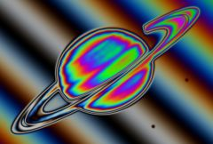

## S_PsykoStripes

将源素材与条纹图案相结合，然后通过着色处理过程。
Phase Speed 参数使颜色随时间自动旋转。

在 Sapphire Stylize 效果子菜单中。

### Inputs:

- **Source**: 当前图层。要处理的素材。

- **Mask**: 默认为无。在结果和源输入之间进行插值。白色区域使用效果结果，黑色区域使用源素材。

### Parameters:

- **Load Preset** (Push-button)
  打开预设浏览器，浏览此效果的所有可用预设。

- **Save Preset** (Push-button)
  打开预设保存对话框，保存此效果的预设。

- **Mocha Project** (Default: 0, Range: 0 or greater)
  打开 Mocha 窗口用于跟踪素材和生成遮罩。

- **Blur Mocha** (Default: 0, Range: 0 or greater)
  在使用前对 Mocha 遮罩进行此量的模糊处理。可用于柔化遮罩的边缘或量化伪像，并平滑时间位移。

- **Mocha Opacity** (Default: 1, Range: 0 to 1)
  控制 Mocha 遮罩的强度。较低的值会降低效果的强度。

- **Invert Mocha** (Check-box, Default: off)
  如果启用，在应用效果之前反转 Mocha 遮罩的黑白。

- **Resize Mocha** (Default: 1, Range: 0 to 2)
  缩放 Mocha 遮罩。1.0 为原始大小。

- **Resize Rel X** (Default: 1, Range: 0 to 2)
  Mocha 遮罩的相对水平大小。

- **Resize Rel Y** (Default: 1, Range: 0 to 2)
  Mocha 遮罩的相对垂直大小。

- **Shift Mocha** (X & Y, Default: [0 0], Range: any)
  偏移 Mocha 遮罩的位置。

- **Dilate Mocha** (Default: 0, Range: -100 to 100)
  在使用前对 Mocha 遮罩进行此像素量的膨胀或腐蚀处理。

- **Dilation Quality** (Popup menu, Default: Fast)
  选择 Dilate Mocha 是在默认 Fast 模式下快速调整还是在 High 质量模式下获得更好效果。
  - **Fast**: 以 Fast 模式进行 Dilate Mocha，用于快速调整。
  - **High**: 以 High 质量模式进行 Dilate Mocha，获得更好看的遮罩形状。

- **Bypass Mocha** (Check-box, Default: off)
  忽略 Mocha 遮罩并将效果应用于整个源素材。

- **Show Mocha Only** (Check-box, Default: off)
  绕过效果并仅显示 Mocha 遮罩本身。

- **Combine Masks** (Popup menu, Default: Union)
  决定当效果同时提供 Mocha 遮罩和输入遮罩时如何合并它们。
  - **Union**: 使用两个遮罩共同覆盖的区域。
  - **Intersect**: 使用两个遮罩之间重叠的区域。
  - **Mocha Only**: 忽略输入遮罩，仅使用 Mocha 遮罩。

- **Stripe Dir** (Default: 45, Range: any)
  条纹的方向，以相对于垂直方向的角度表示（单位为度）。

- **Stripe Mag** (Default: 0.5, Range: 0 or greater)
  条纹的幅度。增加可在条纹方向上获得更多颜色循环。

- **Source Blur** (Default: 0.088, Range: 0 or greater)
  如果为正值，在应用着色之前将源的边缘平滑此量。

- **Source Scale** (Default: 1, Range: 0 or greater)
  缩放源值，但不缩放添加的条纹。

- **Freq Colors** (Default: 3, Range: 0 or greater)
  颜色图案的频率。增加可获得更多色谱循环的更繁忙纹理。

- **Freq Red** (Default: 1, Range: 0 or greater)
  红色分量的频率。增加可获得红色通道中更多循环。

- **Freq Green** (Default: 1.1, Range: 0 or greater)
  绿色分量的频率。增加可获得绿色通道中更多循环。

- **Freq Blue** (Default: 1.2, Range: 0 or greater)
  蓝色分量的频率。增加可获得蓝色通道中更多循环。

- **Phase Start** (Default: 0.5, Range: any)
  颜色图案的相位偏移。

- **Phase Speed** (Default: 1, Range: any)
  颜色图案的相位速度。如果非零，相位将自动动画，使颜色图案产生沸腾效果。

- **Phase Red** (Default: 0, Range: any)
  红色分量的相位偏移。

- **Phase Green** (Default: 0, Range: any)
  绿色分量的相位偏移。

- **Phase Blue** (Default: 0, Range: any)
  蓝色分量的相位偏移。

- **Brightness** (Default: 1, Range: 0 or greater)
  缩放结果的亮度。

- **Color** (Default rgb: [1 1 1])
  缩放结果的颜色。例如，如果为黄色 [1 1 0]，则结果的蓝色将为 0。

- **Offset** (Default: 0, Range: -8 to 2)
  向结果添加此灰度值（如为负则减去）。0 无效果，0.5 为中灰，1 为白色。

- **Saturation** (Default: 1, Range: 0 to 10)
  缩放颜色强度。增加可获得更鲜艳的颜色，减少可获得更柔和的颜色。

- **Scale By Source** (Default: 0, Range: 0 to 1)
  随着此值增加到 1，输出的亮度将被原始源亮度缩小。

- **Scale By Src Amp** (Default: 1, Range: 0 or greater)
  放大 Scale By Source 的效果，如果增加到 1 以上，中间灰色仍可保持其完整亮度。除非 Scale By Source 为正值，否则此参数无效。

- **Mix With Source** (Default: 0, Range: 0 to 1)
  在结果 (0) 和原始源 (1) 之间进行插值。

- **Input Opacity** (Popup menu, Default: Normal)
  决定处理不透明度/透明度的方法。
  - **All Opaque**: 当输入图像完全不透明且没有透明度 (alpha=1) 时使用此选项可稍微加快渲染速度。
  - **Normal**: 正常处理不透明度。
  - **As Premult**: 按图像已经是预乘形式（颜色已按不透明度缩放）来处理。此选项的渲染速度也比 Normal 模式稍快，但结果也将是预乘形式，有时不太准确。

- **Output Opacity** (Popup menu, Default: Copy From Input)
  决定结果的不透明度/透明度。此效果不处理其输入的不透明度（alpha 通道），但可以从输入复制不透明度，或输出完全不透明的结果。
  - **All Opaque**: 使结果完全不透明，无透明度。
  - **Copy From Input**: 从应用此效果的当前图层复制不透明度/透明度。

- **Mask Use** (Popup menu, Default: Luma)
  决定如何使用遮罩输入通道来制作单色遮罩。
  - **Luma**: 使用 RGB 通道的亮度。
  - **Alpha**: 仅使用 Alpha 通道。

- **Blur Mask** (Default: 0.05, Range: 0 or greater)
  在使用前对遮罩输入进行此量的模糊处理。这可以在遮罩和非遮罩区域之间提供更平滑的过渡。除非提供了遮罩输入，否则此参数无效。

- **Invert Mask** (Check-box, Default: off)
  如果启用，反转遮罩输入，使效果应用于遮罩为黑色而非白色的区域。除非提供了遮罩输入，否则此参数无效。
