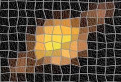

## S_RomanTile

基于源素材生成马赛克图案。调整 Edge Attract 参数可使砖块角落向源中的边缘靠拢。
增加 Vary Shape 可获得不太规则的砖块图案。

在 Sapphire Stylize 效果子菜单中。

### Inputs:

- **Source**: 当前图层。要处理的素材。

- **Matte**: 默认为无。定义将被平铺的区域。

### Parameters:

- **Load Preset** (Push-button)
  打开预设浏览器，浏览此效果的所有可用预设。

- **Save Preset** (Push-button)
  打开预设保存对话框，保存此效果的预设。

- **Mocha Project** (Default: 0, Range: 0 or greater)
  打开 Mocha 窗口用于跟踪素材和生成遮罩。

- **Blur Mocha** (Default: 0, Range: 0 or greater)
  在使用前对 Mocha 遮罩进行此量的模糊处理。可用于柔化遮罩的边缘或量化伪像，并平滑时间位移。

- **Mocha Opacity** (Default: 1, Range: 0 to 1)
  控制 Mocha 遮罩的强度。较低的值会降低效果的强度。

- **Invert Mocha** (Check-box, Default: off)
  如果启用，在应用效果之前反转 Mocha 遮罩的黑白。

- **Resize Mocha** (Default: 1, Range: 0 to 2)
  缩放 Mocha 遮罩。1.0 为原始大小。

- **Resize Rel X** (Default: 1, Range: 0 to 2)
  Mocha 遮罩的相对水平大小。

- **Resize Rel Y** (Default: 1, Range: 0 to 2)
  Mocha 遮罩的相对垂直大小。

- **Shift Mocha** (X & Y, Default: [0 0], Range: any)
  偏移 Mocha 遮罩的位置。

- **Dilate Mocha** (Default: 0, Range: -100 to 100)
  在使用前对 Mocha 遮罩进行此像素量的膨胀或腐蚀处理。

- **Dilation Quality** (Popup menu, Default: Fast)
  选择 Dilate Mocha 是在默认 Fast 模式下快速调整还是在 High 质量模式下获得更好效果。
  - **Fast**: 以 Fast 模式进行 Dilate Mocha，用于快速调整。
  - **High**: 以 High 质量模式进行 Dilate Mocha，获得更好看的遮罩形状。

- **Bypass Mocha** (Check-box, Default: off)
  忽略 Mocha 遮罩并将效果应用于整个源素材。

- **Show Mocha Only** (Check-box, Default: off)
  绕过效果并仅显示 Mocha 遮罩本身。

- **Combine Masks** (Popup menu, Default: Union)
  决定当效果同时提供 Mocha 遮罩和输入遮罩时如何合并它们。
  - **Union**: 使用两个遮罩共同覆盖的区域。
  - **Intersect**: 使用两个遮罩之间重叠的区域。
  - **Mocha Only**: 忽略输入遮罩，仅使用 Mocha 遮罩。

- **Tile Size** (Default: 0.5, Range: 0 or greater)
  单个砖块的宽度。

- **Tile Shape** (Popup menu, Default: Square)
  决定砖块的形状。
  - **Square**: 四边形砖块。
  - **Hexagon**: 六边形砖块。

- **Vary Shape** (Default: 0.2, Range: 0 to 1)
  控制砖块形状的变化程度。设为 0 可获得形状规则的砖块，设为 1 可获得随机形状的砖块。

- **Tile Shift** (X & Y, Default: [0 0], Range: any)
  结果的平移偏移。

- **Tile Edge Sharpness** (Default: 0.9, Range: 0 to 1)
  砖块边缘 3D 光照衰减的锐利程度。设为 1 可获得非常锐利的砖块边缘，设为较低数值可获得更柔和、更弯曲的砖块。

- **Tile Texture Freq** (Default: 50, Range: 0 or greater)
  频率控制砖块表面凹凸纹理的粗细程度。

- **Tile Roughness** (Default: 0.75, Range: 0 to 1)
  砖块表面凹凸纹理的高度。

- **Tile Height** (Default: 0.5, Range: 0 or greater)
  砖块边缘光照的强度。

- **Tile Opacity** (Default: 0.9, Range: 0 to 1)
  砖块的不透明度。设为 0 可显示源素材，设为 1 则仅显示砖块。

- **Cracked Tiles** (Default: 0, Range: 0 to 1)
  砖块沿源中边缘开裂的可能性。设为 0 不产生裂纹砖块，设为 1 则可检测到边缘的砖块均会开裂。设为 0.5 时，只有具有强烈边缘的砖块才会开裂。渐变非常缓慢的砖块永远不会开裂。

- **Smooth Colors** (Default: 0.2, Range: 0 or greater)
  控制调色板中颜色的变化。增加可使只有非常锐利的图像边缘才会改变砖块颜色。

- **Edge Attract** (Default: 0.2, Range: 0 to 1)
  砖块角落向图像中边缘靠拢的程度。

- **Grout Color** (Default rgb: [0.4 0.4 0.4])
  砖块间勾缝的颜色。

- **Grout Width** (Default: 0.1, Range: 0 to 1)
  砖块间勾缝的宽度，以砖块尺寸的百分比表示。

- **Grout Texture Freq** (Default: 150, Range: 0 or greater)
  频率控制勾缝中凹凸纹理的粗细程度。

- **Grout Roughness** (Default: 0.5, Range: 0 to 1)
  勾缝中凹凸纹理的高度。

- **Grout Opacity** (Default: 1, Range: 0 to 1)
  砖块间勾缝的不透明度。设为 0 可显示源素材，设为 1 则仅显示勾缝。

- **Light Position** (X & Y, Default: [0.9 0.5], Range: any)
  光源的 XY 位置。可使用 Light Position 控件调整此参数。

- **Light Brightness** (Default: 1, Range: 0 or greater)
  砖块使用 3D 点光源进行照明。此参数设置该光源的亮度。设为 0 可禁用光源，增加数值可增强光源强度。

- **Light Color** (Default rgb: [0.5 0.5 0.5])
  光源的颜色。

- **Light Z** (Default: 5, Range: 1 or greater)
  光源的高度。

- **Crop To Alpha** (Check-box, Default: off)
  将砖块裁剪至源的 Alpha 范围。如果提供了遮罩输入，马赛克也将被裁剪至遮罩范围。关闭时，在图像不透明区域内生成的砖块可能会延伸到透明区域。开启时，砖块本身将在不透明区域的边缘处被裁剪。

- **Bg Brightness** (Default: 1, Range: 0 to 1)
  在与马赛克合成之前缩放背景的亮度。如果为 0，结果将仅包含黑色背景上的马赛克图像。

- **Invert Matte** (Check-box, Default: off)
  如果启用，反转遮罩输入，使效果应用于遮罩为黑色而非白色的区域。除非提供了遮罩输入，否则此参数无效。

- **Matte Use** (Popup menu, Default: Alpha)
  决定如何使用遮罩输入通道来制作单色遮罩。
  - **Luma**: 使用 RGB 通道的亮度。
  - **Alpha**: 仅使用 Alpha 通道。

- **Seed** (Default: 0.123, Range: 0 or greater)
  用于初始化随机数生成器。实际种子值并不重要，但不同的种子会给出不同的结果，相同的值应给出可重复的结果。

- **Opacity** (Popup menu, Default: Normal)
  决定处理不透明度/透明度的方法。
  - **All Opaque**: 当输入图像完全不透明且没有透明度 (alpha=1) 时使用此选项可稍微加快渲染速度。
  - **Normal**: 正常处理不透明度。
  - **As Premult**: 按图像已经是预乘形式（颜色已按不透明度缩放）来处理。此选项的渲染速度也比 Normal 模式稍快，但结果也将是预乘形式，有时不太准确。

- **Show Light Position** (Check-box, Default: on)
  开启或关闭用于调整 Light Position 参数的屏幕用户界面。此参数仅在 AE 和 Premiere 中出现，因为这些软件支持屏幕控件。
