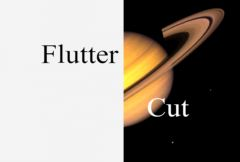

## S_FlutterCut

通过在两个片段之间快速来回切换来实现转场，还可以选择插入纯色或反色帧。每个片段的切换长度可以在转场过程中逐渐变长或变短。

在 Sapphire Transitions 效果子菜单中。

### Inputs:

- **Foreground**: 当前图层。以此片段开始转场。

- **Background**: 默认为无。以此片段结束转场。

### Parameters:

- **Load Preset** (Push-button)
  打开预设浏览器，浏览此效果的所有可用预设。

- **Save Preset** (Push-button)
  打开预设保存对话框，保存此效果的预设。

- **From Start Frames** (Integer, Default: 2, Range: 1 or greater)
  转场第一个周期中 From 片段的帧数。

- **From End Frames** (Integer, Default: 2, Range: 1 or greater)
  转场最后一个周期中 From 片段的帧数。

- **From Acceleration** (Default: 1, Range: 1 or greater)
  切换长度变化的速度。设置为 1 时，长度会在 From Start Frames 和 From End Frames 之间逐渐变化，在最后一个周期达到最终值。随着值增大，切换长度将更快地变化并更快地达到最终值。

- **To Start Frames** (Integer, Default: 2, Range: 1 or greater)
  转场第一个周期中 To 片段的帧数。

- **To End Frames** (Integer, Default: 2, Range: 1 or greater)
  转场最后一个周期中 To 片段的帧数。

- **To Acceleration** (Default: 1, Range: 1 or greater)
  切换长度变化的速度。设置为 1 时，长度会在 To Start Frames 和 To End Frames 之间逐渐变化，在最后一个周期达到最终值。随着值增大，切换长度将更快地变化并更快地达到最终值。

### Colored Frames Parameters:

Color1:
*Default rgb:
*[0 0 0].添加到模式中的纯色。

Color1 Frames:
*Integer, Default:
*0,
*Range:
*0 or greater.每个周期中 Color 1 帧的数量。在整个转场过程中保持不变。

Color1 Position:
*Popup menu, Default: After Both
*.Color 1 帧在模式中的位置。
*Before From:
*在周期的开头，From 片段之前。*After From:
*在周期的中间，From 和 To 片段之间。*After To:
*在周期的末尾，To 片段之后。*After Both:
*在周期的中间以及末尾（但不在转场最后一个周期之后的最末端）。

Color2:
*Default rgb:
*[1 1 1].添加到模式中的另一种纯色。

Color2 Frames:
*Integer, Default:
*0,
*Range:
*0 or greater.每个周期中 Color 2 帧的数量。在整个转场过程中保持不变。

Color2 Position:
*Popup menu, Default: After Both
*.Color 2 帧在模式中的位置。
*Before From:
*在周期的开头，From 片段之前。*After From:
*在周期的中间，From 和 To 片段之间。*After To:
*在周期的末尾，To 片段之后。*After Both:
*在周期的中间以及末尾（但不在转场最后一个周期之后的最末端）。

### Invert Parameters:

Invert:
*Popup menu, Default: None
*.反转某些帧。
*None:
*不反转任何内容。*From Clip:
*仅反转 From 片段的帧。*To Clip:
*仅反转 To 片段的帧。*Both Clips:
*反转 From 和 To 片段的帧，但不反转纯色帧。*Custom Pattern:
*在 From/To/颜色模式上叠加自定义的反转帧模式。反转帧的模式由 Invert Length、Normal Before 和 Normal After 控制。

### Invert Pattern Parameters:

Invert Length:
*Integer, Default:
*1,
*Range:
*0 or greater.要连续反转的帧数。反转帧的周期由此参数、Normal Before 和 Normal After 控制，并且独立于 From/To/Color 周期。除非 Invert 设置为 Custom Pattern，否则无效。

Normal Before:
*Integer, Default:
*1,
*Range:
*0 or greater.在每组反转帧之前保留此数量的正常（非反转）帧。除非 Invert 设置为 Custom Pattern，否则无效。

Normal After:
*Integer, Default:
*0,
*Range:
*0 or greater.
在每组反转帧之后保留此数量的正常（非反转）帧。除非 Invert 设置为 Custom Pattern，否则无效。
