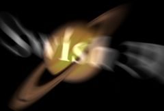

## S_Swish3D

在对两个输入片段执行 3D 运动的同时进行溶解转场。在转场过程中，From 片段由 Zdist、Rotate、Swivel、Tilt、Shift、Scale 和 Shear 参数进行变换，To 片段则由这些值的相反数进行变换。每个图像的整体运动量可以通过 Rel Amp From 和 Rel Amp To 参数进行缩放。

在 Sapphire Transitions 效果子菜单中。

### Inputs:

- **Foreground**: 当前图层。以此片段开始转场。

- **Background**: 默认为无。以此片段结束转场。

### Parameters:

- **Load Preset** (Push-button)
  打开预设浏览器，浏览此效果的所有可用预设。

- **Save Preset** (Push-button)
  打开预设保存对话框，保存此效果的预设。

- **Mode** (Popup menu, Default: Blur Warp)
  选择移动 From 和 To 片段时应用的运动模糊类型。
  - **Blur Warp**: 常规运动模糊，类似于 BlurMotion 效果。
  - **Chroma Warp**: 以不同量移动颜色通道，产生类似于 WarpChroma 的色彩边缘效果。

- **Transition Dir** (Popup menu, Default: Wipe Off to Bg)
  选择转场方向。
  - **Wipe Off to Bg**: 从当前图层转场到背景。
  - **Wipe On from Bg**: 从背景转场到当前图层。

- **Auto Trans** (Popup YES-NO, Default: No)
  启用后，将在图层的第一帧和最后一帧之间自动执行转场。如果关闭，则通过对 Swish3 Percent 参数进行动画设置来手动执行转场。

- **Wipe Percent** (Default: 0, Range: 0 to 1)
  必须禁用 Auto Trans 才能使用此参数。它确定 From 和 To 输入之间的转场比例，通常从 0 动画到 100 以执行完整的转场。可以调整控制此参数的曲线，以更精细地控制擦除的时序。

- **Center** (X & Y, Default: [0 0], Range: any)
  画面中心的位置，以屏幕坐标表示，相对于帧的中心。可以通过启用和移动 Center Widget 来设置此参数。请注意，移动中心也可能导致大小发生变化，以使 Wipe Amt 的当前值保持正确。

- **Motion Blur** (Default: 1, Range: 0 or greater)
  缩放要使用的运动模糊量。

- **Z Dist** (Default: 0.5, Range: 0.001 or greater)
  变换 From 片段的"距离"。大于 1.0 的值将其移得更远并使其变小。小于 1.0 的值将图像移得更近并放大。默认情况下，To 片段也会按此值的相反数进行变换。

- **Rotate** (Default: 0, Range: any)
  按指定角度旋转，以度为单位。

- **Swivel** (Default: 0, Range: any)
  围绕垂直轴在 3D 中向左或向右旋转。

- **Tilt** (Default: 0, Range: any)
  围绕水平轴在 3D 中向上或向下旋转。您可以同时使用 Swivel 和 Tilt 围绕任意对角线轴旋转。

- **Perspective Amount** (Default: 1, Range: 0.25 to 4)
  控制应用 Swivel 和 Tilt 时的镜头伸缩程度。增大以获得更强的 3D 透视效果。

- **Shift** (X & Y, Default: [0 0], Range: any)
  图案的平移。

- **Scale** (Default: 1, Range: 0 to 2)
  缩放片段的大小。

- **Scale Rel** (X & Y, Default: [1 1], Range: 0 to 2)
  缩放片段的相对水平或垂直大小。

- **Shear** (X & Y, Default: [0 0], Range: any)
  水平或垂直剪切。

- **Rel Amp From** (Default: 1, Range: any)
  缩放应用于 From 片段的变换量。设置为零可禁用 From 片段的移动。设为负值可反转运动。

- **Rel Amp To** (Default: -1, Range: any)
  缩放应用于 To 片段的变换量。默认情况下，To 片段的变换方向与 From 片段相反。设置为零可禁用 To 片段的移动。设为正值可使 To 片段与 From 片段同向移动。

- **Fade** (Popup menu, Default: From and To)
  确定在转场过程中哪些片段进行淡入淡出。
  - **From and To**: 在转场过程中对两个片段进行交叉溶解。
  - **Only From**: 淡出 From 片段并将其合成到 To 片段之上。这使得 To 片段在 From 片段未重叠的区域保持完全不透明。
  - **Only To**: 淡入 To 片段并将其合成到 From 片段之上。这使得 From 片段在 To 片段未重叠的区域保持完全不透明。

- **Fade Mid Time** (Default: 0.5, Range: 0 to 1)
  图像溶解的时间中点。减小以提前溶解，增大以延后溶解。如果设为 1.0，From 片段将在整个转场期间保持完全不透明。您可以将此与 Combine 参数结合使用，以创建各种不进行淡化的显示效果。例如，将 Dissolve Mid Time 设为 1.0，Combine 设为 Fade From，然后使用 Shift 和/或 Rotate 使 From 片段移出屏幕。

- **Slow In** (Default: 0.5, Range: 0 to 1)
  如果为正值，使转场开始更加平缓。

- **Slow Out** (Default: 0.5, Range: 0 to 1)
  如果为正值，使转场结束更加平缓。

- **Wrap From** (X & Y, Popup menu, Default: [ Reflect Reflect ])
  确定访问 From 图像边界之外区域的方法。
  - **No**: 边界之外显示黑色。
  - **Tile**: 重复图像的副本。
  - **Reflect**: 重复镜像副本。使用此方法时边缘通常不太明显。

- **Wrap To** (X & Y, Popup menu, Default: [ Reflect Reflect ])
  确定访问 To 图像边界之外区域的方法。
  - **No**: 边界之外显示黑色。
  - **Tile**: 重复图像的副本。
  - **Reflect**: 重复镜像副本。使用此方法时边缘通常不太明显。

- **Filter** (Check-box, Default: on)
  启用后，图像在重新采样时进行自适应过滤。当图像缩小变形时，这会产生更好的质量结果。

- **Brightness** (Default: 1, Range: 0 or greater)
  缩放结果的亮度。可以对此进行动画设置以在转场期间增亮结果，但通常应以 1.0 开始和结束，以避免在转场开始或结束时出现跳跃。

- **Mid Brightness** (Default: 1, Range: 0 or greater)
  在转场中点按此量缩放结果的亮度。在转场过程中自动增加到此亮度然后恢复。

- **Steps** (Integer, Default: 8, Range: 3 to 100)
  在 From（红色）和 To（蓝色）变换之间的路径上包含的光谱采样数量。更多步数产生更平滑的结果，但需要更多处理时间。

- **Color1** (Default rgb: [1 0 0])
  From 变换处的颜色。

- **Color2** (Default rgb: [0 1 0])
  From 和 To 变换中间的颜色。

- **Color3** (Default rgb: [0 0 1])
  To 变换处的颜色。

- **White Balance** (Check-box, Default: off)
  启用后，三种颜色在内部进行调整使其总和为白色。在这种情况下，未变形区域的颜色不受影响，结果的平均颜色保持不变。

- **Opacity** (Popup menu, Default: Normal)
  确定处理不透明度/透明度的方法。
  - **All Opaque**: 当输入图像完全不透明且没有透明度 (alpha=1) 时，使用此选项可以稍微加快渲染速度。
  - **Normal**: 正常处理不透明度。
  - **As Premult**: 按预乘形式处理图像（颜色已按不透明度缩放）。此选项的渲染速度也比 Normal 模式稍快，但结果也将以预乘形式呈现，有时不太准确。如果您的图像在遮罩通道也有锐利边缘的位置有突然的颜色变化，使用 Normal 模式可能会获得更好的结果。

- **Show To Shift** (Check-box, Default: off)
  打开或关闭用于调整 Center 参数的屏幕用户界面。此参数仅在 AE 和 Premiere 中出现，这些平台支持屏幕控件。

- **Show To Transform** (Check-box, Default: on)
  打开或关闭用于调整 To Z Dist 和 To Rotate 参数的屏幕用户界面。此参数仅在 AE 和 Premiere 中出现，这些平台支持屏幕控件。

- **Show From Shift** (Check-box, Default: off)
  打开或关闭用于调整 Center 参数的屏幕用户界面。此参数仅在 AE 和 Premiere 中出现，这些平台支持屏幕控件。

- **Show From Transform** (Check-box, Default: on)
  打开或关闭用于调整 Center 参数的屏幕用户界面。此参数仅在 AE 和 Premiere 中出现，这些平台支持屏幕控件。

- **Show Center** (Check-box, Default: on)
  打开或关闭用于调整 Center 参数的屏幕用户界面。此参数仅在 AE 和 Premiere 中出现，这些平台支持屏幕控件。
