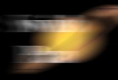

## S_SwishPan

通过将一个片段滑出画面并将另一个片段滑入来实现两个输入片段之间的转场，同时添加运动模糊以呈现快速摇镜的效果。当转场持续时间较短时效果最佳。

在 Sapphire Transitions 效果子菜单中。

### Inputs:

- **Foreground**: 当前图层。以此片段开始转场。

- **Background**: 默认为无。以此片段结束转场。

### Parameters:

- **Load Preset** (Push-button)
  打开预设浏览器，浏览此效果的所有可用预设。

- **Save Preset** (Push-button)
  打开预设保存对话框，保存此效果的预设。

- **Transition Dir** (Popup menu, Default: Wipe Off to Bg)
  选择转场方向。
  - **Wipe Off to Bg**: 从当前图层转场到背景。
  - **Wipe On from Bg**: 从背景转场到当前图层。

- **Auto Trans** (Popup YES-NO, Default: No)
  启用后，将在图层的第一帧和最后一帧之间自动执行转场。如果关闭，则通过对 Swish Percent 参数进行动画设置来手动执行转场。

- **Wipe Percent** (Default: 0, Range: 0 to 1)
  必须禁用 Auto Trans 才能使用此参数。它确定 From 和 To 输入之间的转场比例，通常从 0 动画到 100 以执行完整的转场。可以调整控制此参数的曲线，以更精细地控制擦除的时序。

- **Direction** (Popup menu, Default: Left)
  转场过程中片段移动的方向。
  - **Left**: 从右向左移动。
  - **Right**: 从左向右移动。
  - **Up**: 向上移动。
  - **Down**: 向下移动。

- **Blur Amount** (Default: 2, Range: 0 or greater)
  要使用的运动模糊量。如果方向为左或右，模糊为水平方向。如果方向为上或下，模糊为垂直方向。

- **Overlap** (Default: 0, Range: any)
  两个片段重叠的量。在片段重叠的区域，它们将进行滤色混合。这对于消除不良边缘很有用。

- **Slow In** (Default: 0.5, Range: 0 to 1)
  如果为正值，使转场开始更加平缓。

- **Slow Out** (Default: 0.5, Range: 0 to 1)
  如果为正值，使转场结束更加平缓。

- **Opacity** (Popup menu, Default: Normal)
  确定处理不透明度/透明度的方法。
  - **All Opaque**: 当输入图像完全不透明且没有透明度 (alpha=1) 时，使用此选项可以稍微加快渲染速度。
  - **Normal**: 正常处理不透明度。
  - **As Premult**: 按预乘形式处理图像（颜色已按不透明度缩放）。此选项的渲染速度也比 Normal 模式稍快，但结果也将以预乘形式呈现，有时不太准确。如果您的图像在遮罩通道也有锐利边缘的位置有突然的颜色变化，使用 Normal 模式可能会获得更好的结果。
