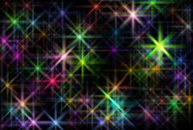

## S_SparklesColor

生成一片带有不同颜色的闪烁光芒效果。调整 Frequency、Density 和 Size 参数可获得不同类型的闪烁图案。使用 Matte 输入可仅在指定区域生成闪烁。

在 Sapphire Render 效果子菜单中。

### Inputs:

- **Background**: 当前图层。用于与闪烁效果合成的素材。

- **Matte**: 默认为无。如果提供，闪烁颜色将按此输入缩放。单色遮罩可用于选择生成闪烁的区域。彩色遮罩可用于在不同区域选择性地调整闪烁颜色。遮罩在闪烁生成前应用，因此不会裁剪产生的光芒射线。

### Parameters:

- **Load Preset** (Push-button)
  打开预设浏览器，浏览此效果的所有可用预设。

- **Save Preset** (Push-button)
  打开预设保存对话框，保存此效果的预设。

- **Mocha Project** (Default: 0, Range: 0 or greater)
  打开 Mocha 窗口，用于跟踪素材和生成遮罩。

- **Blur Mocha** (Default: 0, Range: 0 or greater)
  在使用前按此数值模糊 Mocha 遮罩。可用于柔化遮罩的边缘或量化伪影，并平滑时间位移。

- **Mocha Opacity** (Default: 1, Range: 0 to 1)
  控制 Mocha 遮罩的强度。较低的值会降低效果的强度。

- **Invert Mocha** (Check-box, Default: off)
  如果启用，则在应用效果前反转 Mocha 遮罩的黑白。

- **Resize Mocha** (Default: 1, Range: 0 to 2)
  缩放 Mocha 遮罩。1.0 为原始大小。

- **Resize Rel X** (Default: 1, Range: 0 to 2)
  Mocha 遮罩的相对水平大小。

- **Resize Rel Y** (Default: 1, Range: 0 to 2)
  Mocha 遮罩的相对垂直大小。

- **Shift Mocha** (X & Y, Default: [0 0], Range: any)
  偏移 Mocha 遮罩的位置。

- **Dilate Mocha** (Default: 0, Range: -100 to 100)
  在使用前按此像素值扩展或收缩 Mocha 遮罩。

- **Dilation Quality** (Popup menu, Default: Fast)
  选择 Dilate Mocha 是在默认的快速模式下快速调整，还是在高质量模式下获得更好的效果。
  - **Fast**: 在快速模式下扩展 Mocha 遮罩，以便快速调整。
  - **High**: 在高质量模式下扩展 Mocha 遮罩，以获得更好的遮罩形状。

- **Bypass Mocha** (Check-box, Default: off)
  忽略 Mocha 遮罩，将效果应用于整个源素材。

- **Show Mocha Only** (Check-box, Default: off)
  跳过效果，仅显示 Mocha 遮罩本身。

- **Combine Masks** (Popup menu, Default: Union)
  当同时提供 Mocha 遮罩和输入遮罩时，确定如何组合它们。
  - **Union**: 使用两个遮罩共同覆盖的区域。
  - **Intersect**: 使用两个遮罩之间重叠的区域。
  - **Mocha Only**: 忽略输入遮罩，仅使用 Mocha 遮罩。

- **Frequency** (Default: 25, Range: 0.01 or greater)
  闪烁的频率。增大可缩小视图，减小可放大视图。

- **Density** (Default: 0.65, Range: 0 to 1)
  增大可添加更多闪烁。

- **Seed** (Default: 0.23, Range: 0 or greater)
  用于初始化随机数生成器。实际的种子值本身不重要，但不同的种子会产生不同的结果，相同的值应产生可重复的结果。

- **Brightness** (Default: 1, Range: 0 or greater)
  缩放所有闪烁的亮度。

- **Color** (Default rgb: [1 1 1])
  缩放所有闪烁的颜色。

- **Color Variation** (Default: 1, Range: 0 or greater)
  缩放闪烁的饱和度。增大可获得更鲜艳的颜色，减小可获得更柔和的颜色。

- **Brightness X** (Default: 1, Range: 0 or greater)
  缩放水平光芒射线的亮度。

- **Brightness Y** (Default: 1, Range: 0 or greater)
  缩放垂直光芒射线的亮度。

- **Brightness Diag1** (Default: 1, Range: 0 or greater)
  缩放从右上到左下的对角射线的亮度。

- **Brightness Diag2** (Default: 1, Range: 0 or greater)
  缩放从左上到右下的对角射线的亮度。

- **Size** (Default: 1, Range: 0 or greater)
  缩放所有光芒射线的长度。此参数和所有尺寸参数都可以通过 Size Widget 调整。

- **Size X** (Default: 1, Range: 0 or greater)
  缩放水平光芒射线的长度。

- **Size Y** (Default: 1, Range: 0 or greater)
  缩放垂直光芒射线的长度。

- **Size Diag1** (Default: 0.5, Range: 0 or greater)
  缩放从左上到右下的对角射线的长度。

- **Size Diag2** (Default: 0.5, Range: 0 or greater)
  缩放从右上到左下的对角射线的长度。

- **Size Red** (Default: 0.6, Range: 0 or greater)
  缩放射线红色分量的长度。如果红、绿、蓝尺寸相等，闪烁将是单色的。

- **Size Green** (Default: 0.8, Range: 0 or greater)
  缩放射线绿色分量的长度。

- **Size Blue** (Default: 1, Range: 0 or greater)
  缩放射线蓝色分量的长度。

- **Shift Start** (X & Y, Default: [0 0], Range: any)
  结果的平移偏移。

- **Shift Speed** (X & Y, Default: [0 0], Range: any)
  结果的平移速度。如果非零，结果将自动以此速率进行动画平移。动画速度值的结果可能不太直观，因此对于可变速度运动，通常最好将此值设为 0 并改为对 Shift Start 值进行动画。

- **Sparkle Speed** (X & Y, Default: [0.1 0], Range: any)
  如果非零，闪烁将自动以此速率闪烁开关。

- **Affect Alpha** (Default: 1, Range: 0 or greater)
  如果此值为正，输出 Alpha 通道将包含来自闪烁的一些不透明度。闪烁的红、绿、蓝亮度的最大值按此值缩放，并在每个像素处与背景 Alpha 组合。

- **Bg Brightness** (Default: 1, Range: 0 or greater)
  在与 Sparkles 合成前缩放背景的亮度。如果为 0，结果将仅包含黑色背景上的闪烁图像。

- **Smooth Anim** (Check-box, Default: off)
  启用以获得更稳定的动画，特别是在 Frequency 值较高时。

- **Invert Matte** (Check-box, Default: off)
  如果启用，则反转遮罩输入，使效果应用于遮罩为黑色而非白色的区域。除非提供了遮罩输入，否则无效。

- **Matte Use** (Popup menu, Default: RGB)
  确定如何使用遮罩输入通道来生成单色遮罩。
  - **RGB**: 使用红、绿、蓝通道。
  - **Alpha**: 仅使用 Alpha 通道。

- **Opacity** (Popup menu, Default: Normal)
  确定处理不透明度/透明度的方法。
  - **All Opaque**: 当输入图像完全不透明且没有透明度（alpha=1）时，使用此选项可稍微加快渲染速度。
  - **Normal**: 正常处理不透明度。
  - **As Premult**: 按预乘形式处理图像（颜色已按不透明度缩放）。此选项的渲染速度也比 Normal 模式稍快，但结果也将是预乘形式，有时不太正确。

- **Swap Diagonals** (Check-box, Default: off)
  如果需要，垂直翻转闪烁以获得一致的外观。

- **Show Size** (Check-box, Default: on)
  打开或关闭用于调整尺寸参数的屏幕用户界面。此参数仅在 AE 和 Premiere 中出现，这些软件支持屏幕小部件。
