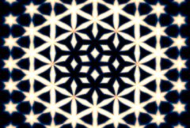

## S_TextureTiles

TextureTiles 绘制重复的瓷砖图案。根据 Morph 参数的不同，形状可以是六边形、三角形、菱形、星形或它们的变体。

在 Sapphire Render 效果子菜单中。

### Inputs:

- **Background**: 当前图层。用于与纹理图像合成的素材。如果 Combine 选项设置为 Texture Only，则可能忽略此输入。

- **Mask**: 默认为无。在结果与源输入之间进行插值。白色区域使用效果结果，黑色区域使用源素材。

### Parameters:

- **Load Preset** (Push-button)
  打开预设浏览器，浏览此效果的所有可用预设。

- **Save Preset** (Push-button)
  打开预设保存对话框，保存此效果的预设。

- **Mocha Project** (Default: 0, Range: 0 or greater)
  打开 Mocha 窗口，用于跟踪素材和生成遮罩。

- **Blur Mocha** (Default: 0, Range: 0 or greater)
  在使用前按此数值模糊 Mocha 遮罩。可用于柔化遮罩的边缘或量化伪影，并平滑时间位移。

- **Mocha Opacity** (Default: 1, Range: 0 to 1)
  控制 Mocha 遮罩的强度。较低的值会降低效果的强度。

- **Invert Mocha** (Check-box, Default: off)
  如果启用，则在应用效果前反转 Mocha 遮罩的黑白。

- **Resize Mocha** (Default: 1, Range: 0 to 2)
  缩放 Mocha 遮罩。1.0 为原始大小。

- **Resize Rel X** (Default: 1, Range: 0 to 2)
  Mocha 遮罩的相对水平大小。

- **Resize Rel Y** (Default: 1, Range: 0 to 2)
  Mocha 遮罩的相对垂直大小。

- **Shift Mocha** (X & Y, Default: [0 0], Range: any)
  偏移 Mocha 遮罩的位置。

- **Dilate Mocha** (Default: 0, Range: -100 to 100)
  在使用前按此像素值扩展或收缩 Mocha 遮罩。

- **Dilation Quality** (Popup menu, Default: Fast)
  选择 Dilate Mocha 是在默认的快速模式下快速调整，还是在高质量模式下获得更好的效果。
  - **Fast**: 在快速模式下扩展 Mocha 遮罩，以便快速调整。
  - **High**: 在高质量模式下扩展 Mocha 遮罩，以获得更好的遮罩形状。

- **Bypass Mocha** (Check-box, Default: off)
  忽略 Mocha 遮罩，将效果应用于整个源素材。

- **Show Mocha Only** (Check-box, Default: off)
  跳过效果，仅显示 Mocha 遮罩本身。

- **Combine Masks** (Popup menu, Default: Union)
  当同时提供 Mocha 遮罩和输入遮罩时，确定如何组合它们。
  - **Union**: 使用两个遮罩共同覆盖的区域。
  - **Intersect**: 使用两个遮罩之间重叠的区域。
  - **Mocha Only**: 忽略输入遮罩，仅使用 Mocha 遮罩。

- **Size** (Default: 0.5, Range: 0 or greater)
  每个瓷砖在其单元格内的大小。零将全部为 color0，一将全部为 color1。此参数不会改变图案的整体大小；请使用 Frequency。

- **Frequency** (Default: 5, Range: 0.01 or greater)
  瓷砖图案的空间频率；增大可获得更多更小的瓷砖，减小可获得更少更大的瓷砖。可通过 Frequency Widget 调整此参数。

- **Angle** (Default: 0, Range: any)
  围绕中心点旋转整个图案。使用 Shift 调整旋转中心。

- **Rel Width** (Default: 1, Range: 0.2 or greater)
  压缩或拉伸图案。

- **Rel Wid Pre Rot** (Default: 1, Range: 0.1 or greater)
  在按 Angle 旋转前压缩或拉伸图案。如果您希望压缩/拉伸后的整个图案围绕中心旋转，请使用此参数。如果 Angle 为零，此参数与 Rel Width 效果相同。

- **Shift** (X & Y, Default: [0 0], Range: any)
  在屏幕上移动整个图案。同时设置旋转、Morph Radial 和 Size Radial 的中心点。

- **Morph Shapes** (Default: 0, Range: any)
  平滑地改变瓷砖的形状，从六边形到三角形、菱形和星形。

- **Morph Speed** (Default: 0.5, Range: any)
  随时间自动动画形状变形。值为一表示每秒完成一个完整的变形周期。

- **Morph Grad Add** (Default: 0, Range: any)
  在图像上改变形状变形，使左侧为一种形状，右侧为另一种。参见 Morph Grad Angle 更改此渐变的角度。

- **Morph Grad Angle** (Default: 0, Range: any)
  变形渐变的角度。如果 Morph Grad Add 为零，此参数无效。

- **Morph Radial** (Default: 0, Range: any)
  从中心点径向变形形状；形状在中心为（例如）六边形，向图像边缘平滑变为不同形状。Morph Shapes 和 Morph Speed 也与此参数交互。

- **Size Grad Add** (Default: 0, Range: -10 to 10)
  在图像上不同位置改变形状的大小（类似 Size 参数）。

- **Size Grad Angle** (Default: 0, Range: any)
  大小渐变的角度。如果 Size Grad Add 为零，此参数无效。

- **Size Radial** (Default: 0, Range: any)
  根据与中心点的距离改变形状的大小（类似 Size 参数）。增大可使边缘处的大小变小。

- **Edge Softness** (Default: 0.17, Range: 0 or greater)
  柔化每个瓷砖的边缘。如果 Softness Red/Green/Blue 不为一，启用此参数时瓷砖边缘周围将出现一些色散。

- **Softness Red** (Default: 0, Range: 0 or greater)
  红色通道的相对柔和度；参见 Edge Softness。要移除瓷砖边缘周围的色散，请将所有 Softness Red/Green/Blue 设为一。

- **Softness Green** (Default: 1, Range: 0 or greater)
  绿色通道的相对柔和度；参见 Edge Softness。要移除瓷砖边缘周围的色散，请将所有 Softness Red/Green/Blue 设为一。

- **Softness Blue** (Default: 2, Range: 0 or greater)
  蓝色通道的相对柔和度；参见 Edge Softness。要移除瓷砖边缘周围的色散，请将所有 Softness Red/Green/Blue 设为一。

- **Invert** (Check-box, Default: off)
  反转整个图案，交换暗区和亮区。

- **Brightness1** (Default: 1, Range: 0 or greater)
  缩放 Color1 的亮度。增大以获得更多对比度。

- **Color1** (Default rgb: [1 1 1])
  纹理"较亮"部分的颜色。结果的颜色由 Color0 和 Color1 之间的插值决定。

- **Color0** (Default rgb: [0 0 0])
  纹理"较暗"部分的颜色。

- **Offset0** (Default: 0, Range: any)
  将此值添加到 color0。减小为负值以获得更多对比度。

- **Bg Brightness** (Default: 1, Range: 0 or greater)
  背景亮度在与纹理合成前按此值缩放。

- **Combine** (Popup menu, Default: Texture Only)
  确定纹理如何与背景组合。
  - **Texture Only**: 仅输出纹理图像，不包含背景。
  - **Mult**: 纹理与背景相乘。
  - **Add**: 纹理与背景相加。
  - **Screen**: 纹理使用滤色操作与背景混合。
  - **Difference**: 结果为纹理与背景的差值。
  - **Overlay**: 纹理使用叠加功能与背景组合。

- **Input Opacity** (Popup menu, Default: Normal)
  确定处理不透明度/透明度的方法。
  - **All Opaque**: 当输入图像完全不透明且没有透明度（alpha=1）时，使用此选项可稍微加快渲染速度。
  - **Normal**: 正常处理不透明度。
  - **As Premult**: 按预乘形式处理图像（颜色已按不透明度缩放）。此选项的渲染速度也比 Normal 模式稍快，但结果也将是预乘形式，有时不太正确。

- **Output Opacity** (Popup menu, Default: Copy From Input)
  确定结果的不透明度/透明度。此效果不处理输入的不透明度（Alpha 通道），但可以从输入复制不透明度，或输出完全不透明的结果。
  - **All Opaque**: 使结果完全不透明，没有透明度。
  - **Copy From Input**: 从给定此效果的当前图层复制不透明度/透明度。

- **Mask Use** (Popup menu, Default: Luma)
  确定如何使用 Mask 输入通道来生成单色遮罩。
  - **Luma**: 使用 RGB 通道的亮度。
  - **Alpha**: 仅使用 Alpha 通道。

- **Blur Mask** (Default: 0.05, Range: 0 or greater)
  在使用前按此数值模糊遮罩输入。这可以提供遮罩区域和非遮罩区域之间更平滑的过渡。除非提供了遮罩输入，否则无效。

- **Invert Mask** (Check-box, Default: off)
  如果启用，则反转遮罩输入，使效果应用于遮罩为黑色而非白色的区域。除非提供了遮罩输入，否则无效。

- **Show Frequency** (Check-box, Default: on)
  打开或关闭用于调整 Frequency 参数的屏幕用户界面。此参数仅在 AE 和 Premiere 中出现，这些软件支持屏幕小部件。
