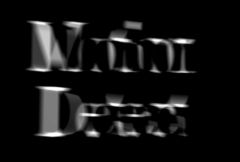

## S_MotionDetect

对于每一帧，找出该帧与其之前一帧之间的差异。

在 Sapphire Time effects 子菜单中。

### Inputs:

- **Source**: 当前图层。要处理的素材。

- **Mask**: 默认为无。在结果和源素材输入之间进行插值。白色区域使用效果结果。黑色区域使用源素材。

### Parameters:

- **Load Preset** (Push-button)
  打开预设浏览器，浏览此效果的所有可用预设。

- **Save Preset** (Push-button)
  打开预设保存对话框，保存此效果的预设。

- **Mocha Project** (Default: 0, Range: 0 or greater)
  打开 Mocha 窗口，用于跟踪素材和生成遮罩。

- **Blur Mocha** (Default: 0, Range: 0 or greater)
  在使用前按此数值模糊 Mocha 遮罩。可用于柔化遮罩的边缘或量化伪影，并平滑时间位移。

- **Mocha Opacity** (Default: 1, Range: 0 to 1)
  控制 Mocha 遮罩的强度。较低的值会降低效果的强度。

- **Invert Mocha** (Check-box, Default: off)
  如果启用，Mocha 遮罩的黑白将在应用效果之前反转。

- **Resize Mocha** (Default: 1, Range: 0 to 2)
  缩放 Mocha 遮罩。1.0 为原始大小。

- **Resize Rel X** (Default: 1, Range: 0 to 2)
  Mocha 遮罩的相对水平大小。

- **Resize Rel Y** (Default: 1, Range: 0 to 2)
  Mocha 遮罩的相对垂直大小。

- **Shift Mocha** (X & Y, Default: [0 0], Range: any)
  偏移 Mocha 遮罩的位置。

- **Dilate Mocha** (Default: 0, Range: -100 to 100)
  在使用前按此像素量扩展或收缩 Mocha 遮罩。

- **Dilation Quality** (Popup menu, Default: Fast)
  选择 Dilate Mocha 是在默认的快速模式下快速调整，还是在高质量模式下获得更好的效果。
  - **Fast**: 在快速模式下扩展 Mocha 遮罩以进行快速调整。
  - **High**: 在高质量模式下扩展 Mocha 遮罩以获得更好的遮罩形状。

- **Bypass Mocha** (Check-box, Default: off)
  忽略 Mocha 遮罩，将效果应用于整个源素材。

- **Show Mocha Only** (Check-box, Default: off)
  绕过效果，仅显示 Mocha 遮罩本身。

- **Combine Masks** (Popup menu, Default: Union)
  当两个遮罩同时提供给效果时，决定如何组合 Mocha 遮罩和输入遮罩。
  - **Union**: 使用两个遮罩共同覆盖的区域。
  - **Intersect**: 使用两个遮罩之间重叠的区域。
  - **Mocha Only**: 忽略输入遮罩，仅使用 Mocha 遮罩。

- **Delay Frames** (Integer, Default: 1, Range: any)
  向前回溯的帧数，用于获取与当前帧进行比较的先前帧。

- **Brightness** (Default: 1, Range: 0 or greater)
  缩放运动图像的亮度。

- **Offset Darks** (Default: 0, Range: -8 to 2)
  将此灰度值添加到运动图像的较暗区域。可以为负值以增加对比度。

- **Saturation** (Default: 1, Range: -2 to 10)
  缩放运动图像的颜色饱和度。增大以获得更强烈的颜色。设为 0 表示单色。

- **Motion** (Popup menu, Default: All)
  选择要检测的不同运动类型。
  - **All**: 显示所有运动，包括亮度增加和减少。
  - **Brighter**: 仅显示亮度增加的运动，例如对象在较暗背景上移动的前缘。
  - **Darker**: 仅显示亮度减少的运动，例如对象在较暗背景上移动的后缘。

- **Combine** (Popup menu, Default: Motion Only)
  确定运动图像如何与原始源素材组合。
  - **Motion Only**: 仅显示运动。
  - **Mult**: 运动与源素材相乘。
  - **Add**: 运动添加到源素材。
  - **Screen**: 运动使用滤色操作与源素材混合。
  - **Difference**: 结果为运动和源素材之间的差异。
  - **Overlay**: 使用叠加函数组合运动和源素材。
  - **Subtract**: 从源素材中减去运动图像，使这些区域变暗。

- **Input Opacity** (Popup menu, Default: Normal)
  确定处理不透明度/透明度的方法。
  - **All Opaque**: 当输入图像完全不透明且没有透明度（alpha=1）时，使用此选项可稍微加快渲染速度。
  - **Normal**: 正常处理不透明度。
  - **As Premult**: 按照图像已为预乘形式（颜色已按不透明度缩放）进行处理。此选项的渲染速度也比 Normal 模式稍快，但结果也将为预乘形式，有时不太准确。

- **Output Opacity** (Popup menu, Default: All Opaque)
  确定结果的不透明度/透明度。此效果不处理其输入的不透明度（Alpha 通道），但可以从输入复制不透明度，或输出完全不透明的结果。
  - **All Opaque**: 使结果完全不透明，没有透明度。
  - **Copy From Input**: 从给定此效果的当前图层复制不透明度/透明度。

- **Mask Use** (Popup menu, Default: Luma)
  确定如何使用 Mask 输入通道来创建单色遮罩。
  - **Luma**: 使用 RGB 通道的亮度。
  - **Alpha**: 仅使用 Alpha 通道。

- **Blur Mask** (Default: 0.05, Range: 0 or greater)
  在使用前按此数值模糊遮罩输入。这可以在遮罩区域和非遮罩区域之间提供更平滑的过渡。除非提供了遮罩输入，否则不起作用。

- **Invert Mask** (Check-box, Default: off)
  如果启用，反转遮罩输入，使效果应用于遮罩为黑色而非白色的区域。除非提供了遮罩输入，否则不起作用。

