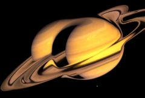

## S_TimeDisplace

根据遮罩输入的亮度值，在时间上对源素材进行可变量的位移。

在 Sapphire Time effects 子菜单中。

### Inputs:

- **Source**: 当前图层。要处理的素材。

- **Matte**: 默认为无。确定时间位移的量。在遮罩为白色的地方，源素材按 White Time Shift 给定的帧数进行时间偏移，在遮罩为黑色的地方按 Black Time Shift 进行偏移。灰色区域按相应的插值量进行时间偏移。此输入可以使用 Blur Matte 参数进行可选的模糊处理。如果未提供此输入，则使用源素材输入代替作为位移遮罩。

### Parameters:

- **Load Preset** (Push-button)
  打开预设浏览器，浏览此效果的所有可用预设。

- **Save Preset** (Push-button)
  打开预设保存对话框，保存此效果的预设。

- **Mocha Project** (Default: 0, Range: 0 or greater)
  打开 Mocha 窗口，用于跟踪素材和生成遮罩。

- **Blur Mocha** (Default: 0, Range: 0 or greater)
  在使用前按此数值模糊 Mocha 遮罩。可用于柔化遮罩的边缘或量化伪影，并平滑时间位移。

- **Mocha Opacity** (Default: 1, Range: 0 to 1)
  控制 Mocha 遮罩的强度。较低的值会降低效果的强度。

- **Invert Mocha** (Check-box, Default: off)
  如果启用，Mocha 遮罩的黑白将在应用效果之前反转。

- **Resize Mocha** (Default: 1, Range: 0 to 2)
  缩放 Mocha 遮罩。1.0 为原始大小。

- **Resize Rel X** (Default: 1, Range: 0 to 2)
  Mocha 遮罩的相对水平大小。

- **Resize Rel Y** (Default: 1, Range: 0 to 2)
  Mocha 遮罩的相对垂直大小。

- **Shift Mocha** (X & Y, Default: [0 0], Range: any)
  偏移 Mocha 遮罩的位置。

- **Dilate Mocha** (Default: 0, Range: -100 to 100)
  在使用前按此像素量扩展或收缩 Mocha 遮罩。

- **Dilation Quality** (Popup menu, Default: Fast)
  选择 Dilate Mocha 是在默认的快速模式下快速调整，还是在高质量模式下获得更好的效果。
  - **Fast**: 在快速模式下扩展 Mocha 遮罩以进行快速调整。
  - **High**: 在高质量模式下扩展 Mocha 遮罩以获得更好的遮罩形状。

- **Bypass Mocha** (Check-box, Default: off)
  忽略 Mocha 遮罩，将效果应用于整个源素材。

- **Show Mocha Only** (Check-box, Default: off)
  绕过效果，仅显示 Mocha 遮罩本身。

- **Combine Masks** (Popup menu, Default: Union)
  当两个遮罩同时提供给效果时，决定如何组合 Mocha 遮罩和输入遮罩。
  - **Union**: 使用两个遮罩共同覆盖的区域。
  - **Intersect**: 使用两个遮罩之间重叠的区域。
  - **Mocha Only**: 忽略输入遮罩，仅使用 Mocha 遮罩。

- **Black Time Shift** (Default: -10, Range: any)
  在遮罩为黑色的地方按此帧数进行时间偏移。

- **White Time Shift** (Default: 10, Range: any)
  在遮罩为白色的地方按此帧数进行时间偏移。

- **Shift Relative To** (Popup menu, Default: Current Frame)
  选择相对或绝对时间偏移。
  - **Frame 0**: 时间偏移到绝对帧号，相对于第一帧。
  - **Current Frame**: 相对于当前帧进行时间偏移。

- **Interp Frames** (Check-box, Default: off)
  选择非整数帧号引用时使用的方法。如果禁用，使用最近的整数帧号而不进行插值，通常会在时间切片之间产生可见的边缘。如果启用，则在两个最近的整数帧号之间执行加权插值，使时间切片之间的结果更平滑。

- **Matte Use** (Popup menu, Default: Luma)
  确定如何使用 Matte 输入通道来创建单色遮罩。
  - **Luma**: 使用 RGB 通道的亮度。
  - **Alpha**: 仅使用 Alpha 通道。

- **Blur Matte** (Default: 0.224, Range: 0 or greater)
  在使用前按此数值模糊 Matte 输入。可用于柔化遮罩的边缘或量化伪影，并平滑时间位移。

- **Opacity** (Popup menu, Default: Normal)
  确定处理不透明度/透明度的方法。
  - **All Opaque**: 当输入图像完全不透明且没有透明度（alpha=1）时，使用此选项可稍微加快渲染速度。
  - **Normal**: 正常处理不透明度。
  - **As Premult**: 按照图像已为预乘形式（颜色已按不透明度缩放）进行处理。此选项的渲染速度也比 Normal 模式稍快，但结果也将为预乘形式，有时不太准确。

