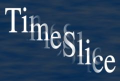

## S_TimeSlice

将输出帧分成切片，每个切片接收源素材中的不同帧。此效果的一个示例用途是使旋转的对象扭曲成螺旋形状，而不是刚性旋转。切片的方向取决于 Slice Direction，并接收正负 Slice Number 一半之间的相对帧号。例如，如果当前帧号为 30，Slice Direction 为 -90 度，Slice Number 为 12，Frame Offset 为 0，结果将由从下到上包含大约第 30-6 到 30+6 帧的水平切片组成。

在 Sapphire Time effects 子菜单中。

### Inputs:

- **Source**: 当前图层。要处理的素材。

- **Mask**: 默认为无。在结果和源素材输入之间进行插值。白色区域使用效果结果。黑色区域使用源素材。

### Parameters:

- **Load Preset** (Push-button)
  打开预设浏览器，浏览此效果的所有可用预设。

- **Save Preset** (Push-button)
  打开预设保存对话框，保存此效果的预设。

- **Mocha Project** (Default: 0, Range: 0 or greater)
  打开 Mocha 窗口，用于跟踪素材和生成遮罩。

- **Blur Mocha** (Default: 0, Range: 0 or greater)
  在使用前按此数值模糊 Mocha 遮罩。可用于柔化遮罩的边缘或量化伪影，并平滑时间位移。

- **Mocha Opacity** (Default: 1, Range: 0 to 1)
  控制 Mocha 遮罩的强度。较低的值会降低效果的强度。

- **Invert Mocha** (Check-box, Default: off)
  如果启用，Mocha 遮罩的黑白将在应用效果之前反转。

- **Resize Mocha** (Default: 1, Range: 0 to 2)
  缩放 Mocha 遮罩。1.0 为原始大小。

- **Resize Rel X** (Default: 1, Range: 0 to 2)
  Mocha 遮罩的相对水平大小。

- **Resize Rel Y** (Default: 1, Range: 0 to 2)
  Mocha 遮罩的相对垂直大小。

- **Shift Mocha** (X & Y, Default: [0 0], Range: any)
  偏移 Mocha 遮罩的位置。

- **Dilate Mocha** (Default: 0, Range: -100 to 100)
  在使用前按此像素量扩展或收缩 Mocha 遮罩。

- **Dilation Quality** (Popup menu, Default: Fast)
  选择 Dilate Mocha 是在默认的快速模式下快速调整，还是在高质量模式下获得更好的效果。
  - **Fast**: 在快速模式下扩展 Mocha 遮罩以进行快速调整。
  - **High**: 在高质量模式下扩展 Mocha 遮罩以获得更好的遮罩形状。

- **Bypass Mocha** (Check-box, Default: off)
  忽略 Mocha 遮罩，将效果应用于整个源素材。

- **Show Mocha Only** (Check-box, Default: off)
  绕过效果，仅显示 Mocha 遮罩本身。

- **Combine Masks** (Popup menu, Default: Union)
  当两个遮罩同时提供给效果时，决定如何组合 Mocha 遮罩和输入遮罩。
  - **Union**: 使用两个遮罩共同覆盖的区域。
  - **Intersect**: 使用两个遮罩之间重叠的区域。
  - **Mocha Only**: 忽略输入遮罩，仅使用 Mocha 遮罩。

- **Slice Direction** (Default: 90, Range: any)
  切片的方向，以度为单位。如果为 0，切片将从左到右排列。如果为 90，切片将从上到下排列。此参数可通过 Slice Widget 调整。

- **Slice Number** (Default: 12, Range: 1 or greater)
  将帧切分成的时间切片数量。此参数可通过 Slice Widget 调整。

- **Frame Offset** (Default: 0, Range: any)
  在时间上偏移切片接收的所有帧号。此参数可通过 Slice Widget 调整。

- **Interp Frames** (Check-box, Default: off)
  选择非整数帧号引用时使用的方法。如果禁用，使用最近的整数帧号而不进行插值，通常会在时间切片之间产生可见的边缘。如果启用，则在两个最近的整数帧号之间执行加权插值，使时间切片之间的结果更平滑。

- **Opacity** (Popup menu, Default: Normal)
  确定处理不透明度/透明度的方法。
  - **All Opaque**: 当输入图像完全不透明且没有透明度（alpha=1）时，使用此选项可稍微加快渲染速度。
  - **Normal**: 正常处理不透明度。
  - **As Premult**: 按照图像已为预乘形式（颜色已按不透明度缩放）进行处理。此选项的渲染速度也比 Normal 模式稍快，但结果也将为预乘形式，有时不太准确。

- **Mask Use** (Popup menu, Default: Luma)
  确定如何使用 Mask 输入通道来创建单色遮罩。
  - **Luma**: 使用 RGB 通道的亮度。
  - **Alpha**: 仅使用 Alpha 通道。

- **Blur Mask** (Default: 0.05, Range: 0 or greater)
  在使用前按此数值模糊遮罩输入。这可以在遮罩区域和非遮罩区域之间提供更平滑的过渡。除非提供了遮罩输入，否则不起作用。

- **Invert Mask** (Check-box, Default: off)
  如果启用，反转遮罩输入，使效果应用于遮罩为黑色而非白色的区域。除非提供了遮罩输入，否则不起作用。

- **Show Slice** (Check-box, Default: on)
  开启或关闭用于调整 Slice Direction、Slice Number 和 Frame Offset 参数的屏幕用户界面。此小工具直观地显示结果等于源素材当前帧的单个切片。此参数仅在 AE 和 Premiere 中出现，这些宿主支持屏幕小工具。

