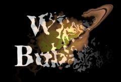

## S_WipeBubble

在转场区域内执行气泡扭曲处理，实现两个输入素材之间的擦除转场。应对 Wipe Percent 参数设置动画以控制转场速度。

在 Sapphire Transitions 效果子菜单中。

### Inputs:

- **Foreground**: 当前图层。以此素材开始转场。

- **Background**: 默认为无。以此素材结束转场。如果未提供此输入，将使用完全透明的背景，显示其后面的内容。请注意，除非提供此输入，否则在转场过程中无法对背景进行气泡处理。

### Parameters:

- **Load Preset** (Push-button)
  打开预设浏览器，浏览此效果的所有可用预设。

- **Save Preset** (Push-button)
  打开预设保存对话框，保存此效果的预设。

- **Transition Dir** (Popup menu, Default: Wipe Off to Bg)
  选择转场的方向。
  - **Wipe Off to Bg**: 从当前图层转场到背景。
  - **Wipe On from Bg**: 从背景转场到当前图层。

- **Auto Trans** (Popup YES-NO, Default: No)
  如果启用，将在图层的第一帧和最后一帧之间自动执行转场。如果关闭，则通过对 Wipe Percent 参数设置动画来手动执行转场。

- **Wipe Percent** (Default: 0, Range: 0 to 1)
  必须禁用 Auto Trans 才能使用此参数。它决定了 From 和 To 输入之间的转场比例，通常应从 0 动画到 100 以执行完整的转场。可以调整控制此参数的曲线以更精细地控制擦除时序。

- **Edge Width** (Default: 1.4, Range: 0.0138 or greater)
  转场区域的宽度。可以使用 Wipe Widget 调整此参数。

- **Angle** (Default: 0, Range: any)
  擦除方向的角度（从右侧起以度为单位）。可以使用 Wipe Widget 调整此参数。

- **Bubble Amount** (Default: 0.5, Range: 0 or greater)
  气泡扭曲的幅度。

- **Frequency** (Default: 8, Range: 0.1 or greater)
  气泡图案的频率。增大可缩小，减小可放大。

- **Frequency Rel X** (Default: 1, Range: 0.01 or greater)
  气泡图案的相对水平频率。增大可获得更高的气泡，减小可获得更宽的气泡。

- **Octaves** (Integer, Default: 8, Range: 1 to 10)
  噪声叠加层的数量。每个八度是前一个的两倍频率和一半振幅。单个八度产生平滑的纹理。添加八度使结果趋近于分形（1/f）噪声纹理。

- **Seed** (Default: 0.23, Range: 0 or greater)
  用于初始化随机数生成器。实际种子值并不重要，但不同的种子会产生不同的结果，相同的值应产生可重复的结果。

- **Wrap** (X & Y, Popup menu, Default: [ Reflect Reflect ])
  确定访问源图像边界之外区域的方法。
  - **No**: 边界之外显示为黑色。
  - **Tile**: 重复图像的副本。
  - **Reflect**: 重复图像的镜像副本。使用此方法边缘通常不太明显。

- **Opacity** (Popup menu, Default: Normal)
  确定处理不透明度/透明度的方法。
  - **All Opaque**: 当输入图像完全不透明且没有透明度（Alpha=1）时，使用此选项可稍微加快渲染速度。
  - **Normal**: 正常处理不透明度。
  - **As Premult**: 按照图像已经是预乘形式（颜色已按不透明度缩放）来处理。此选项也比 Normal 模式渲染速度稍快，但结果也将是预乘形式，这有时不太正确。

- **Crop Input Parameters** (Default: 0, Range: 0 or greater)
  这4个参数（Crop Top、Crop Bottom、Crop Left 和 Crop Right）允许选择要处理的输入图像的矩形子区域。如果 Wrap 参数设置为"No"，则暴露的边界将是透明的。如果 Wrap 设置为"Tile"或"Reflect"，则源图像将在新裁剪的边界上环绕以填充画面。这可以更容易地避免因扭曲具有不良边缘的图像而产生的伪影。

- **Show Wipe** (Check-box, Default: on)
  打开或关闭用于调整 Wipe Amt、Angle 和 Edge Width 参数的屏幕用户界面控件。此参数仅在 AE 和 Premiere 中显示，因为这些软件支持屏幕控件。
