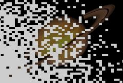

## S_WipePixelate

通过以半随机顺序将一个素材的像素块添加到另一个素材上来实现两个输入素材之间的转场。应对 Wipe Percent 参数设置动画以控制转场速度。调整 Edge Width 和 Chunky 参数可获得不同的像素化图案。

在 Sapphire Transitions 效果子菜单中。

### Inputs:

- **Foreground**: 当前图层。以此素材开始转场。

- **Background**: 默认为无。以此素材结束转场。

### Parameters:

- **Load Preset** (Push-button)
  打开预设浏览器，浏览此效果的所有可用预设。

- **Save Preset** (Push-button)
  打开预设保存对话框，保存此效果的预设。

- **Transition Dir** (Popup menu, Default: Wipe Off to Bg)
  选择转场的方向。
  - **Wipe Off to Bg**: 从当前图层转场到背景。
  - **Wipe On from Bg**: 从背景转场到当前图层。

- **Auto Trans** (Popup YES-NO, Default: No)
  如果启用，将在图层的第一帧和最后一帧之间自动执行转场。如果关闭，则通过对 Wipe Percent 参数设置动画来手动执行转场。

- **Wipe Percent** (Default: 0, Range: 0 to 1)
  必须禁用 Auto Trans 才能使用此参数。它决定了 From 和 To 输入之间的转场比例，通常应从 0 动画到 100 以执行完整的转场。可以调整控制此参数的曲线以更精细地控制擦除时序。

- **Edge Width** (Default: 1, Range: 0.0138 or greater)
  转场区域的宽度。

- **Angle** (Default: 0, Range: any)
  擦除方向的角度（以度为单位）。使用 0 表示从左到右的擦除，90 或 -90 表示垂直擦除，180 表示从右到左的擦除。

- **Pixel Frequency** (Default: 20, Range: 0.1 or greater)
  增大可获得更小更多的像素，减小可获得更少更大的像素。

- **Pixel Rel Width** (Default: 1, Range: 0.01 or greater)
  像素的相对水平尺寸。增大可获得宽像素，减小可获得高像素。

- **Chunky** (Default: 0, Range: 0 or greater)
  增大可使像素以更聚集的顺序添加。

- **Seed** (Default: 0.23, Range: 0 or greater)
  用于初始化随机数生成器。实际种子值并不重要，但不同的种子会产生不同的结果，相同的值应产生可重复的结果。

- **Show Wipe** (Check-box, Default: on)
  打开或关闭用于调整 Grad Add、Grad Angle 和 Wipe Percent 参数的屏幕用户界面控件。Grad Add 参数的值必须首先为正值才能使此控件可见。此参数仅在 AE 和 Premiere 中显示，因为这些软件支持屏幕控件。
