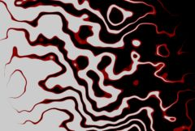

## S_WipePlasma

使用具有移动触须的等离子纹理在两个输入素材之间执行擦除转场。应对 Wipe Percent 参数设置动画以控制转场速度。增大 Grad Add 参数可使等离子图案的时序在擦除过程中移动到屏幕上。增大 Border Width 参数可在擦除转场边缘绘制边框。

在 Sapphire Transitions 效果子菜单中。

### Inputs:

- **Foreground**: 当前图层。以此素材开始转场。

- **Background**: 默认为无。以此素材结束转场。

### Parameters:

- **Load Preset** (Push-button)
  打开预设浏览器，浏览此效果的所有可用预设。

- **Save Preset** (Push-button)
  打开预设保存对话框，保存此效果的预设。

- **Transition Dir** (Popup menu, Default: Wipe Off to Bg)
  选择转场的方向。
  - **Wipe Off to Bg**: 从当前图层转场到背景。
  - **Wipe On from Bg**: 从背景转场到当前图层。

- **Auto Trans** (Popup YES-NO, Default: No)
  如果启用，将在图层的第一帧和最后一帧之间自动执行转场。如果关闭，则通过对 Wipe Percent 参数设置动画来手动执行转场。

- **Wipe Percent** (Default: 0, Range: 0 to 1)
  必须禁用 Auto Trans 才能使用此参数。它决定了 From 和 To 输入之间的转场比例，通常应从 0 动画到 100 以执行完整的转场。可以调整控制此参数的曲线以更精细地控制擦除时序。

- **Edge Softness** (Default: 0, Range: 0 or greater)
  转场边缘的宽度。较大的值将导致擦除图案中更柔和、更不明显的边缘。

- **Frequency** (Default: 4, Range: 0.05 or greater)
  等离子图案的频率。增大可获得更多更小的元素，减小可获得更少更大的元素。

- **Freq Rel X** (Default: 1, Range: 0.01 or greater)
  纹理的相对水平频率。增大可将其垂直拉伸，减小可将其水平拉伸。

- **Octaves** (Integer, Default: 4, Range: 1 to 10)
  噪声叠加层的数量。每个八度是前一个的两倍频率和一半振幅。单个八度产生平滑的纹理。添加八度使结果趋近于分形（1/f）噪声纹理。

- **Seed** (Default: 0.12, Range: 0 or greater)
  用于初始化随机数生成器。实际种子值并不重要，但不同的种子会产生不同的结果，相同的值应产生可重复的结果。

- **Plasma Grad** (Default: 0, Range: 0 or greater)
  用于对齐等离子触须的渐变振幅。增大可获得更像斑马纹的条纹效果。

- **Plasma Grad Angle** (Default: 0, Range: any)
  设定等离子线条渐变的方向。仅在 Plasma Grad 参数为正值时有效。

- **Layers** (Default: 8, Range: 0 or greater)
  等离子线条的层数。增大可获得更强的条纹效果。

- **Shift** (X & Y, Default: [0 0], Range: any)
  等离子图案的平移。

- **Phase Start** (Default: 0, Range: any)
  等离子线条的相位偏移。

- **Phase Speed** (Default: 2, Range: any)
  等离子线条的相位速度。如果非零，线条将自动以此速率波动动画。

- **Grad Add** (Default: 0.5, Range: -10 to 10)
  如果为正值，将在转场图案的时序中添加渐变，使其在擦除过程中移动到屏幕上。如果启用了 Wipe Widget，可以使用它调整此参数，但值必须为正才能使此控件可见。

- **Grad Angle** (Default: 0, Range: any)
  擦除渐变的方向（以度为单位）。除非 Grad Add 为正值，否则此参数无效。Wipe Widget 也允许调整此参数。

- **Border Width** (Default: 0, Range: 0 or greater)
  如果为正值，将在擦除转场边缘使用以下边框颜色、不透明度、柔和度和偏移参数绘制彩色边框。

- **Border Color** (Default rgb: [0.75 0 0])
  边框的颜色。除非 Border Width 为正值，否则此参数无效。

- **Border Opacity** (Default: 1, Range: 0 to 1)
  边框的不透明度。减小可使边框变为透明，允许其下方的图像透过显示。除非 Border Width 为正值，否则此参数无效。

- **Border Softness** (Default: 0, Range: 0 or greater)
  边框边缘的柔和度。除非 Border Width 为正值，否则此参数无效。

- **Border Shift** (Default: 0, Range: any)
  将边框向转场边缘的前方或后方偏移。除非 Border Width 为正值，否则此参数无效。

- **Border Glow** (Default: 0, Range: 0 or greater)
  沿擦除边框添加辉光。该值决定辉光的亮度。

- **Glow Width** (Default: 0.1, Range: 0 or greater)
  辉光边框的宽度。

- **Width Red** (Default: 1, Range: 0 or greater)
  缩放红色辉光宽度。如果红色、绿色和蓝色宽度都相等，辉光将匹配 Glow Color。否则将产生不同颜色的边缘。

- **Width Green** (Default: 1.2, Range: 0 or greater)
  缩放绿色辉光宽度。

- **Width Blue** (Default: 1.4, Range: 0 or greater)
  缩放蓝色辉光宽度。

- **Glow Color** (Default rgb: [1 1 1])
  辉光边框的颜色。

- **Noise Amp** (Default: 1, Range: 0 or greater)
  添加到辉光边框的噪声量。

- **Noise Freq** (Default: 16, Range: 0.1 to 20)
  噪声的空间频率。

- **Noise Speed** (Default: 2, Range: any)
  噪声随时间变化或沸腾的速度。

- **Opacity** (Popup menu, Default: Normal)
  确定处理不透明度/透明度的方法。
  - **All Opaque**: 当输入图像完全不透明且没有透明度（Alpha=1）时，使用此选项可稍微加快渲染速度。
  - **Normal**: 正常处理不透明度。
  - **As Premult**: 按照图像已经是预乘形式（颜色已按不透明度缩放）来处理。此选项也比 Normal 模式渲染速度稍快，但结果也将是预乘形式，这有时不太正确。

- **Show Wipe** (Check-box, Default: on)
  打开或关闭用于调整 Grad Add、Grad Angle 和 Wipe Percent 参数的屏幕用户界面控件。Grad Add 参数的值必须首先为正值才能使此控件可见。此参数仅在 AE 和 Premiere 中显示，因为这些软件支持屏幕控件。

- **Show Glow Width** (Check-box, Default: off)
  打开或关闭用于调整 Glow Width 参数的屏幕用户界面。此参数仅在 AE 和 Premiere 中显示，因为这些软件支持屏幕控件。
