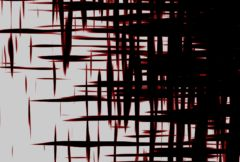

## S_WipeWeave

在两个输入素材之间执行擦除过渡，使用类似相互垂直的编织纤维纹理。应对 Wipe Percent 进行动画以控制过渡速度。增加 Grad Add 可使编织纹理的时间相位在擦除过程中横向移动。增加 Border Width 可在擦除边缘绘制边框。

位于 Sapphire Transitions 效果子菜单中。

### Inputs:

- **Foreground**: 当前图层。以此素材开始过渡。

- **Background**: 默认为无。以此素材结束过渡。

### Parameters:

- **Load Preset** (Push-button)
  打开预设浏览器，浏览此效果的所有可用预设。

- **Save Preset** (Push-button)
  打开预设保存对话框，保存此效果的预设。

- **Transition Dir** (Popup menu, Default: Wipe Off to Bg)
  选择过渡方向。
  - **Wipe Off to Bg**: 从当前图层过渡到 Background。
  - **Wipe On from Bg**: 从 Background 过渡到当前图层。

- **Auto Trans** (Popup YES-NO, Default: No)
  若启用，将在图层的首帧与末帧之间自动执行一次过渡。关闭时，需要通过动画 Wipe Percent 手动控制过渡。

- **Wipe Percent** (Default: 0, Range: 0 to 1)
  仅在关闭 Auto Trans 时生效。决定 From 与 To 两个输入之间的过渡比例。通常将其从 0 动画到 1 以完成一次完整的过渡。可通过曲线精细控制擦除节奏。

- **Strands** (Popup menu, Default: Grow)
  编织纹理的演变方向。
  - **Shrink**: 纤维从大开始向内收缩。
  - **Grow**: 纤维从小开始向外生长。

- **Edge Softness** (Default: 0, Range: 0 or greater)
  过渡边缘的宽度。值更大时，擦除纹理边界更柔、更不明显。

- **Frequency** (Default: 20, Range: 0.01 or greater)
  编织纹理的频率。增大得到更多且更细小的元素；减小得到更少且更大的元素。

- **Rel Length** (Default: 10, Range: 0.1 or greater)
  纤维的相对长度。增大得到更长更细的纤维；减小得到更短更粗的纤维。

- **Octaves** (Integer, Default: 2, Range: 1 to 10)
  噪声层的叠加数量。每一“倍频”层的频率是前一层的两倍、幅度是前一层的一半。1 层较为平滑，增加层数会使结果趋近分形（1/f）噪声纹理。

- **Seed** (Default: 0.123, Range: 0 or greater)
  随机种子。不同种子得到不同结果，相同种子应得到可复现的结果。

- **Shift** (X & Y, Default: [0 0], Range: any)
  编织纹理的平移。

- **H Speed X** (Default: 0, Range: any)
  水平纤维沿其长度方向的自动匍匐速度。非 0 将自动沿长度方向爬行。

- **V Speed Y** (Default: 0, Range: any)
  垂直纤维沿其长度方向的自动匍匐速度。非 0 将自动沿长度方向爬行。

- **Grad Add** (Default: 0, Range: -10 to 10)
  若为正，会在过渡纹理的时间上叠加一个梯度，使其在擦除过程中横向移动。启用 Wipe Widget 后可调整，需先设为正值以显示控件。

- **Grad Angle** (Default: 0, Range: any)
  擦除梯度的方向（度）。仅当 Grad Add 为正时生效。Wipe Widget 也可调整该参数。

- **Border Width** (Default: 0, Range: 0 or greater)
  若为正，则在擦除边界处绘制一条有色边框；受下列边框颜色、不透明度、柔化与偏移等参数影响。

- **Border Color** (Default rgb: [0.75 0 0])
  边框颜色。仅当 Border Width 为正时生效。

- **Border Opacity** (Default: 1, Range: 0 to 1)
  边框不透明度。减小可使其透明，让下方图像显现。仅当 Border Width 为正时生效。

- **Border Softness** (Default: 0, Range: 0 or greater)
  边框边缘柔和度。仅当 Border Width 为正时生效。

- **Border Shift** (Default: 0, Range: any)
  将边框向过渡边缘前后偏移。仅当 Border Width 为正时生效。

- **Border Glow** (Default: 0, Range: 0 or greater)
  在擦除边界叠加辉光。数值决定辉光亮度。

- **Glow Width** (Default: 0.1, Range: 0 or greater)
  辉光的宽度。

- **Width Red** (Default: 1, Range: 0 or greater)
  红色辉光宽度缩放。若 RGB 三色宽度相等，辉光会与 Glow Color 一致；否则将出现彩色边缘。

- **Width Green** (Default: 1.2, Range: 0 or greater)
  绿色辉光宽度缩放。

- **Width Blue** (Default: 1.4, Range: 0 or greater)
  蓝色辉光宽度缩放。

- **Glow Color** (Default rgb: [1 1 1])
  辉光颜色。

- **Noise Amp** (Default: 1, Range: 0 or greater)
  叠加到辉光上的噪声强度。

- **Noise Freq** (Default: 16, Range: 0.1 to 20)
  噪声的空间频率。

- **Noise Speed** (Default: 2, Range: any)
  噪声随时间变化（翻滚/沸腾）的速度。

- **Opacity** (Popup menu, Default: Normal)
  处理不透明度/透明度的方法。
  - **All Opaque**: 当输入图像完全不透明（alpha=1）时渲染略快。
  - **Normal**: 正常处理透明度。
  - **As Premult**: 按已预乘形式处理（颜色已按不透明度缩放），渲染略快，但结果也将是预乘形式，精确性可能略差。

- **Show Wipe** (Check-box, Default: on)
  打开或关闭用于调整 Grad Add、Grad Angle 与 Wipe Percent 的屏幕控件。须先将 Grad Add 设为正值以显示该控件。此参数仅在支持屏幕控件的 AE 与 Premiere 中出现。

- **Show Glow Width** (Check-box, Default: off)
  打开或关闭用于调整 Glow Width 的屏幕控件。此参数仅在支持屏幕控件的 AE 与 Premiere 中出现。
